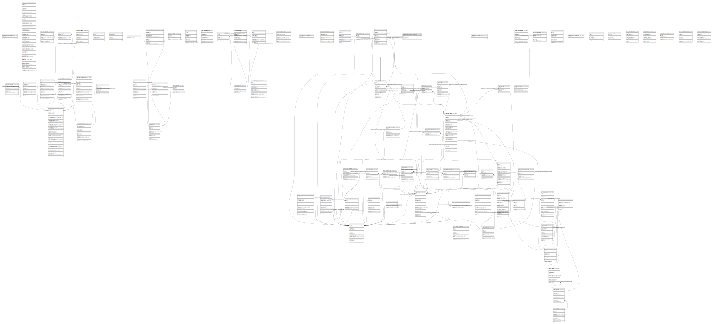

# postgres

## Tables

| Name | Columns | Comment | Type |
| ---- | ------- | ------- | ---- |
| [extensions.pg_stat_statements_info](extensions.pg_stat_statements_info.md) | 2 |  | VIEW |
| [extensions.pg_stat_statements](extensions.pg_stat_statements.md) | 49 |  | VIEW |
| [auth.users](auth.users.md) | 35 | Auth: Stores user login data within a secure schema. | BASE TABLE |
| [auth.refresh_tokens](auth.refresh_tokens.md) | 9 | Auth: Store of tokens used to refresh JWT tokens once they expire. | BASE TABLE |
| [auth.instances](auth.instances.md) | 5 | Auth: Manages users across multiple sites. | BASE TABLE |
| [auth.audit_log_entries](auth.audit_log_entries.md) | 5 | Auth: Audit trail for user actions. | BASE TABLE |
| [auth.schema_migrations](auth.schema_migrations.md) | 1 | Auth: Manages updates to the auth system. | BASE TABLE |
| [storage.buckets](storage.buckets.md) | 11 |  | BASE TABLE |
| [storage.objects](storage.objects.md) | 13 |  | BASE TABLE |
| [storage.migrations](storage.migrations.md) | 4 |  | BASE TABLE |
| [vault.secrets](vault.secrets.md) | 8 | Table with encrypted `secret` column for storing sensitive information on disk. | BASE TABLE |
| [vault.decrypted_secrets](vault.decrypted_secrets.md) | 9 |  | VIEW |
| [auth.identities](auth.identities.md) | 9 | Auth: Stores identities associated to a user. | BASE TABLE |
| [auth.sessions](auth.sessions.md) | 15 | Auth: Stores session data associated to a user. | BASE TABLE |
| [auth.mfa_factors](auth.mfa_factors.md) | 13 | auth: stores metadata about factors | BASE TABLE |
| [auth.mfa_challenges](auth.mfa_challenges.md) | 7 | auth: stores metadata about challenge requests made | BASE TABLE |
| [auth.mfa_amr_claims](auth.mfa_amr_claims.md) | 5 | auth: stores authenticator method reference claims for multi factor authentication | BASE TABLE |
| [auth.sso_providers](auth.sso_providers.md) | 5 | Auth: Manages SSO identity provider information; see saml_providers for SAML. | BASE TABLE |
| [auth.sso_domains](auth.sso_domains.md) | 5 | Auth: Manages SSO email address domain mapping to an SSO Identity Provider. | BASE TABLE |
| [auth.saml_providers](auth.saml_providers.md) | 9 | Auth: Manages SAML Identity Provider connections. | BASE TABLE |
| [auth.saml_relay_states](auth.saml_relay_states.md) | 8 | Auth: Contains SAML Relay State information for each Service Provider initiated login. | BASE TABLE |
| [auth.flow_state](auth.flow_state.md) | 12 | stores metadata for pkce logins | BASE TABLE |
| [auth.one_time_tokens](auth.one_time_tokens.md) | 7 |  | BASE TABLE |
| [auth.oauth_clients](auth.oauth_clients.md) | 12 |  | BASE TABLE |
| [auth.oauth_authorizations](auth.oauth_authorizations.md) | 17 |  | BASE TABLE |
| [auth.oauth_consents](auth.oauth_consents.md) | 6 |  | BASE TABLE |
| [storage.s3_multipart_uploads](storage.s3_multipart_uploads.md) | 9 |  | BASE TABLE |
| [storage.s3_multipart_uploads_parts](storage.s3_multipart_uploads_parts.md) | 10 |  | BASE TABLE |
| [storage.prefixes](storage.prefixes.md) | 5 |  | BASE TABLE |
| [storage.buckets_analytics](storage.buckets_analytics.md) | 7 |  | BASE TABLE |
| [realtime.schema_migrations](realtime.schema_migrations.md) | 2 |  | BASE TABLE |
| [realtime.subscription](realtime.subscription.md) | 7 |  | BASE TABLE |
| [realtime.messages](realtime.messages.md) | 8 |  | BASE TABLE |
| [public.users](public.users.md) | 13 |  | BASE TABLE |
| [public.regions](public.regions.md) | 10 |  | BASE TABLE |
| [public.prefectures](public.prefectures.md) | 9 |  | BASE TABLE |
| [public.cities](public.cities.md) | 11 |  | BASE TABLE |
| [public.machi](public.machi.md) | 17 |  | BASE TABLE |
| [public.maps](public.maps.md) | 18 |  | BASE TABLE |
| [public.follows](public.follows.md) | 4 |  | BASE TABLE |
| [public.comments](public.comments.md) | 12 |  | BASE TABLE |
| [public.bookmarks](public.bookmarks.md) | 6 |  | BASE TABLE |
| [public.images](public.images.md) | 10 |  | BASE TABLE |
| [public.likes](public.likes.md) | 5 |  | BASE TABLE |
| [public.visits](public.visits.md) | 6 | ユーザーが訪問した街の記録（街ごとに1レコード、訪問有無のみ管理） | BASE TABLE |
| [supabase_migrations.schema_migrations](supabase_migrations.schema_migrations.md) | 3 |  | BASE TABLE |
| [supabase_migrations.seed_files](supabase_migrations.seed_files.md) | 2 |  | BASE TABLE |
| [public.master_spots](public.master_spots.md) | 16 |  | BASE TABLE |
| [public.user_spots](public.user_spots.md) | 27 |  | BASE TABLE |
| [storage.buckets_vectors](storage.buckets_vectors.md) | 4 |  | BASE TABLE |
| [storage.vector_indexes](storage.vector_indexes.md) | 9 |  | BASE TABLE |
| [public.bookmark_folders](public.bookmark_folders.md) | 7 |  | BASE TABLE |
| [public.notifications](public.notifications.md) | 10 |  | BASE TABLE |
| [public.system_announcements](public.system_announcements.md) | 9 |  | BASE TABLE |
| [public.system_announcement_reads](public.system_announcement_reads.md) | 4 |  | BASE TABLE |
| [net.http_request_queue](net.http_request_queue.md) | 6 |  | BASE TABLE |
| [net._http_response](net._http_response.md) | 8 |  | BASE TABLE |
| [supabase_functions.migrations](supabase_functions.migrations.md) | 2 |  | BASE TABLE |
| [supabase_functions.hooks](supabase_functions.hooks.md) | 5 | Supabase Functions Hooks: Audit trail for triggered hooks. | BASE TABLE |
| [public.comment_likes](public.comment_likes.md) | 4 |  | BASE TABLE |
| [public.collections](public.collections.md) | 10 |  | BASE TABLE |
| [public.collection_maps](public.collection_maps.md) | 5 |  | BASE TABLE |
| [public.user_notification_settings](public.user_notification_settings.md) | 14 |  | BASE TABLE |
| [public.reports](public.reports.md) | 12 | 報告機能テーブル | BASE TABLE |
| [public.transport_hubs](public.transport_hubs.md) | 18 | 交通機関データ（駅、空港、フェリーターミナル、バスターミナル） | BASE TABLE |
| [public.spatial_ref_sys](public.spatial_ref_sys.md) | 5 |  | BASE TABLE |
| [public.geography_columns](public.geography_columns.md) | 7 |  | VIEW |
| [public.geometry_columns](public.geometry_columns.md) | 7 |  | VIEW |
| [public.admin_boundaries](public.admin_boundaries.md) | 7 | 行政区域ポリゴン（国土数値情報N03由来） | BASE TABLE |
| [auth.oauth_client_states](auth.oauth_client_states.md) | 4 | Stores OAuth states for third-party provider authentication flows where Supabase acts as the OAuth client. | BASE TABLE |
| [public.countries](public.countries.md) | 9 |  | BASE TABLE |
| [public.featured_carousel_items](public.featured_carousel_items.md) | 14 | 発見タブの特集カルーセルに表示するバナーコンテンツ | BASE TABLE |
| [public.terms_versions](public.terms_versions.md) | 8 | 利用規約・プライバシーポリシーのバージョン管理 | BASE TABLE |
| [public.terms_agreements](public.terms_agreements.md) | 8 | ユーザーの利用規約・プライバシーポリシー同意履歴 | BASE TABLE |
| [public.current_terms_versions](public.current_terms_versions.md) | 7 | 現在有効な利用規約・プライバシーポリシーの最新バージョン | VIEW |
| [public.user_latest_agreements](public.user_latest_agreements.md) | 7 | ユーザーの最新の同意情報 | VIEW |
| [public.view_history](public.view_history.md) | 7 | 閲覧履歴（マップ） | BASE TABLE |
| [public.master_spot_favorites](public.master_spot_favorites.md) | 4 |  | BASE TABLE |
| [public.categories](public.categories.md) | 8 | マップカテゴリ（グルメ、旅行など） | BASE TABLE |
| [public.tags](public.tags.md) | 7 |  | BASE TABLE |
| [public.map_tags](public.map_tags.md) | 4 |  | BASE TABLE |
| [public.spot_tags](public.spot_tags.md) | 4 |  | BASE TABLE |
| [public.category_featured_maps](public.category_featured_maps.md) | 7 | カテゴリ別おすすめマップ（運営選定） | BASE TABLE |
| [public.category_featured_tags](public.category_featured_tags.md) | 7 | カテゴリ別おすすめタグ（運営選定） | BASE TABLE |
| [public.continents](public.continents.md) | 9 | 大陸マスターテーブル | BASE TABLE |
| [public.schedules](public.schedules.md) | 10 | ユーザーの予定（街への訪問予定など） | BASE TABLE |
| [public.map_labels](public.map_labels.md) | 7 | マップごとのラベル定義（スポットの種類分け用） | BASE TABLE |

## Stored procedures and functions

| Name | ReturnType | Arguments | Type |
| ---- | ------- | ------- | ---- |
| pgbouncer.get_auth | record | p_usename text | FUNCTION |
| extensions.pg_stat_statements_info | record | OUT dealloc bigint, OUT stats_reset timestamp with time zone | FUNCTION |
| extensions.pg_stat_statements | record | showtext boolean, OUT userid oid, OUT dbid oid, OUT toplevel boolean, OUT queryid bigint, OUT query text, OUT plans bigint, OUT total_plan_time double precision, OUT min_plan_time double precision, OUT max_plan_time double precision, OUT mean_plan_time double precision, OUT stddev_plan_time double precision, OUT calls bigint, OUT total_exec_time double precision, OUT min_exec_time double precision, OUT max_exec_time double precision, OUT mean_exec_time double precision, OUT stddev_exec_time double precision, OUT rows bigint, OUT shared_blks_hit bigint, OUT shared_blks_read bigint, OUT shared_blks_dirtied bigint, OUT shared_blks_written bigint, OUT local_blks_hit bigint, OUT local_blks_read bigint, OUT local_blks_dirtied bigint, OUT local_blks_written bigint, OUT temp_blks_read bigint, OUT temp_blks_written bigint, OUT shared_blk_read_time double precision, OUT shared_blk_write_time double precision, OUT local_blk_read_time double precision, OUT local_blk_write_time double precision, OUT temp_blk_read_time double precision, OUT temp_blk_write_time double precision, OUT wal_records bigint, OUT wal_fpi bigint, OUT wal_bytes numeric, OUT jit_functions bigint, OUT jit_generation_time double precision, OUT jit_inlining_count bigint, OUT jit_inlining_time double precision, OUT jit_optimization_count bigint, OUT jit_optimization_time double precision, OUT jit_emission_count bigint, OUT jit_emission_time double precision, OUT jit_deform_count bigint, OUT jit_deform_time double precision, OUT stats_since timestamp with time zone, OUT minmax_stats_since timestamp with time zone | FUNCTION |
| extensions.pg_stat_statements_reset | timestamptz | userid oid DEFAULT 0, dbid oid DEFAULT 0, queryid bigint DEFAULT 0, minmax_only boolean DEFAULT false | FUNCTION |
| extensions.uuid_nil | uuid |  | FUNCTION |
| extensions.uuid_ns_dns | uuid |  | FUNCTION |
| extensions.uuid_ns_url | uuid |  | FUNCTION |
| extensions.uuid_ns_oid | uuid |  | FUNCTION |
| extensions.uuid_ns_x500 | uuid |  | FUNCTION |
| extensions.uuid_generate_v1 | uuid |  | FUNCTION |
| extensions.uuid_generate_v1mc | uuid |  | FUNCTION |
| extensions.uuid_generate_v3 | uuid | namespace uuid, name text | FUNCTION |
| extensions.uuid_generate_v4 | uuid |  | FUNCTION |
| extensions.uuid_generate_v5 | uuid | namespace uuid, name text | FUNCTION |
| extensions.digest | bytea | text, text | FUNCTION |
| extensions.digest | bytea | bytea, text | FUNCTION |
| extensions.hmac | bytea | text, text, text | FUNCTION |
| extensions.hmac | bytea | bytea, bytea, text | FUNCTION |
| extensions.crypt | text | text, text | FUNCTION |
| extensions.gen_salt | text | text | FUNCTION |
| extensions.gen_salt | text | text, integer | FUNCTION |
| extensions.encrypt | bytea | bytea, bytea, text | FUNCTION |
| extensions.decrypt | bytea | bytea, bytea, text | FUNCTION |
| extensions.encrypt_iv | bytea | bytea, bytea, bytea, text | FUNCTION |
| extensions.decrypt_iv | bytea | bytea, bytea, bytea, text | FUNCTION |
| extensions.gen_random_bytes | bytea | integer | FUNCTION |
| extensions.gen_random_uuid | uuid |  | FUNCTION |
| extensions.pgp_sym_encrypt | bytea | text, text | FUNCTION |
| extensions.pgp_sym_encrypt_bytea | bytea | bytea, text | FUNCTION |
| extensions.pgp_sym_encrypt | bytea | text, text, text | FUNCTION |
| extensions.pgp_sym_encrypt_bytea | bytea | bytea, text, text | FUNCTION |
| extensions.pgp_sym_decrypt | text | bytea, text | FUNCTION |
| extensions.pgp_sym_decrypt_bytea | bytea | bytea, text | FUNCTION |
| extensions.pgp_sym_decrypt | text | bytea, text, text | FUNCTION |
| extensions.pgp_sym_decrypt_bytea | bytea | bytea, text, text | FUNCTION |
| extensions.pgp_pub_encrypt | bytea | text, bytea | FUNCTION |
| extensions.pgp_pub_encrypt_bytea | bytea | bytea, bytea | FUNCTION |
| extensions.pgp_pub_encrypt | bytea | text, bytea, text | FUNCTION |
| extensions.pgp_pub_encrypt_bytea | bytea | bytea, bytea, text | FUNCTION |
| extensions.pgp_pub_decrypt | text | bytea, bytea | FUNCTION |
| extensions.pgp_pub_decrypt_bytea | bytea | bytea, bytea | FUNCTION |
| extensions.pgp_pub_decrypt | text | bytea, bytea, text | FUNCTION |
| extensions.pgp_pub_decrypt_bytea | bytea | bytea, bytea, text | FUNCTION |
| extensions.pgp_pub_decrypt | text | bytea, bytea, text, text | FUNCTION |
| extensions.pgp_pub_decrypt_bytea | bytea | bytea, bytea, text, text | FUNCTION |
| extensions.pgp_key_id | text | bytea | FUNCTION |
| extensions.armor | text | bytea | FUNCTION |
| extensions.armor | text | bytea, text[], text[] | FUNCTION |
| extensions.dearmor | bytea | text | FUNCTION |
| extensions.pgp_armor_headers | record | text, OUT key text, OUT value text | FUNCTION |
| auth.uid | uuid |  | FUNCTION |
| auth.role | text |  | FUNCTION |
| auth.email | text |  | FUNCTION |
| extensions.grant_pg_cron_access | event_trigger |  | FUNCTION |
| extensions.grant_pg_net_access | event_trigger |  | FUNCTION |
| extensions.pgrst_ddl_watch | event_trigger |  | FUNCTION |
| extensions.pgrst_drop_watch | event_trigger |  | FUNCTION |
| extensions.grant_pg_graphql_access | event_trigger |  | FUNCTION |
| extensions.set_graphql_placeholder | event_trigger |  | FUNCTION |
| vault._crypto_aead_det_encrypt | bytea | message bytea, additional bytea, key_id bigint, context bytea DEFAULT '\x7067736f6469756d'::bytea, nonce bytea DEFAULT NULL::bytea | FUNCTION |
| vault._crypto_aead_det_decrypt | bytea | message bytea, additional bytea, key_id bigint, context bytea DEFAULT '\x7067736f6469756d'::bytea, nonce bytea DEFAULT NULL::bytea | FUNCTION |
| vault._crypto_aead_det_noncegen | bytea |  | FUNCTION |
| vault.create_secret | uuid | new_secret text, new_name text DEFAULT NULL::text, new_description text DEFAULT ''::text, new_key_id uuid DEFAULT NULL::uuid | FUNCTION |
| vault.update_secret | void | secret_id uuid, new_secret text DEFAULT NULL::text, new_name text DEFAULT NULL::text, new_description text DEFAULT NULL::text, new_key_id uuid DEFAULT NULL::uuid | FUNCTION |
| graphql.exception | text | message text | FUNCTION |
| graphql.comment_directive | jsonb | comment_ text | FUNCTION |
| graphql.increment_schema_version | event_trigger |  | FUNCTION |
| graphql.get_schema_version | int4 |  | FUNCTION |
| graphql._internal_resolve | jsonb | query text, variables jsonb DEFAULT '{}'::jsonb, "operationName" text DEFAULT NULL::text, extensions jsonb DEFAULT NULL::jsonb | FUNCTION |
| graphql.resolve | jsonb | query text, variables jsonb DEFAULT '{}'::jsonb, "operationName" text DEFAULT NULL::text, extensions jsonb DEFAULT NULL::jsonb | FUNCTION |
| graphql_public.graphql | jsonb | "operationName" text DEFAULT NULL::text, query text DEFAULT NULL::text, variables jsonb DEFAULT NULL::jsonb, extensions jsonb DEFAULT NULL::jsonb | FUNCTION |
| auth.jwt | jsonb |  | FUNCTION |
| storage.foldername | _text | name text | FUNCTION |
| storage.filename | text | name text | FUNCTION |
| storage.extension | text | name text | FUNCTION |
| storage.search | record | prefix text, bucketname text, limits integer DEFAULT 100, levels integer DEFAULT 1, offsets integer DEFAULT 0, search text DEFAULT ''::text, sortcolumn text DEFAULT 'name'::text, sortorder text DEFAULT 'asc'::text | FUNCTION |
| storage.update_updated_at_column | trigger |  | FUNCTION |
| storage.can_insert_object | void | bucketid text, name text, owner uuid, metadata jsonb | FUNCTION |
| storage.list_objects_with_delimiter | record | bucket_id text, prefix_param text, delimiter_param text, max_keys integer DEFAULT 100, start_after text DEFAULT ''::text, next_token text DEFAULT ''::text | FUNCTION |
| storage.list_multipart_uploads_with_delimiter | record | bucket_id text, prefix_param text, delimiter_param text, max_keys integer DEFAULT 100, next_key_token text DEFAULT ''::text, next_upload_token text DEFAULT ''::text | FUNCTION |
| storage.operation | text |  | FUNCTION |
| storage.get_level | int4 | name text | FUNCTION |
| storage.get_prefix | text | name text | FUNCTION |
| storage.get_prefixes | _text | name text | FUNCTION |
| storage.add_prefixes | void | _bucket_id text, _name text | FUNCTION |
| storage.delete_prefix | bool | _bucket_id text, _name text | FUNCTION |
| storage.prefixes_insert_trigger | trigger |  | FUNCTION |
| storage.objects_insert_prefix_trigger | trigger |  | FUNCTION |
| storage.delete_prefix_hierarchy_trigger | trigger |  | FUNCTION |
| storage.search_v1_optimised | record | prefix text, bucketname text, limits integer DEFAULT 100, levels integer DEFAULT 1, offsets integer DEFAULT 0, search text DEFAULT ''::text, sortcolumn text DEFAULT 'name'::text, sortorder text DEFAULT 'asc'::text | FUNCTION |
| storage.search_legacy_v1 | record | prefix text, bucketname text, limits integer DEFAULT 100, levels integer DEFAULT 1, offsets integer DEFAULT 0, search text DEFAULT ''::text, sortcolumn text DEFAULT 'name'::text, sortorder text DEFAULT 'asc'::text | FUNCTION |
| storage.get_size_by_bucket | record |  | FUNCTION |
| storage.objects_update_prefix_trigger | trigger |  | FUNCTION |
| storage.enforce_bucket_name_length | trigger |  | FUNCTION |
| storage.search_v2 | record | prefix text, bucket_name text, limits integer DEFAULT 100, levels integer DEFAULT 1, start_after text DEFAULT ''::text, sort_order text DEFAULT 'asc'::text, sort_column text DEFAULT 'name'::text, sort_column_after text DEFAULT ''::text | FUNCTION |
| storage.lock_top_prefixes | void | bucket_ids text[], names text[] | FUNCTION |
| storage.delete_leaf_prefixes | void | bucket_ids text[], names text[] | FUNCTION |
| storage.objects_delete_cleanup | trigger |  | FUNCTION |
| storage.objects_update_cleanup | trigger |  | FUNCTION |
| storage.prefixes_delete_cleanup | trigger |  | FUNCTION |
| storage.objects_update_level_trigger | trigger |  | FUNCTION |
| realtime.subscription_check_filters | trigger |  | FUNCTION |
| realtime.quote_wal2json | text | entity regclass | FUNCTION |
| realtime.check_equality_op | bool | op realtime.equality_op, type_ regtype, val_1 text, val_2 text | FUNCTION |
| realtime.cast | jsonb | val text, type_ regtype | FUNCTION |
| realtime.to_regrole | regrole | role_name text | FUNCTION |
| realtime.apply_rls | wal_rls | wal jsonb, max_record_bytes integer DEFAULT (1024 * 1024) | FUNCTION |
| realtime.is_visible_through_filters | bool | columns realtime.wal_column[], filters realtime.user_defined_filter[] | FUNCTION |
| realtime.build_prepared_statement_sql | text | prepared_statement_name text, entity regclass, columns realtime.wal_column[] | FUNCTION |
| realtime.list_changes | wal_rls | publication name, slot_name name, max_changes integer, max_record_bytes integer | FUNCTION |
| realtime.topic | text |  | FUNCTION |
| realtime.send | void | payload jsonb, event text, topic text, private boolean DEFAULT true | FUNCTION |
| realtime.broadcast_changes | void | topic_name text, event_name text, operation text, table_name text, table_schema text, new record, old record, level text DEFAULT 'ROW'::text | FUNCTION |
| public.update_updated_at_column | trigger |  | FUNCTION |
| public.create_like_spot_notification | trigger |  | FUNCTION |
| public.create_like_map_notification | trigger |  | FUNCTION |
| public.create_comment_spot_notification | trigger |  | FUNCTION |
| public.create_comment_map_notification | trigger |  | FUNCTION |
| public.create_follow_notification | trigger |  | FUNCTION |
| public.update_push_token | void | token text | FUNCTION |
| public.clear_push_token | void |  | FUNCTION |
| net.check_worker_is_up | void |  | FUNCTION |
| net._await_response | bool | request_id bigint | FUNCTION |
| net._urlencode_string | text | string character varying | FUNCTION |
| net._encode_url_with_params_array | text | url text, params_array text[] | FUNCTION |
| net.worker_restart | bool |  | FUNCTION |
| net.wait_until_running | void |  | FUNCTION |
| net.wake | void |  | FUNCTION |
| net.http_get | int8 | url text, params jsonb DEFAULT '{}'::jsonb, headers jsonb DEFAULT '{}'::jsonb, timeout_milliseconds integer DEFAULT 5000 | FUNCTION |
| net.http_post | int8 | url text, body jsonb DEFAULT '{}'::jsonb, params jsonb DEFAULT '{}'::jsonb, headers jsonb DEFAULT '{"Content-Type": "application/json"}'::jsonb, timeout_milliseconds integer DEFAULT 5000 | FUNCTION |
| net.http_delete | int8 | url text, params jsonb DEFAULT '{}'::jsonb, headers jsonb DEFAULT '{}'::jsonb, timeout_milliseconds integer DEFAULT 5000, body jsonb DEFAULT NULL::jsonb | FUNCTION |
| net._http_collect_response | http_response_result | request_id bigint, async boolean DEFAULT true | FUNCTION |
| net.http_collect_response | http_response_result | request_id bigint, async boolean DEFAULT true | FUNCTION |
| supabase_functions.http_request | trigger |  | FUNCTION |
| public.increment_comment_likes_count | trigger |  | FUNCTION |
| public.decrement_comment_likes_count | trigger |  | FUNCTION |
| public.increment_comment_replies_count | trigger |  | FUNCTION |
| public.decrement_comment_replies_count | trigger |  | FUNCTION |
| public.update_collection_maps_count | trigger |  | FUNCTION |
| public.update_notification_settings_updated_at | trigger |  | FUNCTION |
| public.create_default_notification_settings | trigger |  | FUNCTION |
| public.get_notification_settings | user_notification_settings |  | FUNCTION |
| public.update_notification_settings | user_notification_settings | p_push_enabled boolean DEFAULT NULL::boolean, p_like_enabled boolean DEFAULT NULL::boolean, p_comment_enabled boolean DEFAULT NULL::boolean, p_follow_enabled boolean DEFAULT NULL::boolean, p_system_enabled boolean DEFAULT NULL::boolean, p_email_enabled boolean DEFAULT NULL::boolean, p_email_like_enabled boolean DEFAULT NULL::boolean, p_email_comment_enabled boolean DEFAULT NULL::boolean, p_email_follow_enabled boolean DEFAULT NULL::boolean, p_email_system_enabled boolean DEFAULT NULL::boolean | FUNCTION |
| public.send_push_notification | trigger |  | FUNCTION |
| public.check_spots_limit | trigger |  | FUNCTION |
| public.check_spots_limit_on_update | trigger |  | FUNCTION |
| public._postgis_deprecate | void | oldname text, newname text, version text | FUNCTION |
| public.spheroid_in | spheroid | cstring | FUNCTION |
| public.spheroid_out | cstring | spheroid | FUNCTION |
| public.geometry_in | geometry | cstring | FUNCTION |
| public.geometry_out | cstring | geometry | FUNCTION |
| public.geometry_typmod_in | int4 | cstring[] | FUNCTION |
| public.geometry_typmod_out | cstring | integer | FUNCTION |
| public.geometry_analyze | bool | internal | FUNCTION |
| public.geometry_recv | geometry | internal | FUNCTION |
| public.geometry_send | bytea | geometry | FUNCTION |
| public.geometry | geometry | geometry, integer, boolean | FUNCTION |
| public.geometry | geometry | point | FUNCTION |
| public.point | point | geometry | FUNCTION |
| public.geometry | geometry | path | FUNCTION |
| public.path | path | geometry | FUNCTION |
| public.geometry | geometry | polygon | FUNCTION |
| public.polygon | polygon | geometry | FUNCTION |
| public.st_x | float8 | geometry | FUNCTION |
| public.st_y | float8 | geometry | FUNCTION |
| public.st_z | float8 | geometry | FUNCTION |
| public.st_m | float8 | geometry | FUNCTION |
| public.box3d_in | box3d | cstring | FUNCTION |
| public.box3d_out | cstring | box3d | FUNCTION |
| public.box2d_in | box2d | cstring | FUNCTION |
| public.box2d_out | cstring | box2d | FUNCTION |
| public.box2df_in | box2df | cstring | FUNCTION |
| public.box2df_out | cstring | box2df | FUNCTION |
| public.gidx_in | gidx | cstring | FUNCTION |
| public.gidx_out | cstring | gidx | FUNCTION |
| public.geometry_lt | bool | geom1 geometry, geom2 geometry | FUNCTION |
| public.geometry_le | bool | geom1 geometry, geom2 geometry | FUNCTION |
| public.geometry_gt | bool | geom1 geometry, geom2 geometry | FUNCTION |
| public.geometry_ge | bool | geom1 geometry, geom2 geometry | FUNCTION |
| public.geometry_eq | bool | geom1 geometry, geom2 geometry | FUNCTION |
| public.geometry_cmp | int4 | geom1 geometry, geom2 geometry | FUNCTION |
| public.geometry_sortsupport | void | internal | FUNCTION |
| public.geometry_hash | int4 | geometry | FUNCTION |
| public.geometry_gist_distance_2d | float8 | internal, geometry, integer | FUNCTION |
| public.geometry_gist_consistent_2d | bool | internal, geometry, integer | FUNCTION |
| public.geometry_gist_compress_2d | internal | internal | FUNCTION |
| public.geometry_gist_penalty_2d | internal | internal, internal, internal | FUNCTION |
| public.geometry_gist_picksplit_2d | internal | internal, internal | FUNCTION |
| public.geometry_gist_union_2d | internal | bytea, internal | FUNCTION |
| public.geometry_gist_same_2d | internal | geom1 geometry, geom2 geometry, internal | FUNCTION |
| public.geometry_gist_decompress_2d | internal | internal | FUNCTION |
| public.geometry_gist_sortsupport_2d | void | internal | FUNCTION |
| public._postgis_selectivity | float8 | tbl regclass, att_name text, geom geometry, mode text DEFAULT '2'::text | FUNCTION |
| public._postgis_join_selectivity | float8 | regclass, text, regclass, text, text DEFAULT '2'::text | FUNCTION |
| public._postgis_stats | text | tbl regclass, att_name text, text DEFAULT '2'::text | FUNCTION |
| public._postgis_index_extent | box2d | tbl regclass, col text | FUNCTION |
| public.gserialized_gist_sel_2d | float8 | internal, oid, internal, integer | FUNCTION |
| public.gserialized_gist_sel_nd | float8 | internal, oid, internal, integer | FUNCTION |
| public.gserialized_gist_joinsel_2d | float8 | internal, oid, internal, smallint | FUNCTION |
| public.gserialized_gist_joinsel_nd | float8 | internal, oid, internal, smallint | FUNCTION |
| public.geometry_overlaps | bool | geom1 geometry, geom2 geometry | FUNCTION |
| public.geometry_same | bool | geom1 geometry, geom2 geometry | FUNCTION |
| public.geometry_distance_centroid | float8 | geom1 geometry, geom2 geometry | FUNCTION |
| public.geometry_distance_box | float8 | geom1 geometry, geom2 geometry | FUNCTION |
| public.geometry_contains | bool | geom1 geometry, geom2 geometry | FUNCTION |
| public.geometry_within | bool | geom1 geometry, geom2 geometry | FUNCTION |
| public.geometry_left | bool | geom1 geometry, geom2 geometry | FUNCTION |
| public.geometry_overleft | bool | geom1 geometry, geom2 geometry | FUNCTION |
| public.geometry_below | bool | geom1 geometry, geom2 geometry | FUNCTION |
| public.geometry_overbelow | bool | geom1 geometry, geom2 geometry | FUNCTION |
| public.geometry_overright | bool | geom1 geometry, geom2 geometry | FUNCTION |
| public.geometry_right | bool | geom1 geometry, geom2 geometry | FUNCTION |
| public.geometry_overabove | bool | geom1 geometry, geom2 geometry | FUNCTION |
| public.geometry_above | bool | geom1 geometry, geom2 geometry | FUNCTION |
| public.geometry_gist_consistent_nd | bool | internal, geometry, integer | FUNCTION |
| public.geometry_gist_compress_nd | internal | internal | FUNCTION |
| public.geometry_gist_penalty_nd | internal | internal, internal, internal | FUNCTION |
| public.geometry_gist_picksplit_nd | internal | internal, internal | FUNCTION |
| public.geometry_gist_union_nd | internal | bytea, internal | FUNCTION |
| public.geometry_gist_same_nd | internal | geometry, geometry, internal | FUNCTION |
| public.geometry_gist_decompress_nd | internal | internal | FUNCTION |
| public.geometry_overlaps_nd | bool | geometry, geometry | FUNCTION |
| public.geometry_contains_nd | bool | geometry, geometry | FUNCTION |
| public.geometry_within_nd | bool | geometry, geometry | FUNCTION |
| public.geometry_same_nd | bool | geometry, geometry | FUNCTION |
| public.geometry_distance_centroid_nd | float8 | geometry, geometry | FUNCTION |
| public.geometry_distance_cpa | float8 | geometry, geometry | FUNCTION |
| public.geometry_gist_distance_nd | float8 | internal, geometry, integer | FUNCTION |
| public.st_shiftlongitude | geometry | geometry | FUNCTION |
| public.st_wrapx | geometry | geom geometry, wrap double precision, move double precision | FUNCTION |
| public.st_xmin | float8 | box3d | FUNCTION |
| public.st_ymin | float8 | box3d | FUNCTION |
| public.st_zmin | float8 | box3d | FUNCTION |
| public.st_xmax | float8 | box3d | FUNCTION |
| public.st_ymax | float8 | box3d | FUNCTION |
| public.st_zmax | float8 | box3d | FUNCTION |
| public.st_expand | box2d | box2d, double precision | FUNCTION |
| public.st_expand | box2d | box box2d, dx double precision, dy double precision | FUNCTION |
| public.postgis_getbbox | box2d | geometry | FUNCTION |
| public.st_makebox2d | box2d | geom1 geometry, geom2 geometry | FUNCTION |
| public.st_estimatedextent | box2d | text, text, text, boolean | FUNCTION |
| public.st_estimatedextent | box2d | text, text, text | FUNCTION |
| public.st_estimatedextent | box2d | text, text | FUNCTION |
| public.st_findextent | box2d | text, text, text | FUNCTION |
| public.st_findextent | box2d | text, text | FUNCTION |
| public.postgis_addbbox | geometry | geometry | FUNCTION |
| public.postgis_dropbbox | geometry | geometry | FUNCTION |
| public.postgis_hasbbox | bool | geometry | FUNCTION |
| public.st_quantizecoordinates | geometry | g geometry, prec_x integer, prec_y integer DEFAULT NULL::integer, prec_z integer DEFAULT NULL::integer, prec_m integer DEFAULT NULL::integer | FUNCTION |
| public.st_memsize | int4 | geometry | FUNCTION |
| public.st_summary | text | geometry | FUNCTION |
| public.st_npoints | int4 | geometry | FUNCTION |
| public.st_nrings | int4 | geometry | FUNCTION |
| public.st_3dlength | float8 | geometry | FUNCTION |
| public.st_length2d | float8 | geometry | FUNCTION |
| public.st_length | float8 | geometry | FUNCTION |
| public.st_lengthspheroid | float8 | geometry, spheroid | FUNCTION |
| public.st_length2dspheroid | float8 | geometry, spheroid | FUNCTION |
| public.st_3dperimeter | float8 | geometry | FUNCTION |
| public.st_perimeter2d | float8 | geometry | FUNCTION |
| public.st_perimeter | float8 | geometry | FUNCTION |
| public.st_area2d | float8 | geometry | FUNCTION |
| public.st_area | float8 | geometry | FUNCTION |
| public.st_ispolygoncw | bool | geometry | FUNCTION |
| public.st_ispolygonccw | bool | geometry | FUNCTION |
| public.st_distancespheroid | float8 | geom1 geometry, geom2 geometry, spheroid | FUNCTION |
| public.st_distancespheroid | float8 | geom1 geometry, geom2 geometry | FUNCTION |
| public.st_distance | float8 | geom1 geometry, geom2 geometry | FUNCTION |
| public.st_pointinsidecircle | bool | geometry, double precision, double precision, double precision | FUNCTION |
| public.st_azimuth | float8 | geom1 geometry, geom2 geometry | FUNCTION |
| public.st_angle | float8 | pt1 geometry, pt2 geometry, pt3 geometry, pt4 geometry DEFAULT '0101000000000000000000F87F000000000000F87F'::geometry | FUNCTION |
| public.st_force2d | geometry | geometry | FUNCTION |
| public.st_force3dz | geometry | geom geometry, zvalue double precision DEFAULT 0.0 | FUNCTION |
| public.st_force3d | geometry | geom geometry, zvalue double precision DEFAULT 0.0 | FUNCTION |
| public.st_force3dm | geometry | geom geometry, mvalue double precision DEFAULT 0.0 | FUNCTION |
| public.st_force4d | geometry | geom geometry, zvalue double precision DEFAULT 0.0, mvalue double precision DEFAULT 0.0 | FUNCTION |
| public.st_forcecollection | geometry | geometry | FUNCTION |
| public.st_collectionextract | geometry | geometry, integer | FUNCTION |
| public.st_collectionextract | geometry | geometry | FUNCTION |
| public.st_collectionhomogenize | geometry | geometry | FUNCTION |
| public.st_multi | geometry | geometry | FUNCTION |
| public.st_forcecurve | geometry | geometry | FUNCTION |
| public.st_forcesfs | geometry | geometry | FUNCTION |
| public.st_forcesfs | geometry | geometry, version text | FUNCTION |
| public.st_expand | box3d | box3d, double precision | FUNCTION |
| public.st_expand | box3d | box box3d, dx double precision, dy double precision, dz double precision DEFAULT 0 | FUNCTION |
| public.st_expand | geometry | geometry, double precision | FUNCTION |
| public.st_expand | geometry | geom geometry, dx double precision, dy double precision, dz double precision DEFAULT 0, dm double precision DEFAULT 0 | FUNCTION |
| public.st_envelope | geometry | geometry | FUNCTION |
| public.st_boundingdiagonal | geometry | geom geometry, fits boolean DEFAULT false | FUNCTION |
| public.st_reverse | geometry | geometry | FUNCTION |
| public.st_scroll | geometry | geometry, geometry | FUNCTION |
| public.st_forcepolygoncw | geometry | geometry | FUNCTION |
| public.st_forcepolygonccw | geometry | geometry | FUNCTION |
| public.st_forcerhr | geometry | geometry | FUNCTION |
| public.postgis_noop | geometry | geometry | FUNCTION |
| public.postgis_geos_noop | geometry | geometry | FUNCTION |
| public.st_normalize | geometry | geom geometry | FUNCTION |
| public.st_zmflag | int2 | geometry | FUNCTION |
| public.st_ndims | int2 | geometry | FUNCTION |
| public.st_asewkt | text | geometry | FUNCTION |
| public.st_asewkt | text | geometry, integer | FUNCTION |
| public.st_astwkb | bytea | geom geometry, prec integer DEFAULT NULL::integer, prec_z integer DEFAULT NULL::integer, prec_m integer DEFAULT NULL::integer, with_sizes boolean DEFAULT NULL::boolean, with_boxes boolean DEFAULT NULL::boolean | FUNCTION |
| public.st_astwkb | bytea | geom geometry[], ids bigint[], prec integer DEFAULT NULL::integer, prec_z integer DEFAULT NULL::integer, prec_m integer DEFAULT NULL::integer, with_sizes boolean DEFAULT NULL::boolean, with_boxes boolean DEFAULT NULL::boolean | FUNCTION |
| public.st_asewkb | bytea | geometry | FUNCTION |
| public.st_ashexewkb | text | geometry | FUNCTION |
| public.st_ashexewkb | text | geometry, text | FUNCTION |
| public.st_asewkb | bytea | geometry, text | FUNCTION |
| public.st_aslatlontext | text | geom geometry, tmpl text DEFAULT ''::text | FUNCTION |
| public.geomfromewkb | geometry | bytea | FUNCTION |
| public.st_geomfromewkb | geometry | bytea | FUNCTION |
| public.st_geomfromtwkb | geometry | bytea | FUNCTION |
| public.geomfromewkt | geometry | text | FUNCTION |
| public.st_geomfromewkt | geometry | text | FUNCTION |
| public.postgis_cache_bbox | trigger |  | FUNCTION |
| public.st_makepoint | geometry | double precision, double precision | FUNCTION |
| public.st_makepoint | geometry | double precision, double precision, double precision | FUNCTION |
| public.st_makepoint | geometry | double precision, double precision, double precision, double precision | FUNCTION |
| public.st_makepointm | geometry | double precision, double precision, double precision | FUNCTION |
| public.st_3dmakebox | box3d | geom1 geometry, geom2 geometry | FUNCTION |
| public.st_makeline | geometry | geometry[] | FUNCTION |
| public.st_linefrommultipoint | geometry | geometry | FUNCTION |
| public.st_makeline | geometry | geom1 geometry, geom2 geometry | FUNCTION |
| public.st_addpoint | geometry | geom1 geometry, geom2 geometry | FUNCTION |
| public.st_addpoint | geometry | geom1 geometry, geom2 geometry, integer | FUNCTION |
| public.st_removepoint | geometry | geometry, integer | FUNCTION |
| public.st_setpoint | geometry | geometry, integer, geometry | FUNCTION |
| public.st_makeenvelope | geometry | double precision, double precision, double precision, double precision, integer DEFAULT 0 | FUNCTION |
| public.st_tileenvelope | geometry | zoom integer, x integer, y integer, bounds geometry DEFAULT '0102000020110F00000200000093107C45F81B73C193107C45F81B73C193107C45F81B734193107C45F81B7341'::geometry, margin double precision DEFAULT 0.0 | FUNCTION |
| public.st_makepolygon | geometry | geometry, geometry[] | FUNCTION |
| public.st_makepolygon | geometry | geometry | FUNCTION |
| public.st_buildarea | geometry | geometry | FUNCTION |
| public.st_polygonize | geometry | geometry[] | FUNCTION |
| public.st_clusterintersecting | _geometry | geometry[] | FUNCTION |
| public.st_clusterwithin | _geometry | geometry[], double precision | FUNCTION |
| public.st_clusterdbscan | int4 | geometry, eps double precision, minpoints integer | w |
| public.st_linemerge | geometry | geometry | FUNCTION |
| public.st_linemerge | geometry | geometry, boolean | FUNCTION |
| public.st_affine | geometry | geometry, double precision, double precision, double precision, double precision, double precision, double precision, double precision, double precision, double precision, double precision, double precision, double precision | FUNCTION |
| public.st_affine | geometry | geometry, double precision, double precision, double precision, double precision, double precision, double precision | FUNCTION |
| public.st_rotate | geometry | geometry, double precision | FUNCTION |
| public.st_rotate | geometry | geometry, double precision, double precision, double precision | FUNCTION |
| public.st_rotate | geometry | geometry, double precision, geometry | FUNCTION |
| public.st_rotatez | geometry | geometry, double precision | FUNCTION |
| public.st_rotatex | geometry | geometry, double precision | FUNCTION |
| public.st_rotatey | geometry | geometry, double precision | FUNCTION |
| public.st_translate | geometry | geometry, double precision, double precision, double precision | FUNCTION |
| public.st_translate | geometry | geometry, double precision, double precision | FUNCTION |
| public.st_scale | geometry | geometry, geometry | FUNCTION |
| public.st_scale | geometry | geometry, geometry, origin geometry | FUNCTION |
| public.st_scale | geometry | geometry, double precision, double precision, double precision | FUNCTION |
| public.st_scale | geometry | geometry, double precision, double precision | FUNCTION |
| public.st_transscale | geometry | geometry, double precision, double precision, double precision, double precision | FUNCTION |
| public.st_dump | geometry_dump | geometry | FUNCTION |
| public.st_dumprings | geometry_dump | geometry | FUNCTION |
| public.st_dumppoints | geometry_dump | geometry | FUNCTION |
| public.st_dumpsegments | geometry_dump | geometry | FUNCTION |
| public.populate_geometry_columns | text | use_typmod boolean DEFAULT true | FUNCTION |
| public.populate_geometry_columns | int4 | tbl_oid oid, use_typmod boolean DEFAULT true | FUNCTION |
| public.addgeometrycolumn | text | catalog_name character varying, schema_name character varying, table_name character varying, column_name character varying, new_srid_in integer, new_type character varying, new_dim integer, use_typmod boolean DEFAULT true | FUNCTION |
| public.addgeometrycolumn | text | schema_name character varying, table_name character varying, column_name character varying, new_srid integer, new_type character varying, new_dim integer, use_typmod boolean DEFAULT true | FUNCTION |
| public.addgeometrycolumn | text | table_name character varying, column_name character varying, new_srid integer, new_type character varying, new_dim integer, use_typmod boolean DEFAULT true | FUNCTION |
| public.dropgeometrycolumn | text | catalog_name character varying, schema_name character varying, table_name character varying, column_name character varying | FUNCTION |
| public.dropgeometrycolumn | text | schema_name character varying, table_name character varying, column_name character varying | FUNCTION |
| public.dropgeometrycolumn | text | table_name character varying, column_name character varying | FUNCTION |
| public.dropgeometrytable | text | catalog_name character varying, schema_name character varying, table_name character varying | FUNCTION |
| public.dropgeometrytable | text | schema_name character varying, table_name character varying | FUNCTION |
| public.dropgeometrytable | text | table_name character varying | FUNCTION |
| public.updategeometrysrid | text | catalogn_name character varying, schema_name character varying, table_name character varying, column_name character varying, new_srid_in integer | FUNCTION |
| public.updategeometrysrid | text | character varying, character varying, character varying, integer | FUNCTION |
| public.updategeometrysrid | text | character varying, character varying, integer | FUNCTION |
| public.find_srid | int4 | character varying, character varying, character varying | FUNCTION |
| public.get_proj4_from_srid | text | integer | FUNCTION |
| public.st_setsrid | geometry | geom geometry, srid integer | FUNCTION |
| public.st_srid | int4 | geom geometry | FUNCTION |
| public.postgis_transform_geometry | geometry | geom geometry, text, text, integer | FUNCTION |
| public.st_transform | geometry | geometry, integer | FUNCTION |
| public.st_transform | geometry | geom geometry, to_proj text | FUNCTION |
| public.st_transform | geometry | geom geometry, from_proj text, to_proj text | FUNCTION |
| public.st_transform | geometry | geom geometry, from_proj text, to_srid integer | FUNCTION |
| public.postgis_version | text |  | FUNCTION |
| public.postgis_liblwgeom_version | text |  | FUNCTION |
| public.postgis_proj_version | text |  | FUNCTION |
| public.postgis_wagyu_version | text |  | FUNCTION |
| public.postgis_scripts_installed | text |  | FUNCTION |
| public.postgis_lib_version | text |  | FUNCTION |
| public.postgis_scripts_released | text |  | FUNCTION |
| public.postgis_geos_version | text |  | FUNCTION |
| public.postgis_lib_revision | text |  | FUNCTION |
| public.postgis_svn_version | text |  | FUNCTION |
| public.postgis_libxml_version | text |  | FUNCTION |
| public.postgis_scripts_build_date | text |  | FUNCTION |
| public.postgis_lib_build_date | text |  | FUNCTION |
| public._postgis_scripts_pgsql_version | text |  | FUNCTION |
| public._postgis_pgsql_version | text |  | FUNCTION |
| public.postgis_extensions_upgrade | text |  | FUNCTION |
| public.postgis_full_version | text |  | FUNCTION |
| public.box2d | box2d | geometry | FUNCTION |
| public.box3d | box3d | geometry | FUNCTION |
| public.box | box | geometry | FUNCTION |
| public.box2d | box2d | box3d | FUNCTION |
| public.box3d | box3d | box2d | FUNCTION |
| public.box | box | box3d | FUNCTION |
| public.text | text | geometry | FUNCTION |
| public.box3dtobox | box | box3d | FUNCTION |
| public.geometry | geometry | box2d | FUNCTION |
| public.geometry | geometry | box3d | FUNCTION |
| public.geometry | geometry | text | FUNCTION |
| public.geometry | geometry | bytea | FUNCTION |
| public.bytea | bytea | geometry | FUNCTION |
| public.st_simplify | geometry | geometry, double precision | FUNCTION |
| public.st_simplify | geometry | geometry, double precision, boolean | FUNCTION |
| public.st_simplifyvw | geometry | geometry, double precision | FUNCTION |
| public.st_seteffectivearea | geometry | geometry, double precision DEFAULT '-1'::integer, integer DEFAULT 1 | FUNCTION |
| public.st_filterbym | geometry | geometry, double precision, double precision DEFAULT NULL::double precision, boolean DEFAULT false | FUNCTION |
| public.st_chaikinsmoothing | geometry | geometry, integer DEFAULT 1, boolean DEFAULT false | FUNCTION |
| public.st_snaptogrid | geometry | geometry, double precision, double precision, double precision, double precision | FUNCTION |
| public.st_snaptogrid | geometry | geometry, double precision, double precision | FUNCTION |
| public.st_snaptogrid | geometry | geometry, double precision | FUNCTION |
| public.st_snaptogrid | geometry | geom1 geometry, geom2 geometry, double precision, double precision, double precision, double precision | FUNCTION |
| public.st_segmentize | geometry | geometry, double precision | FUNCTION |
| public.st_lineinterpolatepoint | geometry | geometry, double precision | FUNCTION |
| public.st_lineinterpolatepoints | geometry | geometry, double precision, repeat boolean DEFAULT true | FUNCTION |
| public.st_linesubstring | geometry | geometry, double precision, double precision | FUNCTION |
| public.st_linelocatepoint | float8 | geom1 geometry, geom2 geometry | FUNCTION |
| public.st_addmeasure | geometry | geometry, double precision, double precision | FUNCTION |
| public.st_closestpointofapproach | float8 | geometry, geometry | FUNCTION |
| public.st_distancecpa | float8 | geometry, geometry | FUNCTION |
| public.st_cpawithin | bool | geometry, geometry, double precision | FUNCTION |
| public.st_isvalidtrajectory | bool | geometry | FUNCTION |
| public.st_intersection | geometry | geom1 geometry, geom2 geometry, gridsize double precision DEFAULT '-1'::integer | FUNCTION |
| public.st_buffer | geometry | geom geometry, radius double precision, options text DEFAULT ''::text | FUNCTION |
| public.st_buffer | geometry | geom geometry, radius double precision, quadsegs integer | FUNCTION |
| public.st_minimumboundingradius | record | geometry, OUT center geometry, OUT radius double precision | FUNCTION |
| public.st_minimumboundingcircle | geometry | inputgeom geometry, segs_per_quarter integer DEFAULT 48 | FUNCTION |
| public.st_orientedenvelope | geometry | geometry | FUNCTION |
| public.st_offsetcurve | geometry | line geometry, distance double precision, params text DEFAULT ''::text | FUNCTION |
| public.st_generatepoints | geometry | area geometry, npoints integer | FUNCTION |
| public.st_generatepoints | geometry | area geometry, npoints integer, seed integer | FUNCTION |
| public.st_convexhull | geometry | geometry | FUNCTION |
| public.st_simplifypreservetopology | geometry | geometry, double precision | FUNCTION |
| public.st_isvalidreason | text | geometry | FUNCTION |
| public.st_isvaliddetail | valid_detail | geom geometry, flags integer DEFAULT 0 | FUNCTION |
| public.st_isvalidreason | text | geometry, integer | FUNCTION |
| public.st_isvalid | bool | geometry, integer | FUNCTION |
| public.st_hausdorffdistance | float8 | geom1 geometry, geom2 geometry | FUNCTION |
| public.st_hausdorffdistance | float8 | geom1 geometry, geom2 geometry, double precision | FUNCTION |
| public.st_frechetdistance | float8 | geom1 geometry, geom2 geometry, double precision DEFAULT '-1'::integer | FUNCTION |
| public.st_maximuminscribedcircle | record | geometry, OUT center geometry, OUT nearest geometry, OUT radius double precision | FUNCTION |
| public.st_difference | geometry | geom1 geometry, geom2 geometry, gridsize double precision DEFAULT '-1.0'::numeric | FUNCTION |
| public.st_boundary | geometry | geometry | FUNCTION |
| public.st_points | geometry | geometry | FUNCTION |
| public.st_symdifference | geometry | geom1 geometry, geom2 geometry, gridsize double precision DEFAULT '-1.0'::numeric | FUNCTION |
| public.st_symmetricdifference | geometry | geom1 geometry, geom2 geometry | FUNCTION |
| public.st_union | geometry | geom1 geometry, geom2 geometry | FUNCTION |
| public.st_union | geometry | geom1 geometry, geom2 geometry, gridsize double precision | FUNCTION |
| public.st_unaryunion | geometry | geometry, gridsize double precision DEFAULT '-1.0'::numeric | FUNCTION |
| public.st_removerepeatedpoints | geometry | geom geometry, tolerance double precision DEFAULT 0.0 | FUNCTION |
| public.st_clipbybox2d | geometry | geom geometry, box box2d | FUNCTION |
| public.st_subdivide | geometry | geom geometry, maxvertices integer DEFAULT 256, gridsize double precision DEFAULT '-1.0'::numeric | FUNCTION |
| public.st_reduceprecision | geometry | geom geometry, gridsize double precision | FUNCTION |
| public.st_makevalid | geometry | geometry | FUNCTION |
| public.st_makevalid | geometry | geom geometry, params text | FUNCTION |
| public.st_cleangeometry | geometry | geometry | FUNCTION |
| public.st_split | geometry | geom1 geometry, geom2 geometry | FUNCTION |
| public.st_sharedpaths | geometry | geom1 geometry, geom2 geometry | FUNCTION |
| public.st_snap | geometry | geom1 geometry, geom2 geometry, double precision | FUNCTION |
| public.st_relatematch | bool | text, text | FUNCTION |
| public.st_node | geometry | g geometry | FUNCTION |
| public.st_delaunaytriangles | geometry | g1 geometry, tolerance double precision DEFAULT 0.0, flags integer DEFAULT 0 | FUNCTION |
| public.st_triangulatepolygon | geometry | g1 geometry | FUNCTION |
| public._st_voronoi | geometry | g1 geometry, clip geometry DEFAULT NULL::geometry, tolerance double precision DEFAULT 0.0, return_polygons boolean DEFAULT true | FUNCTION |
| public.st_voronoipolygons | geometry | g1 geometry, tolerance double precision DEFAULT 0.0, extend_to geometry DEFAULT NULL::geometry | FUNCTION |
| public.st_voronoilines | geometry | g1 geometry, tolerance double precision DEFAULT 0.0, extend_to geometry DEFAULT NULL::geometry | FUNCTION |
| public.st_combinebbox | box3d | box3d, geometry | FUNCTION |
| public.st_combinebbox | box3d | box3d, box3d | FUNCTION |
| public.st_combinebbox | box2d | box2d, geometry | FUNCTION |
| public.st_extent | box2d | geometry | a |
| public.st_3dextent | box3d | geometry | a |
| public.st_collect | geometry | geom1 geometry, geom2 geometry | FUNCTION |
| public.st_memcollect | geometry | geometry | a |
| public.st_collect | geometry | geometry[] | FUNCTION |
| public.st_memunion | geometry | geometry | a |
| public.pgis_geometry_accum_transfn | internal | internal, geometry | FUNCTION |
| public.pgis_geometry_accum_transfn | internal | internal, geometry, double precision | FUNCTION |
| public.pgis_geometry_accum_transfn | internal | internal, geometry, double precision, integer | FUNCTION |
| public.pgis_geometry_collect_finalfn | geometry | internal | FUNCTION |
| public.pgis_geometry_polygonize_finalfn | geometry | internal | FUNCTION |
| public.pgis_geometry_clusterintersecting_finalfn | _geometry | internal | FUNCTION |
| public.pgis_geometry_clusterwithin_finalfn | _geometry | internal | FUNCTION |
| public.pgis_geometry_makeline_finalfn | geometry | internal | FUNCTION |
| public.pgis_geometry_union_parallel_transfn | internal | internal, geometry | FUNCTION |
| public.pgis_geometry_union_parallel_transfn | internal | internal, geometry, double precision | FUNCTION |
| public.pgis_geometry_union_parallel_combinefn | internal | internal, internal | FUNCTION |
| public.pgis_geometry_union_parallel_serialfn | bytea | internal | FUNCTION |
| public.pgis_geometry_union_parallel_deserialfn | internal | bytea, internal | FUNCTION |
| public.pgis_geometry_union_parallel_finalfn | geometry | internal | FUNCTION |
| public.st_union | geometry | geometry[] | FUNCTION |
| public.st_union | geometry | geometry | a |
| public.st_union | geometry | geometry, gridsize double precision | a |
| public.st_collect | geometry | geometry | a |
| public.st_clusterintersecting | _geometry | geometry | a |
| public.st_clusterwithin | _geometry | geometry, double precision | a |
| public.st_polygonize | geometry | geometry | a |
| public.st_makeline | geometry | geometry | a |
| public.st_clusterkmeans | int4 | geom geometry, k integer, max_radius double precision DEFAULT NULL::double precision | w |
| public.st_relate | text | geom1 geometry, geom2 geometry | FUNCTION |
| public.st_relate | text | geom1 geometry, geom2 geometry, integer | FUNCTION |
| public.st_relate | bool | geom1 geometry, geom2 geometry, text | FUNCTION |
| public.st_disjoint | bool | geom1 geometry, geom2 geometry | FUNCTION |
| public._st_linecrossingdirection | int4 | line1 geometry, line2 geometry | FUNCTION |
| public._st_dwithin | bool | geom1 geometry, geom2 geometry, double precision | FUNCTION |
| public._st_touches | bool | geom1 geometry, geom2 geometry | FUNCTION |
| public._st_intersects | bool | geom1 geometry, geom2 geometry | FUNCTION |
| public._st_crosses | bool | geom1 geometry, geom2 geometry | FUNCTION |
| public._st_contains | bool | geom1 geometry, geom2 geometry | FUNCTION |
| public._st_containsproperly | bool | geom1 geometry, geom2 geometry | FUNCTION |
| public._st_covers | bool | geom1 geometry, geom2 geometry | FUNCTION |
| public._st_coveredby | bool | geom1 geometry, geom2 geometry | FUNCTION |
| public._st_within | bool | geom1 geometry, geom2 geometry | FUNCTION |
| public._st_overlaps | bool | geom1 geometry, geom2 geometry | FUNCTION |
| public._st_dfullywithin | bool | geom1 geometry, geom2 geometry, double precision | FUNCTION |
| public._st_3ddwithin | bool | geom1 geometry, geom2 geometry, double precision | FUNCTION |
| public._st_3ddfullywithin | bool | geom1 geometry, geom2 geometry, double precision | FUNCTION |
| public._st_3dintersects | bool | geom1 geometry, geom2 geometry | FUNCTION |
| public._st_orderingequals | bool | geom1 geometry, geom2 geometry | FUNCTION |
| public._st_equals | bool | geom1 geometry, geom2 geometry | FUNCTION |
| public.postgis_index_supportfn | internal | internal | FUNCTION |
| public.st_linecrossingdirection | int4 | line1 geometry, line2 geometry | FUNCTION |
| public.st_dwithin | bool | geom1 geometry, geom2 geometry, double precision | FUNCTION |
| public.st_touches | bool | geom1 geometry, geom2 geometry | FUNCTION |
| public.st_intersects | bool | geom1 geometry, geom2 geometry | FUNCTION |
| public.st_crosses | bool | geom1 geometry, geom2 geometry | FUNCTION |
| public.st_contains | bool | geom1 geometry, geom2 geometry | FUNCTION |
| public.st_containsproperly | bool | geom1 geometry, geom2 geometry | FUNCTION |
| public.st_within | bool | geom1 geometry, geom2 geometry | FUNCTION |
| public.st_covers | bool | geom1 geometry, geom2 geometry | FUNCTION |
| public.st_coveredby | bool | geom1 geometry, geom2 geometry | FUNCTION |
| public.st_overlaps | bool | geom1 geometry, geom2 geometry | FUNCTION |
| public.st_dfullywithin | bool | geom1 geometry, geom2 geometry, double precision | FUNCTION |
| public.st_3ddwithin | bool | geom1 geometry, geom2 geometry, double precision | FUNCTION |
| public.st_3ddfullywithin | bool | geom1 geometry, geom2 geometry, double precision | FUNCTION |
| public.st_3dintersects | bool | geom1 geometry, geom2 geometry | FUNCTION |
| public.st_orderingequals | bool | geom1 geometry, geom2 geometry | FUNCTION |
| public.st_equals | bool | geom1 geometry, geom2 geometry | FUNCTION |
| public.st_isvalid | bool | geometry | FUNCTION |
| public.st_minimumclearance | float8 | geometry | FUNCTION |
| public.st_minimumclearanceline | geometry | geometry | FUNCTION |
| public.st_centroid | geometry | geometry | FUNCTION |
| public.st_geometricmedian | geometry | g geometry, tolerance double precision DEFAULT NULL::double precision, max_iter integer DEFAULT 10000, fail_if_not_converged boolean DEFAULT false | FUNCTION |
| public.st_isring | bool | geometry | FUNCTION |
| public.st_pointonsurface | geometry | geometry | FUNCTION |
| public.st_issimple | bool | geometry | FUNCTION |
| public.st_iscollection | bool | geometry | FUNCTION |
| public.equals | bool | geom1 geometry, geom2 geometry | FUNCTION |
| public._st_geomfromgml | geometry | text, integer | FUNCTION |
| public.st_geomfromgml | geometry | text, integer | FUNCTION |
| public.st_geomfromgml | geometry | text | FUNCTION |
| public.st_gmltosql | geometry | text | FUNCTION |
| public.st_gmltosql | geometry | text, integer | FUNCTION |
| public.st_geomfromkml | geometry | text | FUNCTION |
| public.st_geomfrommarc21 | geometry | marc21xml text | FUNCTION |
| public.st_asmarc21 | text | geom geometry, format text DEFAULT 'hdddmmss'::text | FUNCTION |
| public.st_geomfromgeojson | geometry | text | FUNCTION |
| public.st_geomfromgeojson | geometry | json | FUNCTION |
| public.st_geomfromgeojson | geometry | jsonb | FUNCTION |
| public.postgis_libjson_version | text |  | FUNCTION |
| public.st_linefromencodedpolyline | geometry | txtin text, nprecision integer DEFAULT 5 | FUNCTION |
| public.st_asencodedpolyline | text | geom geometry, nprecision integer DEFAULT 5 | FUNCTION |
| public.st_assvg | text | geom geometry, rel integer DEFAULT 0, maxdecimaldigits integer DEFAULT 15 | FUNCTION |
| public._st_asgml | text | integer, geometry, integer, integer, text, text | FUNCTION |
| public.st_asgml | text | geom geometry, maxdecimaldigits integer DEFAULT 15, options integer DEFAULT 0 | FUNCTION |
| public.st_asgml | text | version integer, geom geometry, maxdecimaldigits integer DEFAULT 15, options integer DEFAULT 0, nprefix text DEFAULT NULL::text, id text DEFAULT NULL::text | FUNCTION |
| public.st_askml | text | geom geometry, maxdecimaldigits integer DEFAULT 15, nprefix text DEFAULT ''::text | FUNCTION |
| public.st_asgeojson | text | geom geometry, maxdecimaldigits integer DEFAULT 9, options integer DEFAULT 8 | FUNCTION |
| public.st_asgeojson | text | r record, geom_column text DEFAULT ''::text, maxdecimaldigits integer DEFAULT 9, pretty_bool boolean DEFAULT false | FUNCTION |
| public.json | json | geometry | FUNCTION |
| public.jsonb | jsonb | geometry | FUNCTION |
| public.pgis_asmvt_transfn | internal | internal, anyelement | FUNCTION |
| public.pgis_asmvt_transfn | internal | internal, anyelement, text | FUNCTION |
| public.pgis_asmvt_transfn | internal | internal, anyelement, text, integer | FUNCTION |
| public.pgis_asmvt_transfn | internal | internal, anyelement, text, integer, text | FUNCTION |
| public.pgis_asmvt_transfn | internal | internal, anyelement, text, integer, text, text | FUNCTION |
| public.pgis_asmvt_finalfn | bytea | internal | FUNCTION |
| public.pgis_asmvt_combinefn | internal | internal, internal | FUNCTION |
| public.pgis_asmvt_serialfn | bytea | internal | FUNCTION |
| public.pgis_asmvt_deserialfn | internal | bytea, internal | FUNCTION |
| public.st_asmvt | bytea | anyelement | a |
| public.st_asmvt | bytea | anyelement, text | a |
| public.st_asmvt | bytea | anyelement, text, integer | a |
| public.st_asmvt | bytea | anyelement, text, integer, text | a |
| public.st_asmvt | bytea | anyelement, text, integer, text, text | a |
| public.st_asmvtgeom | geometry | geom geometry, bounds box2d, extent integer DEFAULT 4096, buffer integer DEFAULT 256, clip_geom boolean DEFAULT true | FUNCTION |
| public.postgis_libprotobuf_version | text |  | FUNCTION |
| public.pgis_asgeobuf_transfn | internal | internal, anyelement | FUNCTION |
| public.pgis_asgeobuf_transfn | internal | internal, anyelement, text | FUNCTION |
| public.pgis_asgeobuf_finalfn | bytea | internal | FUNCTION |
| public.st_asgeobuf | bytea | anyelement | a |
| public.st_asgeobuf | bytea | anyelement, text | a |
| public.pgis_asflatgeobuf_transfn | internal | internal, anyelement | FUNCTION |
| public.pgis_asflatgeobuf_transfn | internal | internal, anyelement, boolean | FUNCTION |
| public.pgis_asflatgeobuf_transfn | internal | internal, anyelement, boolean, text | FUNCTION |
| public.pgis_asflatgeobuf_finalfn | bytea | internal | FUNCTION |
| public.st_asflatgeobuf | bytea | anyelement | a |
| public.st_asflatgeobuf | bytea | anyelement, boolean | a |
| public.st_asflatgeobuf | bytea | anyelement, boolean, text | a |
| public.st_fromflatgeobuftotable | void | text, text, bytea | FUNCTION |
| public.st_fromflatgeobuf | anyelement | anyelement, bytea | FUNCTION |
| public.st_geohash | text | geom geometry, maxchars integer DEFAULT 0 | FUNCTION |
| public._st_sortablehash | int8 | geom geometry | FUNCTION |
| public.st_box2dfromgeohash | box2d | text, integer DEFAULT NULL::integer | FUNCTION |
| public.st_pointfromgeohash | geometry | text, integer DEFAULT NULL::integer | FUNCTION |
| public.st_geomfromgeohash | geometry | text, integer DEFAULT NULL::integer | FUNCTION |
| public.st_numpoints | int4 | geometry | FUNCTION |
| public.st_numgeometries | int4 | geometry | FUNCTION |
| public.st_geometryn | geometry | geometry, integer | FUNCTION |
| public.st_dimension | int4 | geometry | FUNCTION |
| public.st_exteriorring | geometry | geometry | FUNCTION |
| public.st_numinteriorrings | int4 | geometry | FUNCTION |
| public.st_numinteriorring | int4 | geometry | FUNCTION |
| public.st_interiorringn | geometry | geometry, integer | FUNCTION |
| public.geometrytype | text | geometry | FUNCTION |
| public.st_geometrytype | text | geometry | FUNCTION |
| public.st_pointn | geometry | geometry, integer | FUNCTION |
| public.st_numpatches | int4 | geometry | FUNCTION |
| public.st_patchn | geometry | geometry, integer | FUNCTION |
| public.st_startpoint | geometry | geometry | FUNCTION |
| public.st_endpoint | geometry | geometry | FUNCTION |
| public.st_isclosed | bool | geometry | FUNCTION |
| public.st_isempty | bool | geometry | FUNCTION |
| public.st_asbinary | bytea | geometry, text | FUNCTION |
| public.st_asbinary | bytea | geometry | FUNCTION |
| public.st_astext | text | geometry | FUNCTION |
| public.st_astext | text | geometry, integer | FUNCTION |
| public.st_geometryfromtext | geometry | text | FUNCTION |
| public.st_geometryfromtext | geometry | text, integer | FUNCTION |
| public.st_geomfromtext | geometry | text | FUNCTION |
| public.st_geomfromtext | geometry | text, integer | FUNCTION |
| public.st_wkttosql | geometry | text | FUNCTION |
| public.st_pointfromtext | geometry | text | FUNCTION |
| public.st_pointfromtext | geometry | text, integer | FUNCTION |
| public.st_linefromtext | geometry | text | FUNCTION |
| public.st_linefromtext | geometry | text, integer | FUNCTION |
| public.st_polyfromtext | geometry | text | FUNCTION |
| public.st_polyfromtext | geometry | text, integer | FUNCTION |
| public.st_polygonfromtext | geometry | text, integer | FUNCTION |
| public.st_polygonfromtext | geometry | text | FUNCTION |
| public.st_mlinefromtext | geometry | text, integer | FUNCTION |
| public.st_mlinefromtext | geometry | text | FUNCTION |
| public.st_multilinestringfromtext | geometry | text | FUNCTION |
| public.st_multilinestringfromtext | geometry | text, integer | FUNCTION |
| public.st_mpointfromtext | geometry | text, integer | FUNCTION |
| public.st_mpointfromtext | geometry | text | FUNCTION |
| public.st_multipointfromtext | geometry | text | FUNCTION |
| public.st_mpolyfromtext | geometry | text, integer | FUNCTION |
| public.st_mpolyfromtext | geometry | text | FUNCTION |
| public.st_multipolygonfromtext | geometry | text, integer | FUNCTION |
| public.st_multipolygonfromtext | geometry | text | FUNCTION |
| public.st_geomcollfromtext | geometry | text, integer | FUNCTION |
| public.st_geomcollfromtext | geometry | text | FUNCTION |
| public.st_geomfromwkb | geometry | bytea | FUNCTION |
| public.st_geomfromwkb | geometry | bytea, integer | FUNCTION |
| public.st_pointfromwkb | geometry | bytea, integer | FUNCTION |
| public.st_pointfromwkb | geometry | bytea | FUNCTION |
| public.st_linefromwkb | geometry | bytea, integer | FUNCTION |
| public.st_linefromwkb | geometry | bytea | FUNCTION |
| public.st_linestringfromwkb | geometry | bytea, integer | FUNCTION |
| public.st_linestringfromwkb | geometry | bytea | FUNCTION |
| public.st_polyfromwkb | geometry | bytea, integer | FUNCTION |
| public.st_polyfromwkb | geometry | bytea | FUNCTION |
| public.st_polygonfromwkb | geometry | bytea, integer | FUNCTION |
| public.st_polygonfromwkb | geometry | bytea | FUNCTION |
| public.st_mpointfromwkb | geometry | bytea, integer | FUNCTION |
| public.st_mpointfromwkb | geometry | bytea | FUNCTION |
| public.st_multipointfromwkb | geometry | bytea, integer | FUNCTION |
| public.st_multipointfromwkb | geometry | bytea | FUNCTION |
| public.st_multilinefromwkb | geometry | bytea | FUNCTION |
| public.st_mlinefromwkb | geometry | bytea, integer | FUNCTION |
| public.st_mlinefromwkb | geometry | bytea | FUNCTION |
| public.st_mpolyfromwkb | geometry | bytea, integer | FUNCTION |
| public.st_mpolyfromwkb | geometry | bytea | FUNCTION |
| public.st_multipolyfromwkb | geometry | bytea, integer | FUNCTION |
| public.st_multipolyfromwkb | geometry | bytea | FUNCTION |
| public.st_geomcollfromwkb | geometry | bytea, integer | FUNCTION |
| public.st_geomcollfromwkb | geometry | bytea | FUNCTION |
| public._st_maxdistance | float8 | geom1 geometry, geom2 geometry | FUNCTION |
| public.st_maxdistance | float8 | geom1 geometry, geom2 geometry | FUNCTION |
| public.st_closestpoint | geometry | geom1 geometry, geom2 geometry | FUNCTION |
| public.st_shortestline | geometry | geom1 geometry, geom2 geometry | FUNCTION |
| public._st_longestline | geometry | geom1 geometry, geom2 geometry | FUNCTION |
| public.st_longestline | geometry | geom1 geometry, geom2 geometry | FUNCTION |
| public.st_swapordinates | geometry | geom geometry, ords cstring | FUNCTION |
| public.st_flipcoordinates | geometry | geometry | FUNCTION |
| public.st_bdpolyfromtext | geometry | text, integer | FUNCTION |
| public.st_bdmpolyfromtext | geometry | text, integer | FUNCTION |
| public.unlockrows | int4 | text | FUNCTION |
| public.lockrow | int4 | text, text, text, text, timestamp without time zone | FUNCTION |
| public.lockrow | int4 | text, text, text, text | FUNCTION |
| public.lockrow | int4 | text, text, text | FUNCTION |
| public.lockrow | int4 | text, text, text, timestamp without time zone | FUNCTION |
| public.addauth | bool | text | FUNCTION |
| public.checkauth | int4 | text, text, text | FUNCTION |
| public.checkauth | int4 | text, text | FUNCTION |
| public.checkauthtrigger | trigger |  | FUNCTION |
| public.gettransactionid | xid |  | FUNCTION |
| public.enablelongtransactions | text |  | FUNCTION |
| public.longtransactionsenabled | bool |  | FUNCTION |
| public.disablelongtransactions | text |  | FUNCTION |
| public.geography_typmod_in | int4 | cstring[] | FUNCTION |
| public.geography_typmod_out | cstring | integer | FUNCTION |
| public.geography_in | geography | cstring, oid, integer | FUNCTION |
| public.geography_out | cstring | geography | FUNCTION |
| public.geography_recv | geography | internal, oid, integer | FUNCTION |
| public.geography_send | bytea | geography | FUNCTION |
| public.geography_analyze | bool | internal | FUNCTION |
| public.geography | geography | geography, integer, boolean | FUNCTION |
| public.geography | geography | bytea | FUNCTION |
| public.bytea | bytea | geography | FUNCTION |
| public.st_astext | text | geography | FUNCTION |
| public.st_astext | text | geography, integer | FUNCTION |
| public.st_astext | text | text | FUNCTION |
| public.st_geographyfromtext | geography | text | FUNCTION |
| public.st_geogfromtext | geography | text | FUNCTION |
| public.st_geogfromwkb | geography | bytea | FUNCTION |
| public.postgis_typmod_dims | int4 | integer | FUNCTION |
| public.postgis_typmod_srid | int4 | integer | FUNCTION |
| public.postgis_typmod_type | text | integer | FUNCTION |
| public.geography | geography | geometry | FUNCTION |
| public.geometry | geometry | geography | FUNCTION |
| public.geography_gist_consistent | bool | internal, geography, integer | FUNCTION |
| public.geography_gist_compress | internal | internal | FUNCTION |
| public.geography_gist_penalty | internal | internal, internal, internal | FUNCTION |
| public.geography_gist_picksplit | internal | internal, internal | FUNCTION |
| public.geography_gist_union | internal | bytea, internal | FUNCTION |
| public.geography_gist_same | internal | box2d, box2d, internal | FUNCTION |
| public.geography_gist_decompress | internal | internal | FUNCTION |
| public.geography_overlaps | bool | geography, geography | FUNCTION |
| public.geography_distance_knn | float8 | geography, geography | FUNCTION |
| public.geography_gist_distance | float8 | internal, geography, integer | FUNCTION |
| public.overlaps_geog | bool | gidx, geography | FUNCTION |
| public.overlaps_geog | bool | gidx, gidx | FUNCTION |
| public.overlaps_geog | bool | geography, gidx | FUNCTION |
| public.geog_brin_inclusion_add_value | bool | internal, internal, internal, internal | FUNCTION |
| public.geography_lt | bool | geography, geography | FUNCTION |
| public.geography_le | bool | geography, geography | FUNCTION |
| public.geography_gt | bool | geography, geography | FUNCTION |
| public.geography_ge | bool | geography, geography | FUNCTION |
| public.geography_eq | bool | geography, geography | FUNCTION |
| public.geography_cmp | int4 | geography, geography | FUNCTION |
| public.st_assvg | text | geog geography, rel integer DEFAULT 0, maxdecimaldigits integer DEFAULT 15 | FUNCTION |
| public.st_assvg | text | text | FUNCTION |
| public.st_asgml | text | version integer, geog geography, maxdecimaldigits integer DEFAULT 15, options integer DEFAULT 0, nprefix text DEFAULT 'gml'::text, id text DEFAULT ''::text | FUNCTION |
| public.st_asgml | text | geog geography, maxdecimaldigits integer DEFAULT 15, options integer DEFAULT 0, nprefix text DEFAULT 'gml'::text, id text DEFAULT ''::text | FUNCTION |
| public.st_asgml | text | text | FUNCTION |
| public.st_askml | text | geog geography, maxdecimaldigits integer DEFAULT 15, nprefix text DEFAULT ''::text | FUNCTION |
| public.st_askml | text | text | FUNCTION |
| public.st_asgeojson | text | geog geography, maxdecimaldigits integer DEFAULT 9, options integer DEFAULT 0 | FUNCTION |
| public.st_asgeojson | text | text | FUNCTION |
| public.st_distance | float8 | geog1 geography, geog2 geography, use_spheroid boolean DEFAULT true | FUNCTION |
| public.st_distance | float8 | text, text | FUNCTION |
| public._st_expand | geography | geography, double precision | FUNCTION |
| public._st_distanceuncached | float8 | geography, geography, double precision, boolean | FUNCTION |
| public._st_distanceuncached | float8 | geography, geography, boolean | FUNCTION |
| public._st_distanceuncached | float8 | geography, geography | FUNCTION |
| public._st_distancetree | float8 | geography, geography, double precision, boolean | FUNCTION |
| public._st_distancetree | float8 | geography, geography | FUNCTION |
| public._st_dwithinuncached | bool | geography, geography, double precision, boolean | FUNCTION |
| public._st_dwithinuncached | bool | geography, geography, double precision | FUNCTION |
| public.st_area | float8 | geog geography, use_spheroid boolean DEFAULT true | FUNCTION |
| public.st_area | float8 | text | FUNCTION |
| public.st_length | float8 | geog geography, use_spheroid boolean DEFAULT true | FUNCTION |
| public.st_length | float8 | text | FUNCTION |
| public.st_project | geography | geog geography, distance double precision, azimuth double precision | FUNCTION |
| public.st_azimuth | float8 | geog1 geography, geog2 geography | FUNCTION |
| public.st_perimeter | float8 | geog geography, use_spheroid boolean DEFAULT true | FUNCTION |
| public._st_pointoutside | geography | geography | FUNCTION |
| public.st_segmentize | geography | geog geography, max_segment_length double precision | FUNCTION |
| public._st_bestsrid | int4 | geography, geography | FUNCTION |
| public._st_bestsrid | int4 | geography | FUNCTION |
| public.st_asbinary | bytea | geography | FUNCTION |
| public.st_asbinary | bytea | geography, text | FUNCTION |
| public.st_asewkt | text | geography | FUNCTION |
| public.st_asewkt | text | geography, integer | FUNCTION |
| public.st_asewkt | text | text | FUNCTION |
| public.geometrytype | text | geography | FUNCTION |
| public.st_summary | text | geography | FUNCTION |
| public.st_geohash | text | geog geography, maxchars integer DEFAULT 0 | FUNCTION |
| public.st_srid | int4 | geog geography | FUNCTION |
| public.st_setsrid | geography | geog geography, srid integer | FUNCTION |
| public.st_centroid | geography | geography, use_spheroid boolean DEFAULT true | FUNCTION |
| public.st_centroid | geometry | text | FUNCTION |
| public._st_covers | bool | geog1 geography, geog2 geography | FUNCTION |
| public._st_dwithin | bool | geog1 geography, geog2 geography, tolerance double precision, use_spheroid boolean DEFAULT true | FUNCTION |
| public._st_coveredby | bool | geog1 geography, geog2 geography | FUNCTION |
| public.st_covers | bool | geog1 geography, geog2 geography | FUNCTION |
| public.st_dwithin | bool | geog1 geography, geog2 geography, tolerance double precision, use_spheroid boolean DEFAULT true | FUNCTION |
| public.st_coveredby | bool | geog1 geography, geog2 geography | FUNCTION |
| public.st_intersects | bool | geog1 geography, geog2 geography | FUNCTION |
| public.st_buffer | geography | geography, double precision | FUNCTION |
| public.st_buffer | geography | geography, double precision, integer | FUNCTION |
| public.st_buffer | geography | geography, double precision, text | FUNCTION |
| public.st_buffer | geometry | text, double precision | FUNCTION |
| public.st_buffer | geometry | text, double precision, integer | FUNCTION |
| public.st_buffer | geometry | text, double precision, text | FUNCTION |
| public.st_intersection | geography | geography, geography | FUNCTION |
| public.st_intersection | geometry | text, text | FUNCTION |
| public.st_covers | bool | text, text | FUNCTION |
| public.st_coveredby | bool | text, text | FUNCTION |
| public.st_dwithin | bool | text, text, double precision | FUNCTION |
| public.st_intersects | bool | text, text | FUNCTION |
| public.st_distancesphere | float8 | geom1 geometry, geom2 geometry | FUNCTION |
| public.st_distancesphere | float8 | geom1 geometry, geom2 geometry, radius double precision | FUNCTION |
| public.postgis_type_name | varchar | geomname character varying, coord_dimension integer, use_new_name boolean DEFAULT true | FUNCTION |
| public.postgis_constraint_srid | int4 | geomschema text, geomtable text, geomcolumn text | FUNCTION |
| public.postgis_constraint_dims | int4 | geomschema text, geomtable text, geomcolumn text | FUNCTION |
| public.postgis_constraint_type | varchar | geomschema text, geomtable text, geomcolumn text | FUNCTION |
| public.st_3ddistance | float8 | geom1 geometry, geom2 geometry | FUNCTION |
| public.st_3dmaxdistance | float8 | geom1 geometry, geom2 geometry | FUNCTION |
| public.st_3dclosestpoint | geometry | geom1 geometry, geom2 geometry | FUNCTION |
| public.st_3dshortestline | geometry | geom1 geometry, geom2 geometry | FUNCTION |
| public.st_3dlongestline | geometry | geom1 geometry, geom2 geometry | FUNCTION |
| public.st_coorddim | int2 | geometry geometry | FUNCTION |
| public.st_curvetoline | geometry | geom geometry, tol double precision DEFAULT 32, toltype integer DEFAULT 0, flags integer DEFAULT 0 | FUNCTION |
| public.st_hasarc | bool | geometry geometry | FUNCTION |
| public.st_linetocurve | geometry | geometry geometry | FUNCTION |
| public.st_point | geometry | double precision, double precision | FUNCTION |
| public.st_point | geometry | double precision, double precision, srid integer | FUNCTION |
| public.st_pointz | geometry | xcoordinate double precision, ycoordinate double precision, zcoordinate double precision, srid integer DEFAULT 0 | FUNCTION |
| public.st_pointm | geometry | xcoordinate double precision, ycoordinate double precision, mcoordinate double precision, srid integer DEFAULT 0 | FUNCTION |
| public.st_pointzm | geometry | xcoordinate double precision, ycoordinate double precision, zcoordinate double precision, mcoordinate double precision, srid integer DEFAULT 0 | FUNCTION |
| public.st_polygon | geometry | geometry, integer | FUNCTION |
| public.st_wkbtosql | geometry | wkb bytea | FUNCTION |
| public.st_locatebetween | geometry | geometry geometry, frommeasure double precision, tomeasure double precision, leftrightoffset double precision DEFAULT 0.0 | FUNCTION |
| public.st_locatealong | geometry | geometry geometry, measure double precision, leftrightoffset double precision DEFAULT 0.0 | FUNCTION |
| public.st_locatebetweenelevations | geometry | geometry geometry, fromelevation double precision, toelevation double precision | FUNCTION |
| public.st_interpolatepoint | float8 | line geometry, point geometry | FUNCTION |
| public.st_hexagon | geometry | size double precision, cell_i integer, cell_j integer, origin geometry DEFAULT '010100000000000000000000000000000000000000'::geometry | FUNCTION |
| public.st_square | geometry | size double precision, cell_i integer, cell_j integer, origin geometry DEFAULT '010100000000000000000000000000000000000000'::geometry | FUNCTION |
| public.st_hexagongrid | record | size double precision, bounds geometry, OUT geom geometry, OUT i integer, OUT j integer | FUNCTION |
| public.st_squaregrid | record | size double precision, bounds geometry, OUT geom geometry, OUT i integer, OUT j integer | FUNCTION |
| public.contains_2d | bool | box2df, geometry | FUNCTION |
| public.is_contained_2d | bool | box2df, geometry | FUNCTION |
| public.overlaps_2d | bool | box2df, geometry | FUNCTION |
| public.overlaps_2d | bool | box2df, box2df | FUNCTION |
| public.contains_2d | bool | box2df, box2df | FUNCTION |
| public.is_contained_2d | bool | box2df, box2df | FUNCTION |
| public.contains_2d | bool | geometry, box2df | FUNCTION |
| public.is_contained_2d | bool | geometry, box2df | FUNCTION |
| public.overlaps_2d | bool | geometry, box2df | FUNCTION |
| public.overlaps_nd | bool | gidx, geometry | FUNCTION |
| public.overlaps_nd | bool | gidx, gidx | FUNCTION |
| public.overlaps_nd | bool | geometry, gidx | FUNCTION |
| public.geom2d_brin_inclusion_add_value | bool | internal, internal, internal, internal | FUNCTION |
| public.geom3d_brin_inclusion_add_value | bool | internal, internal, internal, internal | FUNCTION |
| public.geom4d_brin_inclusion_add_value | bool | internal, internal, internal, internal | FUNCTION |
| public.st_simplifypolygonhull | geometry | geom geometry, vertex_fraction double precision, is_outer boolean DEFAULT true | FUNCTION |
| public.st_concavehull | geometry | param_geom geometry, param_pctconvex double precision, param_allow_holes boolean DEFAULT false | FUNCTION |
| public._st_asx3d | text | integer, geometry, integer, integer, text | FUNCTION |
| public.st_asx3d | text | geom geometry, maxdecimaldigits integer DEFAULT 15, options integer DEFAULT 0 | FUNCTION |
| public.st_angle | float8 | line1 geometry, line2 geometry | FUNCTION |
| public.st_3dlineinterpolatepoint | geometry | geometry, double precision | FUNCTION |
| public.geometry_spgist_config_2d | void | internal, internal | FUNCTION |
| public.geometry_spgist_choose_2d | void | internal, internal | FUNCTION |
| public.geometry_spgist_picksplit_2d | void | internal, internal | FUNCTION |
| public.geometry_spgist_inner_consistent_2d | void | internal, internal | FUNCTION |
| public.geometry_spgist_leaf_consistent_2d | bool | internal, internal | FUNCTION |
| public.geometry_spgist_compress_2d | internal | internal | FUNCTION |
| public.geometry_overlaps_3d | bool | geom1 geometry, geom2 geometry | FUNCTION |
| public.geometry_contains_3d | bool | geom1 geometry, geom2 geometry | FUNCTION |
| public.geometry_contained_3d | bool | geom1 geometry, geom2 geometry | FUNCTION |
| public.geometry_same_3d | bool | geom1 geometry, geom2 geometry | FUNCTION |
| public.geometry_spgist_config_3d | void | internal, internal | FUNCTION |
| public.geometry_spgist_choose_3d | void | internal, internal | FUNCTION |
| public.geometry_spgist_picksplit_3d | void | internal, internal | FUNCTION |
| public.geometry_spgist_inner_consistent_3d | void | internal, internal | FUNCTION |
| public.geometry_spgist_leaf_consistent_3d | bool | internal, internal | FUNCTION |
| public.geometry_spgist_compress_3d | internal | internal | FUNCTION |
| public.geometry_spgist_config_nd | void | internal, internal | FUNCTION |
| public.geometry_spgist_choose_nd | void | internal, internal | FUNCTION |
| public.geometry_spgist_picksplit_nd | void | internal, internal | FUNCTION |
| public.geometry_spgist_inner_consistent_nd | void | internal, internal | FUNCTION |
| public.geometry_spgist_leaf_consistent_nd | bool | internal, internal | FUNCTION |
| public.geometry_spgist_compress_nd | internal | internal | FUNCTION |
| public.geography_spgist_config_nd | void | internal, internal | FUNCTION |
| public.geography_spgist_choose_nd | void | internal, internal | FUNCTION |
| public.geography_spgist_picksplit_nd | void | internal, internal | FUNCTION |
| public.geography_spgist_inner_consistent_nd | void | internal, internal | FUNCTION |
| public.geography_spgist_leaf_consistent_nd | bool | internal, internal | FUNCTION |
| public.geography_spgist_compress_nd | internal | internal | FUNCTION |
| public.st_letters | geometry | letters text, font json DEFAULT NULL::json | FUNCTION |
| public.update_user_premium_status | void | p_user_id uuid, p_is_premium boolean, p_expires_at timestamp with time zone DEFAULT NULL::timestamp with time zone | FUNCTION |
| public.expire_premium_subscriptions | int4 |  | FUNCTION |
| public.update_view_history_updated_at | trigger |  | FUNCTION |
| public.record_map_view | void | p_user_id uuid, p_map_id uuid | FUNCTION |
| public.cleanup_old_view_history | trigger |  | FUNCTION |
| public.update_tag_usage_count | trigger |  | FUNCTION |
| public.update_tag_usage_count_for_spots | trigger |  | FUNCTION |
| public.count_user_spots_in_map | int4 | p_user_id uuid, p_map_id uuid | FUNCTION |
| public.is_user_premium | bool | p_user_id uuid | FUNCTION |
| public.get_popular_tags_by_category | record | p_category_id uuid, p_limit integer DEFAULT 10 | FUNCTION |
| public.get_city_by_coordinate | record | lng double precision, lat double precision | FUNCTION |
| public.update_map_spots_count | trigger |  | FUNCTION |
| public.update_likes_count | trigger |  | FUNCTION |
| public.update_comments_count | trigger |  | FUNCTION |
| public.update_bookmarks_count | trigger |  | FUNCTION |
| public.update_images_count | trigger |  | FUNCTION |
| public.update_master_spot_favorites_count | trigger |  | FUNCTION |

## Enums

| Name | Values |
| ---- | ------- |
| auth.aal_level | aal1, aal2, aal3 |
| auth.code_challenge_method | plain, s256 |
| auth.factor_status | unverified, verified |
| auth.factor_type | phone, totp, webauthn |
| auth.oauth_authorization_status | approved, denied, expired, pending |
| auth.oauth_client_type | confidential, public |
| auth.oauth_registration_type | dynamic, manual |
| auth.oauth_response_type | code |
| auth.one_time_token_type | confirmation_token, email_change_token_current, email_change_token_new, phone_change_token, reauthentication_token, recovery_token |
| net.request_status | ERROR, PENDING, SUCCESS |
| public.report_reason | copyright, harassment, inappropriate, misinformation, other, spam |
| public.report_status | dismissed, pending, resolved, reviewing |
| public.report_target_type | comment, map, spot, user |
| realtime.action | DELETE, ERROR, INSERT, TRUNCATE, UPDATE |
| realtime.equality_op | eq, gt, gte, in, lt, lte, neq |
| storage.buckettype | ANALYTICS, STANDARD, VECTOR |

## Relations

---

> Generated by [tbls](https://github.com/k1LoW/tbls)
