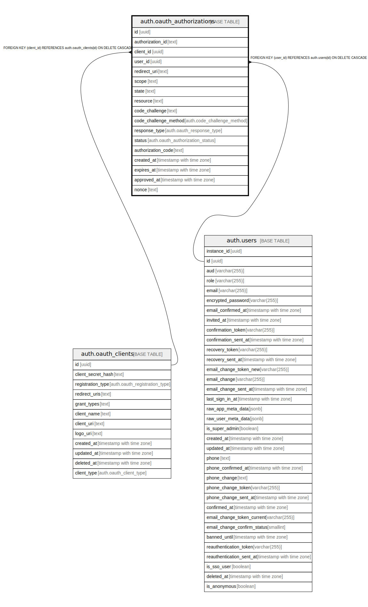

# auth.oauth_authorizations

## Description

## Columns

| Name | Type | Default | Nullable | Children | Parents | Comment |
| ---- | ---- | ------- | -------- | -------- | ------- | ------- |
| id | uuid |  | false |  |  |  |
| authorization_id | text |  | false |  |  |  |
| client_id | uuid |  | false |  | [auth.oauth_clients](auth.oauth_clients.md) |  |
| user_id | uuid |  | true |  | [auth.users](auth.users.md) |  |
| redirect_uri | text |  | false |  |  |  |
| scope | text |  | false |  |  |  |
| state | text |  | true |  |  |  |
| resource | text |  | true |  |  |  |
| code_challenge | text |  | true |  |  |  |
| code_challenge_method | auth.code_challenge_method |  | true |  |  |  |
| response_type | auth.oauth_response_type | 'code'::auth.oauth_response_type | false |  |  |  |
| status | auth.oauth_authorization_status | 'pending'::auth.oauth_authorization_status | false |  |  |  |
| authorization_code | text |  | true |  |  |  |
| created_at | timestamp with time zone | now() | false |  |  |  |
| expires_at | timestamp with time zone | (now() + '00:03:00'::interval) | false |  |  |  |
| approved_at | timestamp with time zone |  | true |  |  |  |
| nonce | text |  | true |  |  |  |

## Constraints

| Name | Type | Definition |
| ---- | ---- | ---------- |
| oauth_authorizations_authorization_code_length | CHECK | CHECK ((char_length(authorization_code) <= 255)) |
| oauth_authorizations_code_challenge_length | CHECK | CHECK ((char_length(code_challenge) <= 128)) |
| oauth_authorizations_expires_at_future | CHECK | CHECK ((expires_at > created_at)) |
| oauth_authorizations_nonce_length | CHECK | CHECK ((char_length(nonce) <= 255)) |
| oauth_authorizations_redirect_uri_length | CHECK | CHECK ((char_length(redirect_uri) <= 2048)) |
| oauth_authorizations_resource_length | CHECK | CHECK ((char_length(resource) <= 2048)) |
| oauth_authorizations_scope_length | CHECK | CHECK ((char_length(scope) <= 4096)) |
| oauth_authorizations_state_length | CHECK | CHECK ((char_length(state) <= 4096)) |
| oauth_authorizations_user_id_fkey | FOREIGN KEY | FOREIGN KEY (user_id) REFERENCES auth.users(id) ON DELETE CASCADE |
| oauth_authorizations_client_id_fkey | FOREIGN KEY | FOREIGN KEY (client_id) REFERENCES auth.oauth_clients(id) ON DELETE CASCADE |
| oauth_authorizations_pkey | PRIMARY KEY | PRIMARY KEY (id) |
| oauth_authorizations_authorization_id_key | UNIQUE | UNIQUE (authorization_id) |
| oauth_authorizations_authorization_code_key | UNIQUE | UNIQUE (authorization_code) |

## Indexes

| Name | Definition |
| ---- | ---------- |
| oauth_authorizations_pkey | CREATE UNIQUE INDEX oauth_authorizations_pkey ON auth.oauth_authorizations USING btree (id) |
| oauth_authorizations_authorization_id_key | CREATE UNIQUE INDEX oauth_authorizations_authorization_id_key ON auth.oauth_authorizations USING btree (authorization_id) |
| oauth_authorizations_authorization_code_key | CREATE UNIQUE INDEX oauth_authorizations_authorization_code_key ON auth.oauth_authorizations USING btree (authorization_code) |
| oauth_auth_pending_exp_idx | CREATE INDEX oauth_auth_pending_exp_idx ON auth.oauth_authorizations USING btree (expires_at) WHERE (status = 'pending'::auth.oauth_authorization_status) |

## Relations

---

> Generated by [tbls](https://github.com/k1LoW/tbls)
