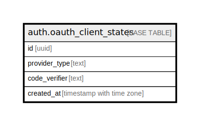

# auth.oauth_client_states

## Description

Stores OAuth states for third-party provider authentication flows where Supabase acts as the OAuth client.

## Columns

| Name | Type | Default | Nullable | Children | Parents | Comment |
| ---- | ---- | ------- | -------- | -------- | ------- | ------- |
| id | uuid |  | false |  |  |  |
| provider_type | text |  | false |  |  |  |
| code_verifier | text |  | true |  |  |  |
| created_at | timestamp with time zone |  | false |  |  |  |

## Constraints

| Name | Type | Definition |
| ---- | ---- | ---------- |
| oauth_client_states_pkey | PRIMARY KEY | PRIMARY KEY (id) |

## Indexes

| Name | Definition |
| ---- | ---------- |
| oauth_client_states_pkey | CREATE UNIQUE INDEX oauth_client_states_pkey ON auth.oauth_client_states USING btree (id) |
| idx_oauth_client_states_created_at | CREATE INDEX idx_oauth_client_states_created_at ON auth.oauth_client_states USING btree (created_at) |

## Relations

---

> Generated by [tbls](https://github.com/k1LoW/tbls)
