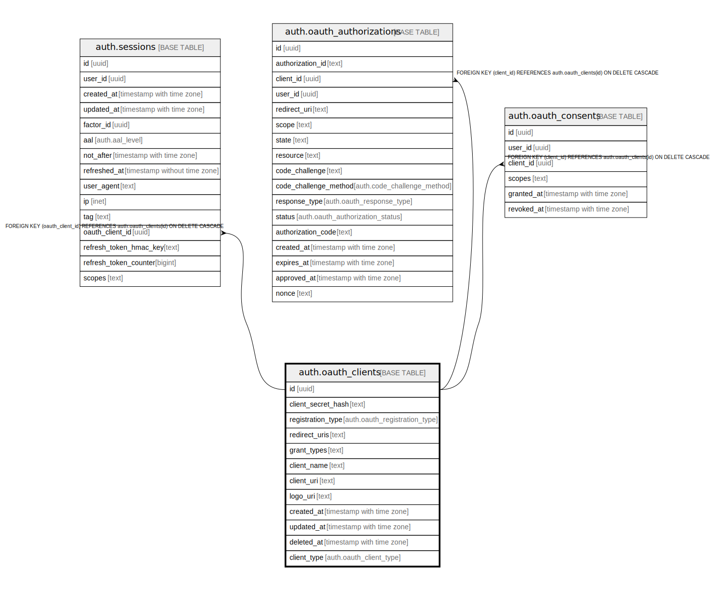

# auth.oauth_clients

## Description

## Columns

| Name | Type | Default | Nullable | Children | Parents | Comment |
| ---- | ---- | ------- | -------- | -------- | ------- | ------- |
| id | uuid |  | false | [auth.sessions](auth.sessions.md) [auth.oauth_authorizations](auth.oauth_authorizations.md) [auth.oauth_consents](auth.oauth_consents.md) |  |  |
| client_secret_hash | text |  | true |  |  |  |
| registration_type | auth.oauth_registration_type |  | false |  |  |  |
| redirect_uris | text |  | false |  |  |  |
| grant_types | text |  | false |  |  |  |
| client_name | text |  | true |  |  |  |
| client_uri | text |  | true |  |  |  |
| logo_uri | text |  | true |  |  |  |
| created_at | timestamp with time zone | now() | false |  |  |  |
| updated_at | timestamp with time zone | now() | false |  |  |  |
| deleted_at | timestamp with time zone |  | true |  |  |  |
| client_type | auth.oauth_client_type | 'confidential'::auth.oauth_client_type | false |  |  |  |

## Constraints

| Name | Type | Definition |
| ---- | ---- | ---------- |
| oauth_clients_client_name_length | CHECK | CHECK ((char_length(client_name) <= 1024)) |
| oauth_clients_client_uri_length | CHECK | CHECK ((char_length(client_uri) <= 2048)) |
| oauth_clients_logo_uri_length | CHECK | CHECK ((char_length(logo_uri) <= 2048)) |
| oauth_clients_pkey | PRIMARY KEY | PRIMARY KEY (id) |

## Indexes

| Name | Definition |
| ---- | ---------- |
| oauth_clients_pkey | CREATE UNIQUE INDEX oauth_clients_pkey ON auth.oauth_clients USING btree (id) |
| oauth_clients_deleted_at_idx | CREATE INDEX oauth_clients_deleted_at_idx ON auth.oauth_clients USING btree (deleted_at) |

## Relations

---

> Generated by [tbls](https://github.com/k1LoW/tbls)
