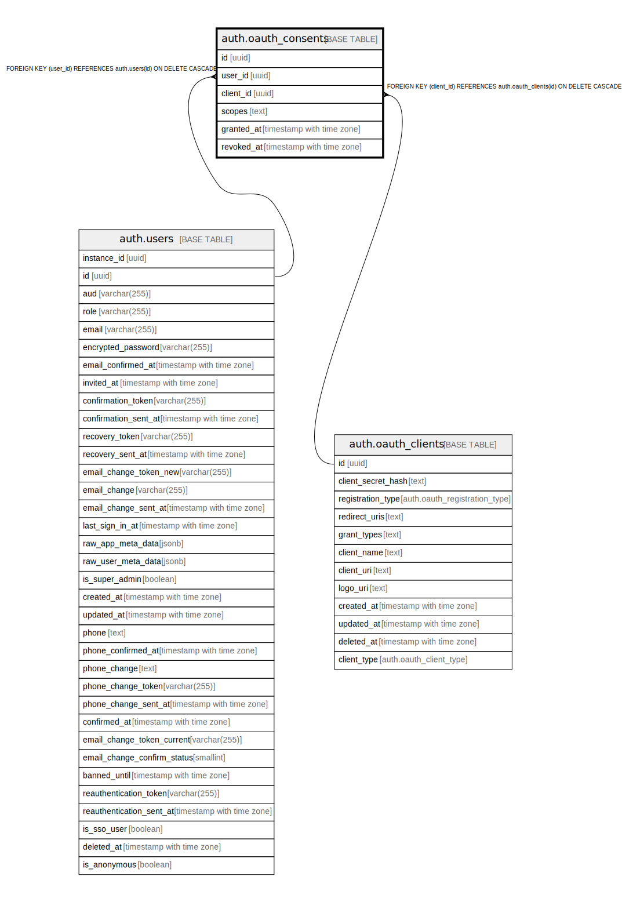

# auth.oauth_consents

## Description

## Columns

| Name | Type | Default | Nullable | Children | Parents | Comment |
| ---- | ---- | ------- | -------- | -------- | ------- | ------- |
| id | uuid |  | false |  |  |  |
| user_id | uuid |  | false |  | [auth.users](auth.users.md) |  |
| client_id | uuid |  | false |  | [auth.oauth_clients](auth.oauth_clients.md) |  |
| scopes | text |  | false |  |  |  |
| granted_at | timestamp with time zone | now() | false |  |  |  |
| revoked_at | timestamp with time zone |  | true |  |  |  |

## Constraints

| Name | Type | Definition |
| ---- | ---- | ---------- |
| oauth_consents_revoked_after_granted | CHECK | CHECK (((revoked_at IS NULL) OR (revoked_at >= granted_at))) |
| oauth_consents_scopes_length | CHECK | CHECK ((char_length(scopes) <= 2048)) |
| oauth_consents_scopes_not_empty | CHECK | CHECK ((char_length(TRIM(BOTH FROM scopes)) > 0)) |
| oauth_consents_user_id_fkey | FOREIGN KEY | FOREIGN KEY (user_id) REFERENCES auth.users(id) ON DELETE CASCADE |
| oauth_consents_client_id_fkey | FOREIGN KEY | FOREIGN KEY (client_id) REFERENCES auth.oauth_clients(id) ON DELETE CASCADE |
| oauth_consents_pkey | PRIMARY KEY | PRIMARY KEY (id) |
| oauth_consents_user_client_unique | UNIQUE | UNIQUE (user_id, client_id) |

## Indexes

| Name | Definition |
| ---- | ---------- |
| oauth_consents_pkey | CREATE UNIQUE INDEX oauth_consents_pkey ON auth.oauth_consents USING btree (id) |
| oauth_consents_user_client_unique | CREATE UNIQUE INDEX oauth_consents_user_client_unique ON auth.oauth_consents USING btree (user_id, client_id) |
| oauth_consents_active_user_client_idx | CREATE INDEX oauth_consents_active_user_client_idx ON auth.oauth_consents USING btree (user_id, client_id) WHERE (revoked_at IS NULL) |
| oauth_consents_user_order_idx | CREATE INDEX oauth_consents_user_order_idx ON auth.oauth_consents USING btree (user_id, granted_at DESC) |
| oauth_consents_active_client_idx | CREATE INDEX oauth_consents_active_client_idx ON auth.oauth_consents USING btree (client_id) WHERE (revoked_at IS NULL) |

## Relations

---

> Generated by [tbls](https://github.com/k1LoW/tbls)
