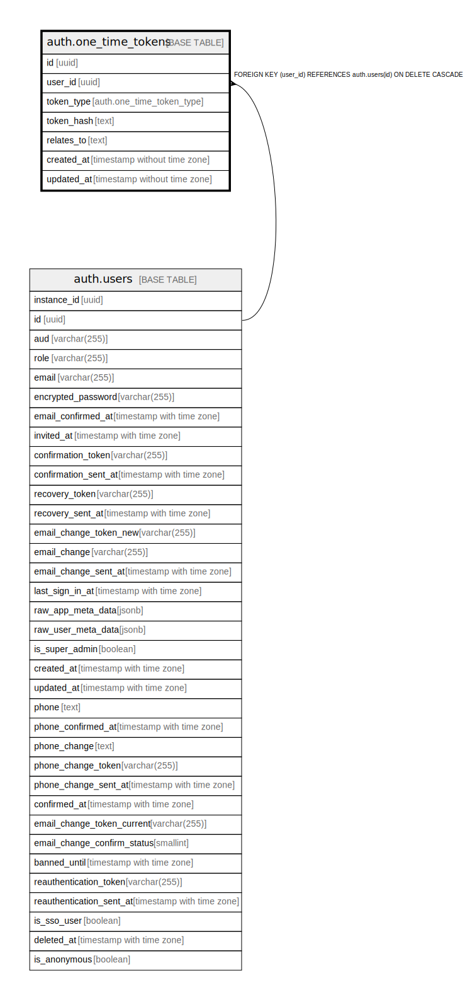

# auth.one_time_tokens

## Description

## Columns

| Name | Type | Default | Nullable | Children | Parents | Comment |
| ---- | ---- | ------- | -------- | -------- | ------- | ------- |
| id | uuid |  | false |  |  |  |
| user_id | uuid |  | false |  | [auth.users](auth.users.md) |  |
| token_type | auth.one_time_token_type |  | false |  |  |  |
| token_hash | text |  | false |  |  |  |
| relates_to | text |  | false |  |  |  |
| created_at | timestamp without time zone | now() | false |  |  |  |
| updated_at | timestamp without time zone | now() | false |  |  |  |

## Constraints

| Name | Type | Definition |
| ---- | ---- | ---------- |
| one_time_tokens_token_hash_check | CHECK | CHECK ((char_length(token_hash) > 0)) |
| one_time_tokens_user_id_fkey | FOREIGN KEY | FOREIGN KEY (user_id) REFERENCES auth.users(id) ON DELETE CASCADE |
| one_time_tokens_pkey | PRIMARY KEY | PRIMARY KEY (id) |

## Indexes

| Name | Definition |
| ---- | ---------- |
| one_time_tokens_pkey | CREATE UNIQUE INDEX one_time_tokens_pkey ON auth.one_time_tokens USING btree (id) |
| one_time_tokens_token_hash_hash_idx | CREATE INDEX one_time_tokens_token_hash_hash_idx ON auth.one_time_tokens USING hash (token_hash) |
| one_time_tokens_relates_to_hash_idx | CREATE INDEX one_time_tokens_relates_to_hash_idx ON auth.one_time_tokens USING hash (relates_to) |
| one_time_tokens_user_id_token_type_key | CREATE UNIQUE INDEX one_time_tokens_user_id_token_type_key ON auth.one_time_tokens USING btree (user_id, token_type) |

## Relations

---

> Generated by [tbls](https://github.com/k1LoW/tbls)
