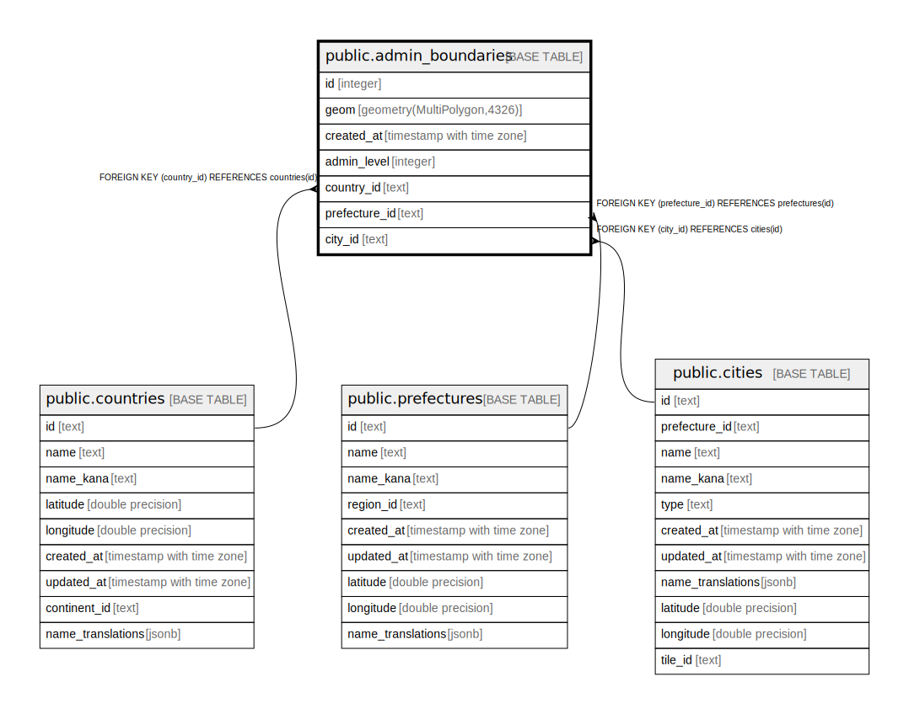

# public.admin_boundaries

## Description

行政区域ポリゴン（国土数値情報N03由来）

## Columns

| Name | Type | Default | Nullable | Children | Parents | Comment |
| ---- | ---- | ------- | -------- | -------- | ------- | ------- |
| id | integer | nextval('admin_boundaries_id_seq'::regclass) | false |  |  |  |
| geom | geometry(MultiPolygon,4326) |  | true |  |  |  |
| created_at | timestamp with time zone | now() | true |  |  |  |
| admin_level | integer |  | true |  |  | OSM admin_level (4=都道府県相当, 6-7=市区町村相当) |
| country_id | text |  | true |  | [public.countries](public.countries.md) | 国ID → countries.id (jp, kr, th, tw, cn) |
| prefecture_id | text |  | true |  | [public.prefectures](public.prefectures.md) | 都道府県ID → prefectures.id |
| city_id | text |  | true |  | [public.cities](public.cities.md) | 市区町村ID → cities.id |

## Constraints

| Name | Type | Definition |
| ---- | ---- | ---------- |
| admin_boundaries_prefecture_id_fkey | FOREIGN KEY | FOREIGN KEY (prefecture_id) REFERENCES prefectures(id) |
| admin_boundaries_city_id_fkey | FOREIGN KEY | FOREIGN KEY (city_id) REFERENCES cities(id) |
| admin_boundaries_pkey | PRIMARY KEY | PRIMARY KEY (id) |
| admin_boundaries_country_id_fkey | FOREIGN KEY | FOREIGN KEY (country_id) REFERENCES countries(id) |
| admin_boundaries_city_id_unique | UNIQUE | UNIQUE (city_id) |

## Indexes

| Name | Definition |
| ---- | ---------- |
| admin_boundaries_pkey | CREATE UNIQUE INDEX admin_boundaries_pkey ON public.admin_boundaries USING btree (id) |
| idx_admin_boundaries_geom | CREATE INDEX idx_admin_boundaries_geom ON public.admin_boundaries USING gist (geom) |
| idx_admin_boundaries_admin_level | CREATE INDEX idx_admin_boundaries_admin_level ON public.admin_boundaries USING btree (admin_level) |
| idx_admin_boundaries_country_id | CREATE INDEX idx_admin_boundaries_country_id ON public.admin_boundaries USING btree (country_id) |
| idx_admin_boundaries_prefecture_id | CREATE INDEX idx_admin_boundaries_prefecture_id ON public.admin_boundaries USING btree (prefecture_id) |
| idx_admin_boundaries_city_id | CREATE INDEX idx_admin_boundaries_city_id ON public.admin_boundaries USING btree (city_id) |
| idx_admin_boundaries_country_level | CREATE INDEX idx_admin_boundaries_country_level ON public.admin_boundaries USING btree (country_id, admin_level) |
| admin_boundaries_city_id_unique | CREATE UNIQUE INDEX admin_boundaries_city_id_unique ON public.admin_boundaries USING btree (city_id) |

## Relations

---

> Generated by [tbls](https://github.com/k1LoW/tbls)
