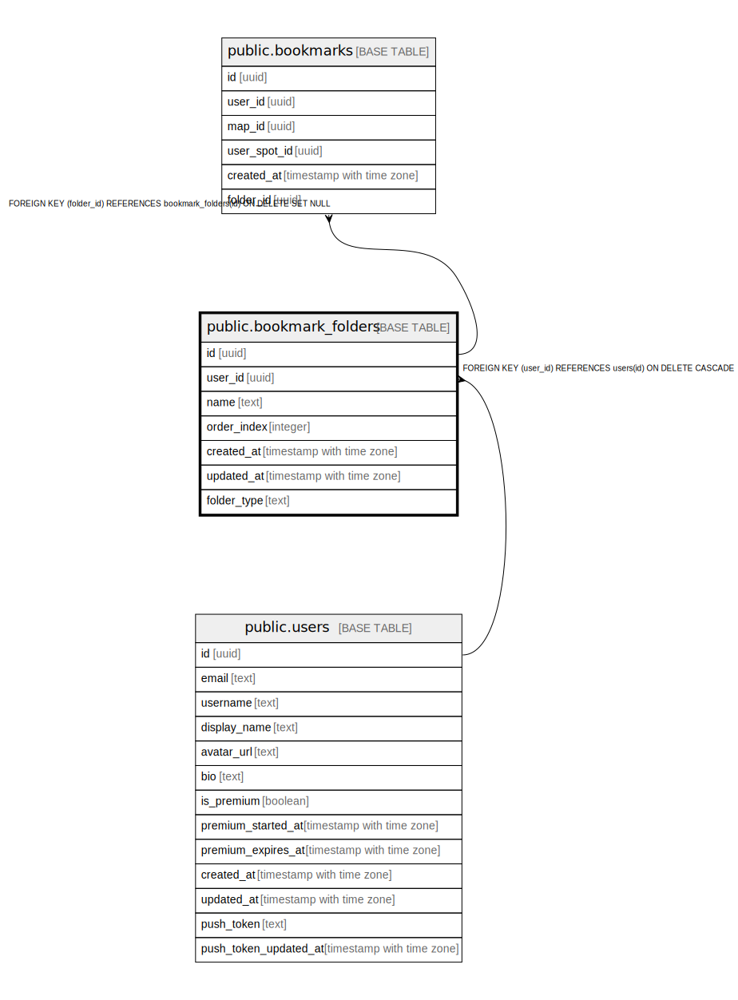

# public.bookmark_folders

## Description

## Columns

| Name | Type | Default | Nullable | Children | Parents | Comment |
| ---- | ---- | ------- | -------- | -------- | ------- | ------- |
| id | uuid | gen_random_uuid() | false | [public.bookmarks](public.bookmarks.md) |  |  |
| user_id | uuid |  | false |  | [public.users](public.users.md) |  |
| name | text |  | false |  |  |  |
| order_index | integer | 0 | true |  |  |  |
| created_at | timestamp with time zone | now() | false |  |  |  |
| updated_at | timestamp with time zone | now() | false |  |  |  |
| folder_type | text | 'spots'::text | false |  |  |  |

## Constraints

| Name | Type | Definition |
| ---- | ---- | ---------- |
| bookmark_folders_folder_type_check | CHECK | CHECK ((folder_type = ANY (ARRAY['spots'::text, 'maps'::text]))) |
| bookmark_folders_user_id_fkey | FOREIGN KEY | FOREIGN KEY (user_id) REFERENCES users(id) ON DELETE CASCADE |
| bookmark_folders_pkey | PRIMARY KEY | PRIMARY KEY (id) |

## Indexes

| Name | Definition |
| ---- | ---------- |
| bookmark_folders_pkey | CREATE UNIQUE INDEX bookmark_folders_pkey ON public.bookmark_folders USING btree (id) |
| idx_bookmark_folders_user_id | CREATE INDEX idx_bookmark_folders_user_id ON public.bookmark_folders USING btree (user_id) |
| idx_bookmark_folders_type | CREATE INDEX idx_bookmark_folders_type ON public.bookmark_folders USING btree (folder_type) |

## Triggers

| Name | Definition |
| ---- | ---------- |
| update_bookmark_folders_updated_at | CREATE TRIGGER update_bookmark_folders_updated_at BEFORE UPDATE ON public.bookmark_folders FOR EACH ROW EXECUTE FUNCTION update_updated_at_column() |

## Relations

---

> Generated by [tbls](https://github.com/k1LoW/tbls)
