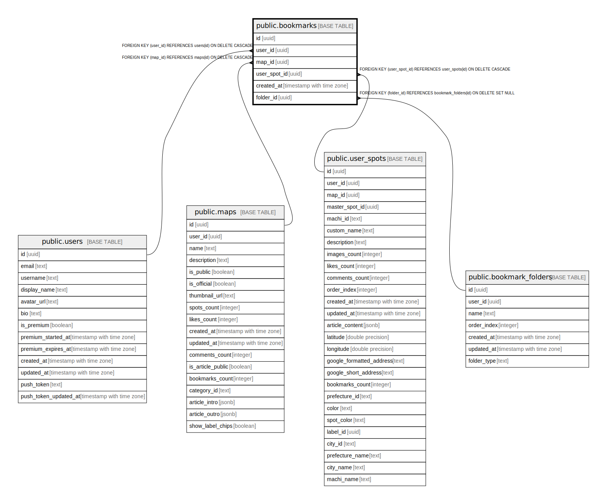

# public.bookmarks

## Description

## Columns

| Name | Type | Default | Nullable | Children | Parents | Comment |
| ---- | ---- | ------- | -------- | -------- | ------- | ------- |
| id | uuid | gen_random_uuid() | false |  |  |  |
| user_id | uuid |  | false |  | [public.users](public.users.md) |  |
| map_id | uuid |  | true |  | [public.maps](public.maps.md) |  |
| user_spot_id | uuid |  | true |  | [public.user_spots](public.user_spots.md) |  |
| created_at | timestamp with time zone | now() | false |  |  |  |
| folder_id | uuid |  | true |  | [public.bookmark_folders](public.bookmark_folders.md) |  |

## Constraints

| Name | Type | Definition |
| ---- | ---- | ---------- |
| bookmarks_check | CHECK | CHECK ((((map_id IS NOT NULL) AND (user_spot_id IS NULL)) OR ((map_id IS NULL) AND (user_spot_id IS NOT NULL)))) |
| bookmarks_user_id_fkey | FOREIGN KEY | FOREIGN KEY (user_id) REFERENCES users(id) ON DELETE CASCADE |
| bookmarks_map_id_fkey | FOREIGN KEY | FOREIGN KEY (map_id) REFERENCES maps(id) ON DELETE CASCADE |
| bookmarks_pkey | PRIMARY KEY | PRIMARY KEY (id) |
| bookmarks_user_spot_id_fkey | FOREIGN KEY | FOREIGN KEY (user_spot_id) REFERENCES user_spots(id) ON DELETE CASCADE |
| bookmarks_folder_id_fkey | FOREIGN KEY | FOREIGN KEY (folder_id) REFERENCES bookmark_folders(id) ON DELETE SET NULL |

## Indexes

| Name | Definition |
| ---- | ---------- |
| bookmarks_pkey | CREATE UNIQUE INDEX bookmarks_pkey ON public.bookmarks USING btree (id) |
| idx_bookmarks_user_id | CREATE INDEX idx_bookmarks_user_id ON public.bookmarks USING btree (user_id) |
| idx_bookmarks_map_id | CREATE INDEX idx_bookmarks_map_id ON public.bookmarks USING btree (map_id) |
| idx_bookmarks_folder_id | CREATE INDEX idx_bookmarks_folder_id ON public.bookmarks USING btree (folder_id) |
| bookmarks_user_map_folder_unique | CREATE UNIQUE INDEX bookmarks_user_map_folder_unique ON public.bookmarks USING btree (user_id, map_id, COALESCE(folder_id, '00000000-0000-0000-0000-000000000000'::uuid)) WHERE (map_id IS NOT NULL) |
| idx_bookmarks_user_spot_id | CREATE INDEX idx_bookmarks_user_spot_id ON public.bookmarks USING btree (user_spot_id) |
| bookmarks_user_spot_folder_unique | CREATE UNIQUE INDEX bookmarks_user_spot_folder_unique ON public.bookmarks USING btree (user_id, user_spot_id, COALESCE(folder_id, '00000000-0000-0000-0000-000000000000'::uuid)) WHERE (user_spot_id IS NOT NULL) |

## Triggers

| Name | Definition |
| ---- | ---------- |
| trigger_update_bookmarks_count | CREATE TRIGGER trigger_update_bookmarks_count AFTER INSERT OR DELETE ON public.bookmarks FOR EACH ROW EXECUTE FUNCTION update_bookmarks_count() |

## Relations

---

> Generated by [tbls](https://github.com/k1LoW/tbls)
