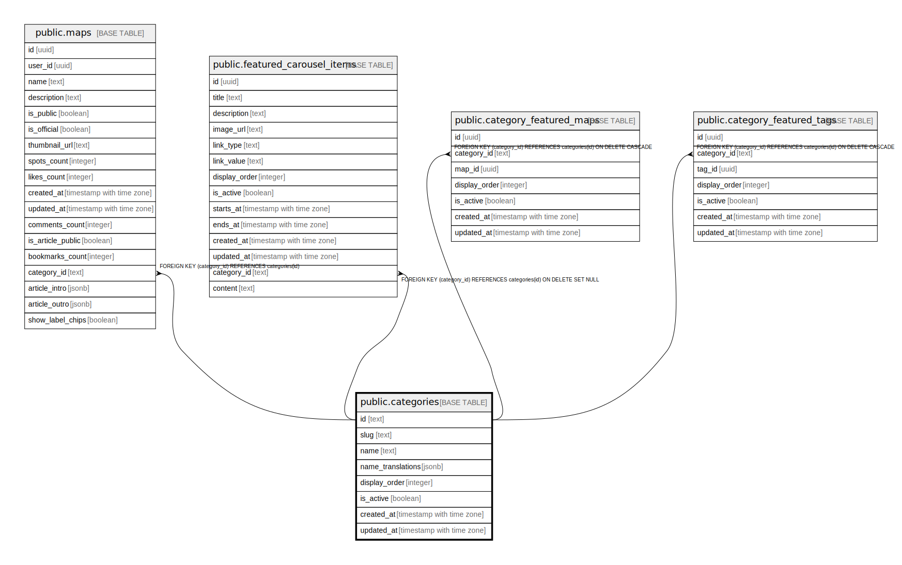

# public.categories

## Description

マップカテゴリ（グルメ、旅行など）

## Columns

| Name | Type | Default | Nullable | Children | Parents | Comment |
| ---- | ---- | ------- | -------- | -------- | ------- | ------- |
| id | text |  | false | [public.maps](public.maps.md) [public.featured_carousel_items](public.featured_carousel_items.md) [public.category_featured_maps](public.category_featured_maps.md) [public.category_featured_tags](public.category_featured_tags.md) |  |  |
| slug | text |  | false |  |  |  |
| name | text |  | false |  |  |  |
| name_translations | jsonb |  | true |  |  |  |
| display_order | integer | 0 | false |  |  |  |
| is_active | boolean | true | false |  |  |  |
| created_at | timestamp with time zone | now() | false |  |  |  |
| updated_at | timestamp with time zone | now() | false |  |  |  |

## Constraints

| Name | Type | Definition |
| ---- | ---- | ---------- |
| categories_pkey | PRIMARY KEY | PRIMARY KEY (id) |
| categories_slug_key | UNIQUE | UNIQUE (slug) |

## Indexes

| Name | Definition |
| ---- | ---------- |
| categories_pkey | CREATE UNIQUE INDEX categories_pkey ON public.categories USING btree (id) |
| categories_slug_key | CREATE UNIQUE INDEX categories_slug_key ON public.categories USING btree (slug) |
| idx_categories_display_order | CREATE INDEX idx_categories_display_order ON public.categories USING btree (display_order) |
| idx_categories_is_active | CREATE INDEX idx_categories_is_active ON public.categories USING btree (is_active) |

## Triggers

| Name | Definition |
| ---- | ---------- |
| update_categories_updated_at | CREATE TRIGGER update_categories_updated_at BEFORE UPDATE ON public.categories FOR EACH ROW EXECUTE FUNCTION update_updated_at_column() |

## Relations

---

> Generated by [tbls](https://github.com/k1LoW/tbls)
