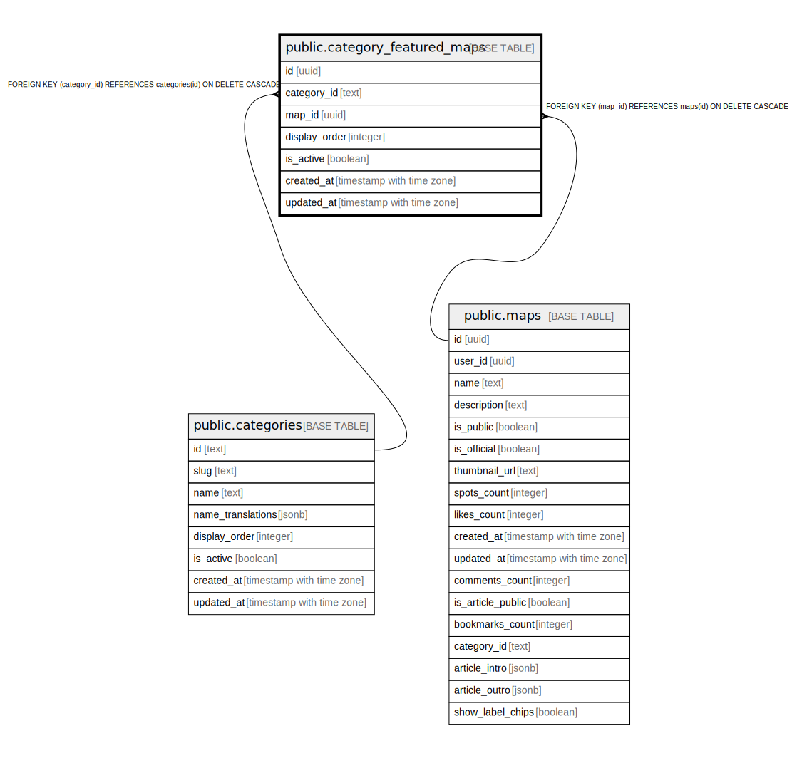

# public.category_featured_maps

## Description

カテゴリ別おすすめマップ（運営選定）

## Columns

| Name | Type | Default | Nullable | Children | Parents | Comment |
| ---- | ---- | ------- | -------- | -------- | ------- | ------- |
| id | uuid | gen_random_uuid() | false |  |  |  |
| category_id | text |  | false |  | [public.categories](public.categories.md) | カテゴリID |
| map_id | uuid |  | false |  | [public.maps](public.maps.md) | マップID |
| display_order | integer | 0 | false |  |  | 表示順序（小さい順） |
| is_active | boolean | true | false |  |  | 有効フラグ |
| created_at | timestamp with time zone | now() | false |  |  |  |
| updated_at | timestamp with time zone | now() | false |  |  |  |

## Constraints

| Name | Type | Definition |
| ---- | ---- | ---------- |
| category_featured_maps_map_id_fkey | FOREIGN KEY | FOREIGN KEY (map_id) REFERENCES maps(id) ON DELETE CASCADE |
| category_featured_maps_category_id_fkey | FOREIGN KEY | FOREIGN KEY (category_id) REFERENCES categories(id) ON DELETE CASCADE |
| category_featured_maps_pkey | PRIMARY KEY | PRIMARY KEY (id) |
| category_featured_maps_category_id_map_id_key | UNIQUE | UNIQUE (category_id, map_id) |

## Indexes

| Name | Definition |
| ---- | ---------- |
| category_featured_maps_pkey | CREATE UNIQUE INDEX category_featured_maps_pkey ON public.category_featured_maps USING btree (id) |
| category_featured_maps_category_id_map_id_key | CREATE UNIQUE INDEX category_featured_maps_category_id_map_id_key ON public.category_featured_maps USING btree (category_id, map_id) |
| idx_category_featured_maps_category | CREATE INDEX idx_category_featured_maps_category ON public.category_featured_maps USING btree (category_id) |
| idx_category_featured_maps_active | CREATE INDEX idx_category_featured_maps_active ON public.category_featured_maps USING btree (is_active) WHERE (is_active = true) |

## Triggers

| Name | Definition |
| ---- | ---------- |
| update_category_featured_maps_updated_at | CREATE TRIGGER update_category_featured_maps_updated_at BEFORE UPDATE ON public.category_featured_maps FOR EACH ROW EXECUTE FUNCTION update_updated_at_column() |

## Relations

---

> Generated by [tbls](https://github.com/k1LoW/tbls)
