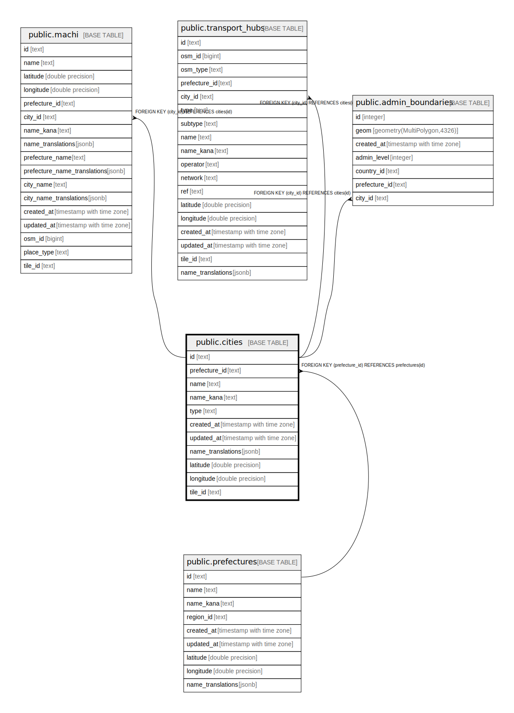

# public.cities

## Description

## Columns

| Name | Type | Default | Nullable | Children | Parents | Comment |
| ---- | ---- | ------- | -------- | -------- | ------- | ------- |
| id | text |  | false | [public.machi](public.machi.md) [public.transport_hubs](public.transport_hubs.md) [public.admin_boundaries](public.admin_boundaries.md) |  |  |
| prefecture_id | text |  | false |  | [public.prefectures](public.prefectures.md) |  |
| name | text |  | false |  |  |  |
| name_kana | text |  | true |  |  |  |
| type | text |  | false |  |  |  |
| created_at | timestamp with time zone | now() | false |  |  |  |
| updated_at | timestamp with time zone | now() | false |  |  |  |
| name_translations | jsonb |  | true |  |  |  |
| latitude | double precision |  | true |  |  |  |
| longitude | double precision |  | true |  |  |  |
| tile_id | text |  | true |  |  |  |

## Constraints

| Name | Type | Definition |
| ---- | ---- | ---------- |
| cities_type_check | CHECK | CHECK ((type = ANY (ARRAY['区'::text, '市'::text, '町'::text, '村'::text]))) |
| cities_prefecture_id_fkey | FOREIGN KEY | FOREIGN KEY (prefecture_id) REFERENCES prefectures(id) |
| cities_pkey | PRIMARY KEY | PRIMARY KEY (id) |

## Indexes

| Name | Definition |
| ---- | ---------- |
| cities_pkey | CREATE UNIQUE INDEX cities_pkey ON public.cities USING btree (id) |
| idx_cities_prefecture_id | CREATE INDEX idx_cities_prefecture_id ON public.cities USING btree (prefecture_id) |
| idx_cities_tile_id | CREATE INDEX idx_cities_tile_id ON public.cities USING btree (tile_id) |

## Triggers

| Name | Definition |
| ---- | ---------- |
| update_cities_updated_at | CREATE TRIGGER update_cities_updated_at BEFORE UPDATE ON public.cities FOR EACH ROW EXECUTE FUNCTION update_updated_at_column() |

## Relations

---

> Generated by [tbls](https://github.com/k1LoW/tbls)
