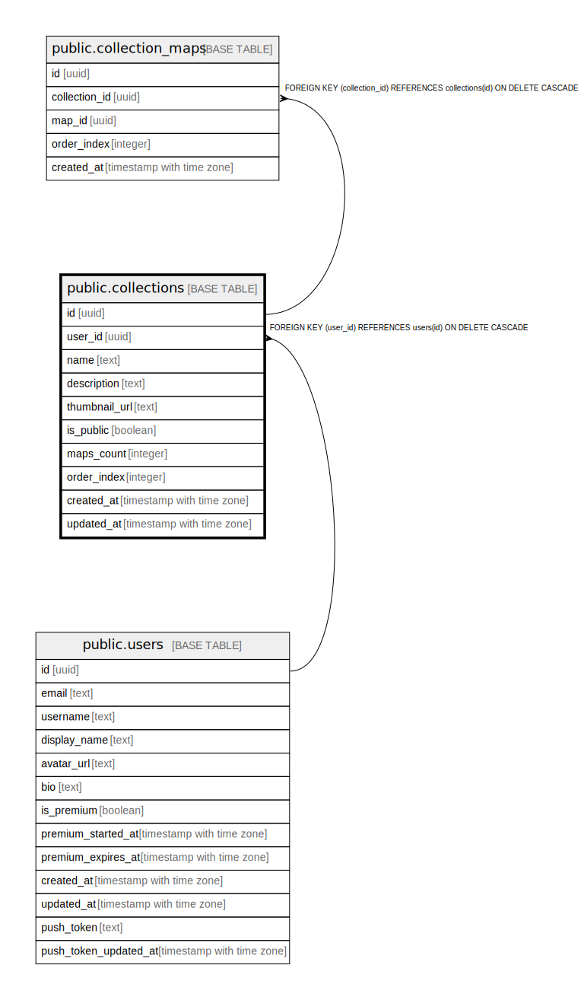

# public.collections

## Description

## Columns

| Name | Type | Default | Nullable | Children | Parents | Comment |
| ---- | ---- | ------- | -------- | -------- | ------- | ------- |
| id | uuid | gen_random_uuid() | false | [public.collection_maps](public.collection_maps.md) |  |  |
| user_id | uuid |  | false |  | [public.users](public.users.md) |  |
| name | text |  | false |  |  |  |
| description | text |  | true |  |  |  |
| thumbnail_url | text |  | true |  |  |  |
| is_public | boolean | false | false |  |  | コレクションが公開されているかどうか（デフォルト: false） |
| maps_count | integer | 0 | false |  |  | マップ数（デフォルト: 0） |
| order_index | integer | 0 | true |  |  |  |
| created_at | timestamp with time zone | now() | false |  |  |  |
| updated_at | timestamp with time zone | now() | false |  |  |  |

## Constraints

| Name | Type | Definition |
| ---- | ---- | ---------- |
| collections_user_id_fkey | FOREIGN KEY | FOREIGN KEY (user_id) REFERENCES users(id) ON DELETE CASCADE |
| collections_pkey | PRIMARY KEY | PRIMARY KEY (id) |

## Indexes

| Name | Definition |
| ---- | ---------- |
| collections_pkey | CREATE UNIQUE INDEX collections_pkey ON public.collections USING btree (id) |
| idx_collections_user_id | CREATE INDEX idx_collections_user_id ON public.collections USING btree (user_id) |
| idx_collections_is_public | CREATE INDEX idx_collections_is_public ON public.collections USING btree (is_public) |

## Triggers

| Name | Definition |
| ---- | ---------- |
| update_collections_updated_at | CREATE TRIGGER update_collections_updated_at BEFORE UPDATE ON public.collections FOR EACH ROW EXECUTE FUNCTION update_updated_at_column() |

## Relations

---

> Generated by [tbls](https://github.com/k1LoW/tbls)
