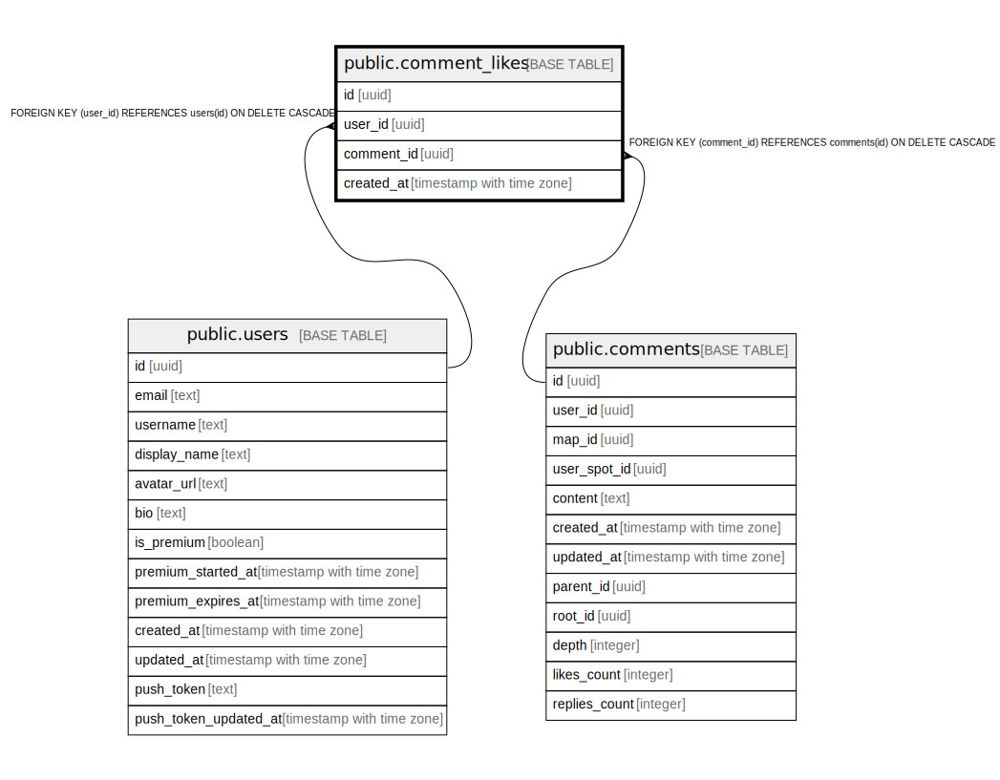

# public.comment_likes

## Description

## Columns

| Name | Type | Default | Nullable | Children | Parents | Comment |
| ---- | ---- | ------- | -------- | -------- | ------- | ------- |
| id | uuid | gen_random_uuid() | false |  |  |  |
| user_id | uuid |  | false |  | [public.users](public.users.md) |  |
| comment_id | uuid |  | false |  | [public.comments](public.comments.md) |  |
| created_at | timestamp with time zone | now() | false |  |  |  |

## Constraints

| Name | Type | Definition |
| ---- | ---- | ---------- |
| comment_likes_user_id_fkey | FOREIGN KEY | FOREIGN KEY (user_id) REFERENCES users(id) ON DELETE CASCADE |
| comment_likes_comment_id_fkey | FOREIGN KEY | FOREIGN KEY (comment_id) REFERENCES comments(id) ON DELETE CASCADE |
| comment_likes_pkey | PRIMARY KEY | PRIMARY KEY (id) |
| comment_likes_user_id_comment_id_key | UNIQUE | UNIQUE (user_id, comment_id) |

## Indexes

| Name | Definition |
| ---- | ---------- |
| comment_likes_pkey | CREATE UNIQUE INDEX comment_likes_pkey ON public.comment_likes USING btree (id) |
| comment_likes_user_id_comment_id_key | CREATE UNIQUE INDEX comment_likes_user_id_comment_id_key ON public.comment_likes USING btree (user_id, comment_id) |
| idx_comment_likes_user_id | CREATE INDEX idx_comment_likes_user_id ON public.comment_likes USING btree (user_id) |
| idx_comment_likes_comment_id | CREATE INDEX idx_comment_likes_comment_id ON public.comment_likes USING btree (comment_id) |

## Triggers

| Name | Definition |
| ---- | ---------- |
| trigger_decrement_comment_likes | CREATE TRIGGER trigger_decrement_comment_likes AFTER DELETE ON public.comment_likes FOR EACH ROW EXECUTE FUNCTION decrement_comment_likes_count() |
| trigger_increment_comment_likes | CREATE TRIGGER trigger_increment_comment_likes AFTER INSERT ON public.comment_likes FOR EACH ROW EXECUTE FUNCTION increment_comment_likes_count() |

## Relations

---

> Generated by [tbls](https://github.com/k1LoW/tbls)
