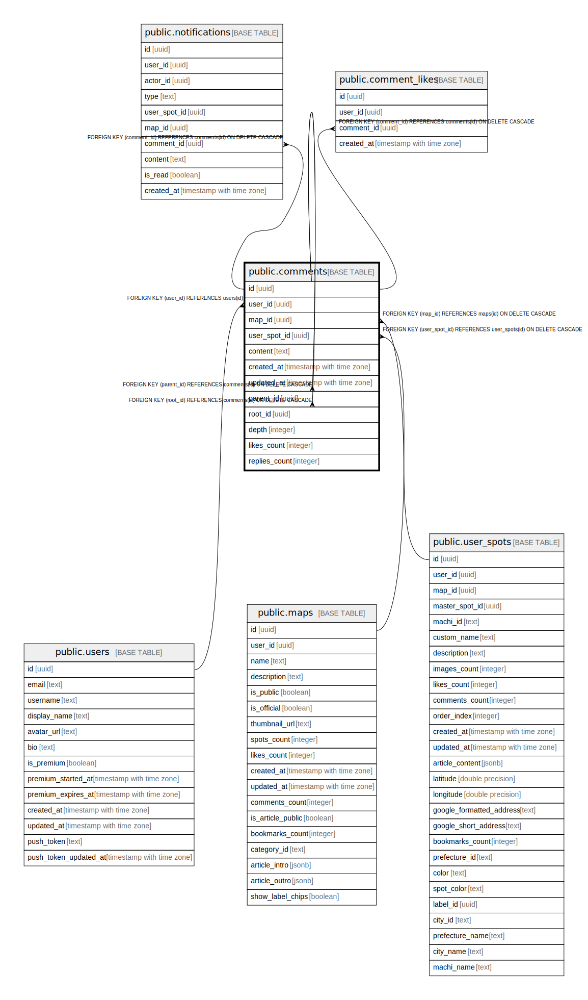

# public.comments

## Description

## Columns

| Name | Type | Default | Nullable | Children | Parents | Comment |
| ---- | ---- | ------- | -------- | -------- | ------- | ------- |
| id | uuid | gen_random_uuid() | false | [public.comments](public.comments.md) [public.notifications](public.notifications.md) [public.comment_likes](public.comment_likes.md) |  |  |
| user_id | uuid |  | false |  | [public.users](public.users.md) |  |
| map_id | uuid |  | true |  | [public.maps](public.maps.md) |  |
| user_spot_id | uuid |  | true |  | [public.user_spots](public.user_spots.md) |  |
| content | text |  | false |  |  |  |
| created_at | timestamp with time zone | now() | false |  |  |  |
| updated_at | timestamp with time zone | now() | false |  |  |  |
| parent_id | uuid |  | true |  | [public.comments](public.comments.md) |  |
| root_id | uuid |  | true |  | [public.comments](public.comments.md) |  |
| depth | integer | 0 | false |  |  |  |
| likes_count | integer | 0 | false |  |  |  |
| replies_count | integer | 0 | false |  |  |  |

## Constraints

| Name | Type | Definition |
| ---- | ---- | ---------- |
| comments_check | CHECK | CHECK ((((map_id IS NOT NULL) AND (user_spot_id IS NULL)) OR ((map_id IS NULL) AND (user_spot_id IS NOT NULL)))) |
| comments_user_id_fkey | FOREIGN KEY | FOREIGN KEY (user_id) REFERENCES users(id) |
| comments_map_id_fkey | FOREIGN KEY | FOREIGN KEY (map_id) REFERENCES maps(id) ON DELETE CASCADE |
| comments_parent_id_fkey | FOREIGN KEY | FOREIGN KEY (parent_id) REFERENCES comments(id) ON DELETE CASCADE |
| comments_pkey | PRIMARY KEY | PRIMARY KEY (id) |
| comments_root_id_fkey | FOREIGN KEY | FOREIGN KEY (root_id) REFERENCES comments(id) ON DELETE CASCADE |
| comments_user_spot_id_fkey | FOREIGN KEY | FOREIGN KEY (user_spot_id) REFERENCES user_spots(id) ON DELETE CASCADE |

## Indexes

| Name | Definition |
| ---- | ---------- |
| comments_pkey | CREATE UNIQUE INDEX comments_pkey ON public.comments USING btree (id) |
| idx_comments_user_id | CREATE INDEX idx_comments_user_id ON public.comments USING btree (user_id) |
| idx_comments_map_id | CREATE INDEX idx_comments_map_id ON public.comments USING btree (map_id) |
| idx_comments_created_at | CREATE INDEX idx_comments_created_at ON public.comments USING btree (created_at DESC) |
| idx_comments_parent_id | CREATE INDEX idx_comments_parent_id ON public.comments USING btree (parent_id) |
| idx_comments_root_id | CREATE INDEX idx_comments_root_id ON public.comments USING btree (root_id) |
| idx_comments_depth | CREATE INDEX idx_comments_depth ON public.comments USING btree (depth) |
| idx_comments_user_spot_id | CREATE INDEX idx_comments_user_spot_id ON public.comments USING btree (user_spot_id) |

## Triggers

| Name | Definition |
| ---- | ---------- |
| on_map_comment_create_notification | CREATE TRIGGER on_map_comment_create_notification AFTER INSERT ON public.comments FOR EACH ROW WHEN ((new.map_id IS NOT NULL)) EXECUTE FUNCTION create_comment_map_notification() |
| on_user_spot_comment_create_notification | CREATE TRIGGER on_user_spot_comment_create_notification AFTER INSERT ON public.comments FOR EACH ROW WHEN ((new.user_spot_id IS NOT NULL)) EXECUTE FUNCTION create_comment_spot_notification() |
| trigger_decrement_comment_replies | CREATE TRIGGER trigger_decrement_comment_replies AFTER DELETE ON public.comments FOR EACH ROW EXECUTE FUNCTION decrement_comment_replies_count() |
| trigger_increment_comment_replies | CREATE TRIGGER trigger_increment_comment_replies AFTER INSERT ON public.comments FOR EACH ROW EXECUTE FUNCTION increment_comment_replies_count() |
| trigger_update_comments_count | CREATE TRIGGER trigger_update_comments_count AFTER INSERT OR DELETE ON public.comments FOR EACH ROW EXECUTE FUNCTION update_comments_count() |
| update_comments_updated_at | CREATE TRIGGER update_comments_updated_at BEFORE UPDATE ON public.comments FOR EACH ROW EXECUTE FUNCTION update_updated_at_column() |

## Relations

---

> Generated by [tbls](https://github.com/k1LoW/tbls)
