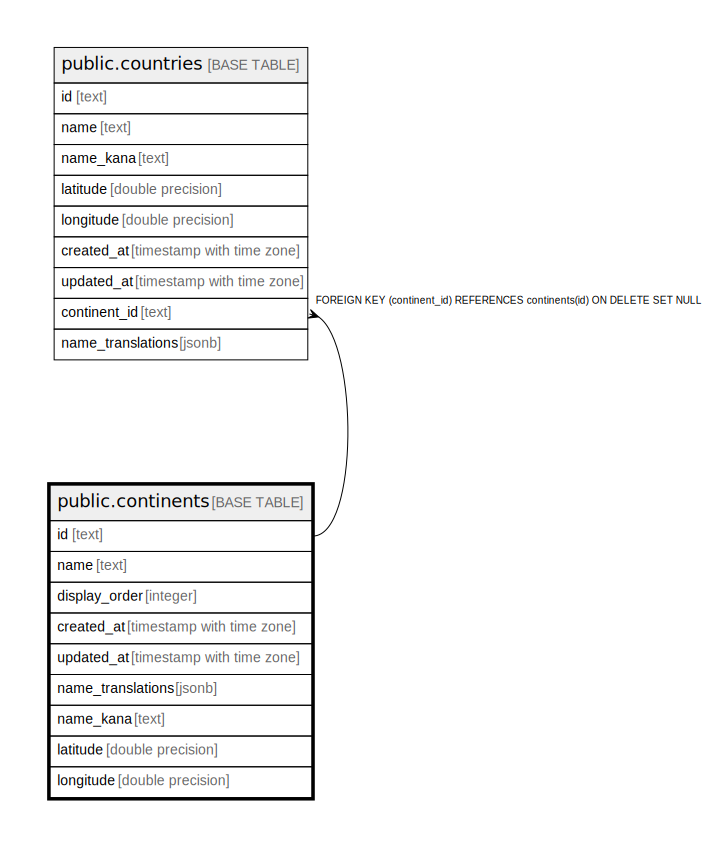

# public.continents

## Description

大陸マスターテーブル

## Columns

| Name | Type | Default | Nullable | Children | Parents | Comment |
| ---- | ---- | ------- | -------- | -------- | ------- | ------- |
| id | text |  | false | [public.countries](public.countries.md) |  | 大陸ID (例: east_asia, europe) |
| name | text |  | false |  |  | 大陸名（日本語） |
| display_order | integer | 0 | false |  |  | 表示順序 |
| created_at | timestamp with time zone | now() | false |  |  |  |
| updated_at | timestamp with time zone | now() | false |  |  |  |
| name_translations | jsonb |  | true |  |  |  |
| name_kana | text |  | true |  |  |  |
| latitude | double precision |  | false |  |  | 大陸の代表緯度 |
| longitude | double precision |  | false |  |  | 大陸の代表経度 |

## Constraints

| Name | Type | Definition |
| ---- | ---- | ---------- |
| continents_pkey | PRIMARY KEY | PRIMARY KEY (id) |

## Indexes

| Name | Definition |
| ---- | ---------- |
| continents_pkey | CREATE UNIQUE INDEX continents_pkey ON public.continents USING btree (id) |

## Relations

---

> Generated by [tbls](https://github.com/k1LoW/tbls)
