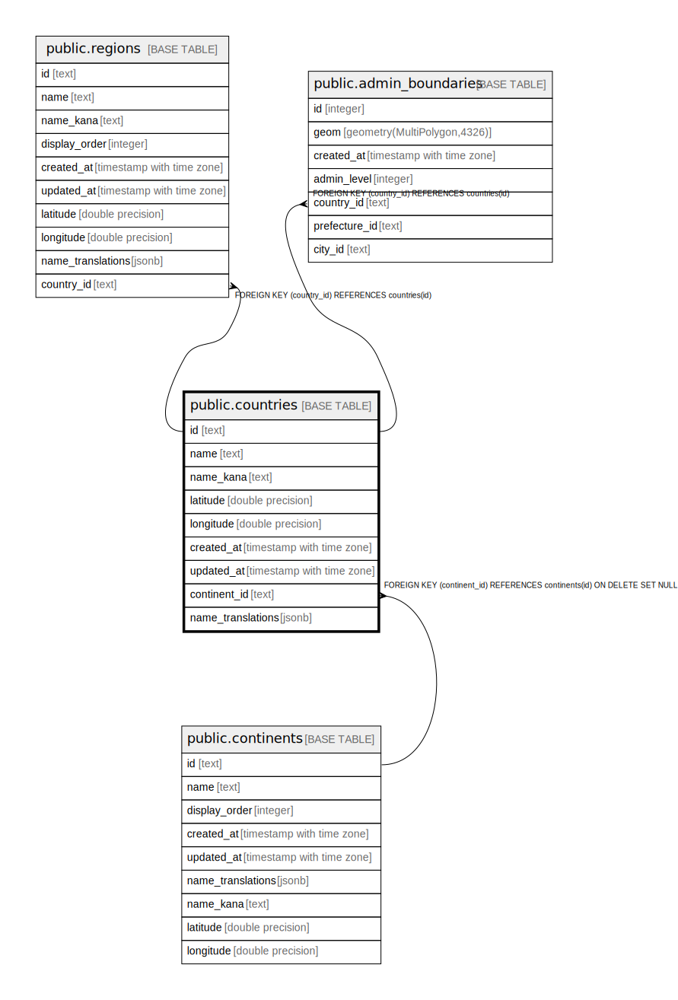

# public.countries

## Description

## Columns

| Name | Type | Default | Nullable | Children | Parents | Comment |
| ---- | ---- | ------- | -------- | -------- | ------- | ------- |
| id | text |  | false | [public.regions](public.regions.md) [public.admin_boundaries](public.admin_boundaries.md) |  |  |
| name | text |  | false |  |  |  |
| name_kana | text |  | true |  |  |  |
| latitude | double precision |  | false |  |  |  |
| longitude | double precision |  | false |  |  |  |
| created_at | timestamp with time zone | now() | false |  |  |  |
| updated_at | timestamp with time zone | now() | false |  |  |  |
| continent_id | text |  | false |  | [public.continents](public.continents.md) | 大陸ID（外部キー → continents.id） |
| name_translations | jsonb |  | true |  |  |  |

## Constraints

| Name | Type | Definition |
| ---- | ---- | ---------- |
| countries_pkey | PRIMARY KEY | PRIMARY KEY (id) |
| countries_continent_id_fkey | FOREIGN KEY | FOREIGN KEY (continent_id) REFERENCES continents(id) ON DELETE SET NULL |

## Indexes

| Name | Definition |
| ---- | ---------- |
| countries_pkey | CREATE UNIQUE INDEX countries_pkey ON public.countries USING btree (id) |

## Triggers

| Name | Definition |
| ---- | ---------- |
| update_countries_updated_at | CREATE TRIGGER update_countries_updated_at BEFORE UPDATE ON public.countries FOR EACH ROW EXECUTE FUNCTION update_updated_at_column() |

## Relations

---

> Generated by [tbls](https://github.com/k1LoW/tbls)
