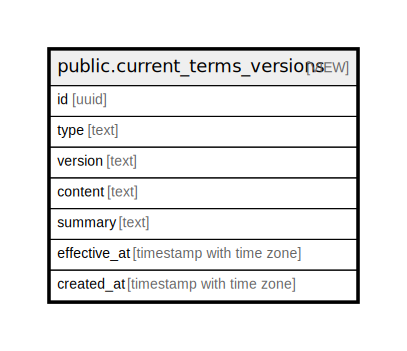

# public.current_terms_versions

## Description

現在有効な利用規約・プライバシーポリシーの最新バージョン

<details>
<summary><strong>Table Definition</strong></summary>

```sql
CREATE VIEW current_terms_versions AS (
 SELECT DISTINCT ON (type) id,
    type,
    version,
    content,
    summary,
    effective_at,
    created_at
   FROM terms_versions
  WHERE (effective_at <= now())
  ORDER BY type, effective_at DESC
)
```

</details>

## Columns

| Name | Type | Default | Nullable | Children | Parents | Comment |
| ---- | ---- | ------- | -------- | -------- | ------- | ------- |
| id | uuid |  | true |  |  |  |
| type | text |  | true |  |  |  |
| version | text |  | true |  |  |  |
| content | text |  | true |  |  |  |
| summary | text |  | true |  |  |  |
| effective_at | timestamp with time zone |  | true |  |  |  |
| created_at | timestamp with time zone |  | true |  |  |  |

## Referenced Tables

| Name | Columns | Comment | Type |
| ---- | ------- | ------- | ---- |
| [public.terms_versions](public.terms_versions.md) | 8 | 利用規約・プライバシーポリシーのバージョン管理 | BASE TABLE |

## Relations



---

> Generated by [tbls](https://github.com/k1LoW/tbls)
