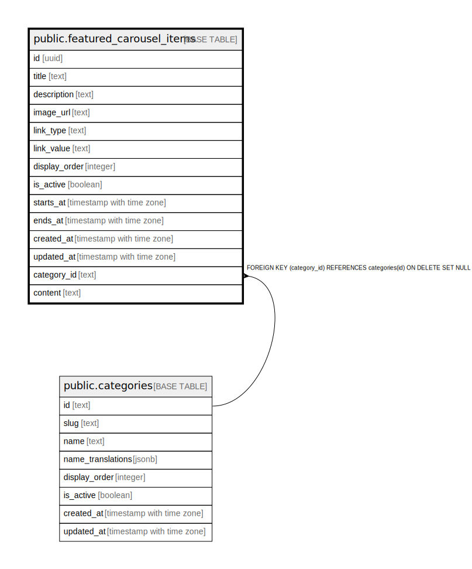

# public.featured_carousel_items

## Description

発見タブの特集カルーセルに表示するバナーコンテンツ

## Columns

| Name | Type | Default | Nullable | Children | Parents | Comment |
| ---- | ---- | ------- | -------- | -------- | ------- | ------- |
| id | uuid | gen_random_uuid() | false |  |  |  |
| title | text |  | false |  |  | 表示タイトル |
| description | text |  | true |  |  | サブタイトル・説明 |
| image_url | text |  | false |  |  | バナー画像URL |
| link_type | text | 'tag'::text | false |  |  | リンク種別（tag/map/user/url） |
| link_value | text |  | true |  |  | リンク先の値 |
| display_order | integer | 0 | false |  |  | 表示順（小さい順） |
| is_active | boolean | true | false |  |  | 公開フラグ |
| starts_at | timestamp with time zone |  | true |  |  | 表示開始日時 |
| ends_at | timestamp with time zone |  | true |  |  | 表示終了日時 |
| created_at | timestamp with time zone | now() | false |  |  |  |
| updated_at | timestamp with time zone | now() | false |  |  |  |
| category_id | text |  | true |  | [public.categories](public.categories.md) | カテゴリID（NULLの場合は「すべて」カテゴリで表示） |
| content | text |  | true |  |  |  |

## Constraints

| Name | Type | Definition |
| ---- | ---- | ---------- |
| featured_carousel_items_pkey | PRIMARY KEY | PRIMARY KEY (id) |
| featured_carousel_items_category_id_fkey | FOREIGN KEY | FOREIGN KEY (category_id) REFERENCES categories(id) ON DELETE SET NULL |

## Indexes

| Name | Definition |
| ---- | ---------- |
| featured_carousel_items_pkey | CREATE UNIQUE INDEX featured_carousel_items_pkey ON public.featured_carousel_items USING btree (id) |
| idx_featured_carousel_items_active_order | CREATE INDEX idx_featured_carousel_items_active_order ON public.featured_carousel_items USING btree (is_active, display_order) WHERE (is_active = true) |
| idx_featured_carousel_items_category | CREATE INDEX idx_featured_carousel_items_category ON public.featured_carousel_items USING btree (category_id) |

## Triggers

| Name | Definition |
| ---- | ---------- |
| update_featured_carousel_items_updated_at | CREATE TRIGGER update_featured_carousel_items_updated_at BEFORE UPDATE ON public.featured_carousel_items FOR EACH ROW EXECUTE FUNCTION update_updated_at_column() |

## Relations

---

> Generated by [tbls](https://github.com/k1LoW/tbls)
