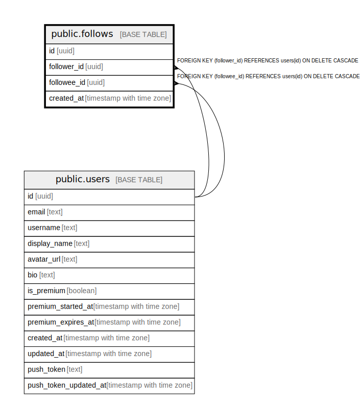

# public.follows

## Description

## Columns

| Name | Type | Default | Nullable | Children | Parents | Comment |
| ---- | ---- | ------- | -------- | -------- | ------- | ------- |
| id | uuid | gen_random_uuid() | false |  |  |  |
| follower_id | uuid |  | false |  | [public.users](public.users.md) |  |
| followee_id | uuid |  | false |  | [public.users](public.users.md) |  |
| created_at | timestamp with time zone | now() | false |  |  |  |

## Constraints

| Name | Type | Definition |
| ---- | ---- | ---------- |
| follows_followee_id_fkey | FOREIGN KEY | FOREIGN KEY (followee_id) REFERENCES users(id) ON DELETE CASCADE |
| follows_follower_id_fkey | FOREIGN KEY | FOREIGN KEY (follower_id) REFERENCES users(id) ON DELETE CASCADE |
| follows_pkey | PRIMARY KEY | PRIMARY KEY (id) |
| follows_follower_id_followee_id_key | UNIQUE | UNIQUE (follower_id, followee_id) |

## Indexes

| Name | Definition |
| ---- | ---------- |
| follows_pkey | CREATE UNIQUE INDEX follows_pkey ON public.follows USING btree (id) |
| follows_follower_id_followee_id_key | CREATE UNIQUE INDEX follows_follower_id_followee_id_key ON public.follows USING btree (follower_id, followee_id) |
| idx_follows_follower_id | CREATE INDEX idx_follows_follower_id ON public.follows USING btree (follower_id) |
| idx_follows_followee_id | CREATE INDEX idx_follows_followee_id ON public.follows USING btree (followee_id) |

## Triggers

| Name | Definition |
| ---- | ---------- |
| on_follow_create_notification | CREATE TRIGGER on_follow_create_notification AFTER INSERT ON public.follows FOR EACH ROW EXECUTE FUNCTION create_follow_notification() |

## Relations

---

> Generated by [tbls](https://github.com/k1LoW/tbls)
