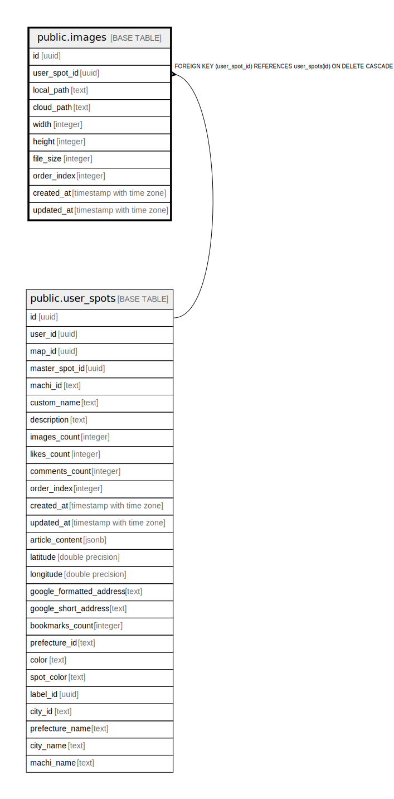

# public.images

## Description

## Columns

| Name | Type | Default | Nullable | Children | Parents | Comment |
| ---- | ---- | ------- | -------- | -------- | ------- | ------- |
| id | uuid | gen_random_uuid() | false |  |  |  |
| user_spot_id | uuid |  | false |  | [public.user_spots](public.user_spots.md) |  |
| local_path | text |  | true |  |  |  |
| cloud_path | text |  | true |  |  |  |
| width | integer |  | true |  |  |  |
| height | integer |  | true |  |  |  |
| file_size | integer |  | true |  |  |  |
| order_index | integer | 0 | true |  |  |  |
| created_at | timestamp with time zone | now() | false |  |  |  |
| updated_at | timestamp with time zone | now() | false |  |  |  |

## Constraints

| Name | Type | Definition |
| ---- | ---- | ---------- |
| images_pkey | PRIMARY KEY | PRIMARY KEY (id) |
| images_user_spot_id_fkey | FOREIGN KEY | FOREIGN KEY (user_spot_id) REFERENCES user_spots(id) ON DELETE CASCADE |

## Indexes

| Name | Definition |
| ---- | ---------- |
| images_pkey | CREATE UNIQUE INDEX images_pkey ON public.images USING btree (id) |
| idx_images_user_spot_id | CREATE INDEX idx_images_user_spot_id ON public.images USING btree (user_spot_id) |

## Triggers

| Name | Definition |
| ---- | ---------- |
| trigger_update_images_count | CREATE TRIGGER trigger_update_images_count AFTER INSERT OR DELETE ON public.images FOR EACH ROW EXECUTE FUNCTION update_images_count() |
| update_images_updated_at | CREATE TRIGGER update_images_updated_at BEFORE UPDATE ON public.images FOR EACH ROW EXECUTE FUNCTION update_updated_at_column() |

## Relations

---

> Generated by [tbls](https://github.com/k1LoW/tbls)
