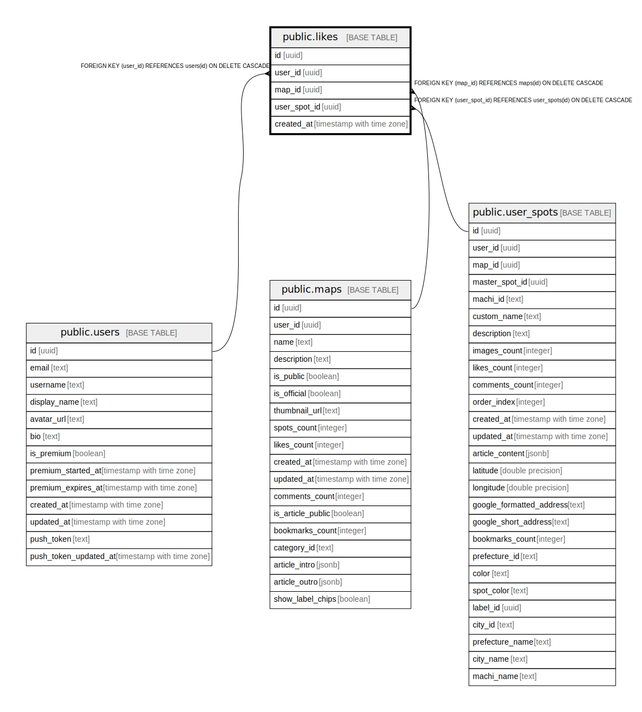

# public.likes

## Description

## Columns

| Name | Type | Default | Nullable | Children | Parents | Comment |
| ---- | ---- | ------- | -------- | -------- | ------- | ------- |
| id | uuid | gen_random_uuid() | false |  |  |  |
| user_id | uuid |  | false |  | [public.users](public.users.md) |  |
| map_id | uuid |  | true |  | [public.maps](public.maps.md) |  |
| user_spot_id | uuid |  | true |  | [public.user_spots](public.user_spots.md) |  |
| created_at | timestamp with time zone | now() | false |  |  |  |

## Constraints

| Name | Type | Definition |
| ---- | ---- | ---------- |
| likes_check | CHECK | CHECK ((((map_id IS NOT NULL) AND (user_spot_id IS NULL)) OR ((map_id IS NULL) AND (user_spot_id IS NOT NULL)))) |
| likes_user_id_fkey | FOREIGN KEY | FOREIGN KEY (user_id) REFERENCES users(id) ON DELETE CASCADE |
| likes_map_id_fkey | FOREIGN KEY | FOREIGN KEY (map_id) REFERENCES maps(id) ON DELETE CASCADE |
| likes_pkey | PRIMARY KEY | PRIMARY KEY (id) |
| likes_user_spot_id_fkey | FOREIGN KEY | FOREIGN KEY (user_spot_id) REFERENCES user_spots(id) ON DELETE CASCADE |

## Indexes

| Name | Definition |
| ---- | ---------- |
| likes_pkey | CREATE UNIQUE INDEX likes_pkey ON public.likes USING btree (id) |
| idx_likes_user_id | CREATE INDEX idx_likes_user_id ON public.likes USING btree (user_id) |
| idx_likes_map_id | CREATE INDEX idx_likes_map_id ON public.likes USING btree (map_id) |
| likes_user_spot_unique | CREATE UNIQUE INDEX likes_user_spot_unique ON public.likes USING btree (user_id, user_spot_id) WHERE (user_spot_id IS NOT NULL) |
| likes_user_map_unique | CREATE UNIQUE INDEX likes_user_map_unique ON public.likes USING btree (user_id, map_id) WHERE (map_id IS NOT NULL) |
| idx_likes_user_spot_id | CREATE INDEX idx_likes_user_spot_id ON public.likes USING btree (user_spot_id) |

## Triggers

| Name | Definition |
| ---- | ---------- |
| on_map_like_create_notification | CREATE TRIGGER on_map_like_create_notification AFTER INSERT ON public.likes FOR EACH ROW WHEN ((new.map_id IS NOT NULL)) EXECUTE FUNCTION create_like_map_notification() |
| on_user_spot_like_create_notification | CREATE TRIGGER on_user_spot_like_create_notification AFTER INSERT ON public.likes FOR EACH ROW WHEN ((new.user_spot_id IS NOT NULL)) EXECUTE FUNCTION create_like_spot_notification() |
| trigger_update_likes_count | CREATE TRIGGER trigger_update_likes_count AFTER INSERT OR DELETE ON public.likes FOR EACH ROW EXECUTE FUNCTION update_likes_count() |

## Relations

---

> Generated by [tbls](https://github.com/k1LoW/tbls)
