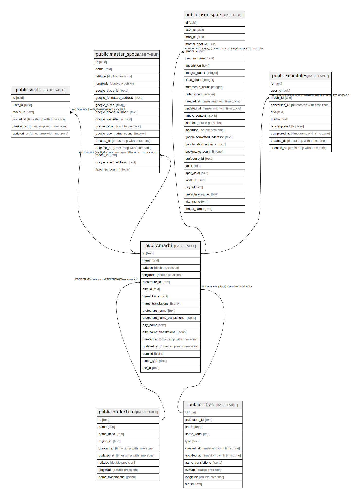

# public.machi

## Description

## Columns

| Name | Type | Default | Nullable | Children | Parents | Comment |
| ---- | ---- | ------- | -------- | -------- | ------- | ------- |
| id | text |  | false | [public.visits](public.visits.md) [public.master_spots](public.master_spots.md) [public.user_spots](public.user_spots.md) [public.schedules](public.schedules.md) |  |  |
| name | text |  | false |  |  |  |
| latitude | double precision |  | true |  |  |  |
| longitude | double precision |  | true |  |  |  |
| prefecture_id | text |  | false |  | [public.prefectures](public.prefectures.md) |  |
| city_id | text |  | true |  | [public.cities](public.cities.md) |  |
| name_kana | text |  | true |  |  |  |
| name_translations | jsonb |  | true |  |  |  |
| prefecture_name | text |  | false |  |  |  |
| prefecture_name_translations | jsonb |  | true |  |  |  |
| city_name | text |  | true |  |  |  |
| city_name_translations | jsonb |  | true |  |  |  |
| created_at | timestamp with time zone | now() | false |  |  |  |
| updated_at | timestamp with time zone | now() | false |  |  |  |
| osm_id | bigint |  | true |  |  |  |
| place_type | text |  | true |  |  |  |
| tile_id | text |  | true |  |  |  |

## Constraints

| Name | Type | Definition |
| ---- | ---- | ---------- |
| machi_prefecture_id_fkey | FOREIGN KEY | FOREIGN KEY (prefecture_id) REFERENCES prefectures(id) |
| machi_city_id_fkey | FOREIGN KEY | FOREIGN KEY (city_id) REFERENCES cities(id) |
| machi_pkey | PRIMARY KEY | PRIMARY KEY (id) |

## Indexes

| Name | Definition |
| ---- | ---------- |
| machi_pkey | CREATE UNIQUE INDEX machi_pkey ON public.machi USING btree (id) |
| idx_machi_name | CREATE INDEX idx_machi_name ON public.machi USING btree (name) |
| idx_machi_prefecture_id | CREATE INDEX idx_machi_prefecture_id ON public.machi USING btree (prefecture_id) |
| idx_machi_city_id | CREATE INDEX idx_machi_city_id ON public.machi USING btree (city_id) |
| idx_machi_osm_id | CREATE INDEX idx_machi_osm_id ON public.machi USING btree (osm_id) |
| idx_machi_place_type | CREATE INDEX idx_machi_place_type ON public.machi USING btree (place_type) |
| idx_machi_tile_id | CREATE INDEX idx_machi_tile_id ON public.machi USING btree (tile_id) |

## Triggers

| Name | Definition |
| ---- | ---------- |
| update_machi_updated_at | CREATE TRIGGER update_machi_updated_at BEFORE UPDATE ON public.machi FOR EACH ROW EXECUTE FUNCTION update_updated_at_column() |

## Relations

---

> Generated by [tbls](https://github.com/k1LoW/tbls)
