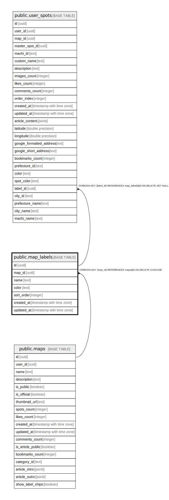

# public.map_labels

## Description

マップごとのラベル定義（スポットの種類分け用）

## Columns

| Name | Type | Default | Nullable | Children | Parents | Comment |
| ---- | ---- | ------- | -------- | -------- | ------- | ------- |
| id | uuid | gen_random_uuid() | false | [public.user_spots](public.user_spots.md) |  |  |
| map_id | uuid |  | false |  | [public.maps](public.maps.md) |  |
| name | text |  | false |  |  | ラベル名（例: ドトール、スタバ） |
| color | text | 'blue'::text | false |  |  | ラベルの色（pink, red, orange, yellow, green, blue, purple, gray, white） |
| sort_order | integer | 0 | false |  |  | 表示順 |
| created_at | timestamp with time zone | now() | false |  |  |  |
| updated_at | timestamp with time zone | now() | false |  |  |  |

## Constraints

| Name | Type | Definition |
| ---- | ---- | ---------- |
| map_labels_map_id_fkey | FOREIGN KEY | FOREIGN KEY (map_id) REFERENCES maps(id) ON DELETE CASCADE |
| map_labels_pkey | PRIMARY KEY | PRIMARY KEY (id) |
| map_labels_map_id_name_key | UNIQUE | UNIQUE (map_id, name) |

## Indexes

| Name | Definition |
| ---- | ---------- |
| map_labels_pkey | CREATE UNIQUE INDEX map_labels_pkey ON public.map_labels USING btree (id) |
| map_labels_map_id_name_key | CREATE UNIQUE INDEX map_labels_map_id_name_key ON public.map_labels USING btree (map_id, name) |
| idx_map_labels_map_id | CREATE INDEX idx_map_labels_map_id ON public.map_labels USING btree (map_id) |

## Triggers

| Name | Definition |
| ---- | ---------- |
| update_map_labels_updated_at | CREATE TRIGGER update_map_labels_updated_at BEFORE UPDATE ON public.map_labels FOR EACH ROW EXECUTE FUNCTION update_updated_at_column() |

## Relations

---

> Generated by [tbls](https://github.com/k1LoW/tbls)
