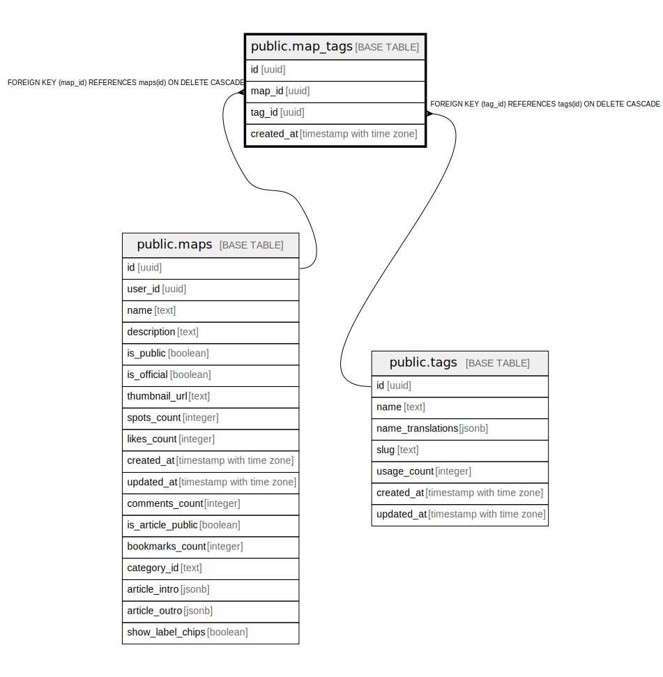

# public.map_tags

## Description

## Columns

| Name | Type | Default | Nullable | Children | Parents | Comment |
| ---- | ---- | ------- | -------- | -------- | ------- | ------- |
| id | uuid | gen_random_uuid() | false |  |  |  |
| map_id | uuid |  | false |  | [public.maps](public.maps.md) |  |
| tag_id | uuid |  | false |  | [public.tags](public.tags.md) |  |
| created_at | timestamp with time zone | now() | false |  |  |  |

## Constraints

| Name | Type | Definition |
| ---- | ---- | ---------- |
| map_tags_map_id_fkey | FOREIGN KEY | FOREIGN KEY (map_id) REFERENCES maps(id) ON DELETE CASCADE |
| map_tags_tag_id_fkey | FOREIGN KEY | FOREIGN KEY (tag_id) REFERENCES tags(id) ON DELETE CASCADE |
| map_tags_pkey | PRIMARY KEY | PRIMARY KEY (id) |
| map_tags_map_id_tag_id_key | UNIQUE | UNIQUE (map_id, tag_id) |

## Indexes

| Name | Definition |
| ---- | ---------- |
| map_tags_pkey | CREATE UNIQUE INDEX map_tags_pkey ON public.map_tags USING btree (id) |
| map_tags_map_id_tag_id_key | CREATE UNIQUE INDEX map_tags_map_id_tag_id_key ON public.map_tags USING btree (map_id, tag_id) |
| idx_map_tags_map_id | CREATE INDEX idx_map_tags_map_id ON public.map_tags USING btree (map_id) |
| idx_map_tags_tag_id | CREATE INDEX idx_map_tags_tag_id ON public.map_tags USING btree (tag_id) |

## Triggers

| Name | Definition |
| ---- | ---------- |
| update_tag_usage_count_trigger | CREATE TRIGGER update_tag_usage_count_trigger AFTER INSERT OR DELETE ON public.map_tags FOR EACH ROW EXECUTE FUNCTION update_tag_usage_count() |

## Relations

---

> Generated by [tbls](https://github.com/k1LoW/tbls)
