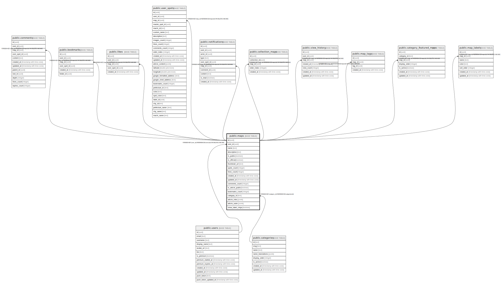

# public.maps

## Description

## Columns

| Name | Type | Default | Nullable | Children | Parents | Comment |
| ---- | ---- | ------- | -------- | -------- | ------- | ------- |
| id | uuid | gen_random_uuid() | false | [public.comments](public.comments.md) [public.bookmarks](public.bookmarks.md) [public.likes](public.likes.md) [public.user_spots](public.user_spots.md) [public.notifications](public.notifications.md) [public.collection_maps](public.collection_maps.md) [public.view_history](public.view_history.md) [public.map_tags](public.map_tags.md) [public.category_featured_maps](public.category_featured_maps.md) [public.map_labels](public.map_labels.md) |  |  |
| user_id | uuid |  | false |  | [public.users](public.users.md) |  |
| name | text |  | false |  |  |  |
| description | text |  | true |  |  |  |
| is_public | boolean | false | false |  |  | マップが公開されているかどうか（デフォルト: false） |
| is_official | boolean | false | false |  |  | 公式マップかどうか（デフォルト: false） |
| thumbnail_url | text |  | true |  |  |  |
| spots_count | integer | 0 | false |  |  | スポット数（デフォルト: 0） |
| likes_count | integer | 0 | false |  |  | いいね数（デフォルト: 0） |
| created_at | timestamp with time zone | now() | false |  |  |  |
| updated_at | timestamp with time zone | now() | false |  |  |  |
| comments_count | integer | 0 | false |  |  | コメント数（デフォルト: 0） |
| is_article_public | boolean | false | false |  |  | 記事が公開されているかどうか（デフォルト: false） |
| bookmarks_count | integer | 0 | false |  |  | ブックマーク数（デフォルト: 0） |
| category_id | text |  | true |  | [public.categories](public.categories.md) | カテゴリへの外部キー参照 |
| article_intro | jsonb |  | true |  |  | マップ記事のまえがき（ProseMirror JSON形式） |
| article_outro | jsonb |  | true |  |  | マップ記事のあとがき（ProseMirror JSON形式） |
| show_label_chips | boolean | false | true |  |  | ラベルチップをマップ上部に表示するかどうか |

## Constraints

| Name | Type | Definition |
| ---- | ---- | ---------- |
| maps_user_id_fkey | FOREIGN KEY | FOREIGN KEY (user_id) REFERENCES users(id) ON DELETE CASCADE |
| maps_pkey | PRIMARY KEY | PRIMARY KEY (id) |
| maps_category_id_fkey | FOREIGN KEY | FOREIGN KEY (category_id) REFERENCES categories(id) |

## Indexes

| Name | Definition |
| ---- | ---------- |
| maps_pkey | CREATE UNIQUE INDEX maps_pkey ON public.maps USING btree (id) |
| idx_maps_user_id | CREATE INDEX idx_maps_user_id ON public.maps USING btree (user_id) |
| idx_maps_is_public | CREATE INDEX idx_maps_is_public ON public.maps USING btree (is_public) |
| idx_maps_created_at | CREATE INDEX idx_maps_created_at ON public.maps USING btree (created_at DESC) |
| idx_maps_is_article_public | CREATE INDEX idx_maps_is_article_public ON public.maps USING btree (is_article_public) |
| idx_maps_bookmarks_count | CREATE INDEX idx_maps_bookmarks_count ON public.maps USING btree (bookmarks_count DESC) |
| idx_maps_category_id | CREATE INDEX idx_maps_category_id ON public.maps USING btree (category_id) |

## Triggers

| Name | Definition |
| ---- | ---------- |
| update_maps_updated_at | CREATE TRIGGER update_maps_updated_at BEFORE UPDATE ON public.maps FOR EACH ROW EXECUTE FUNCTION update_updated_at_column() |

## Relations

---

> Generated by [tbls](https://github.com/k1LoW/tbls)
