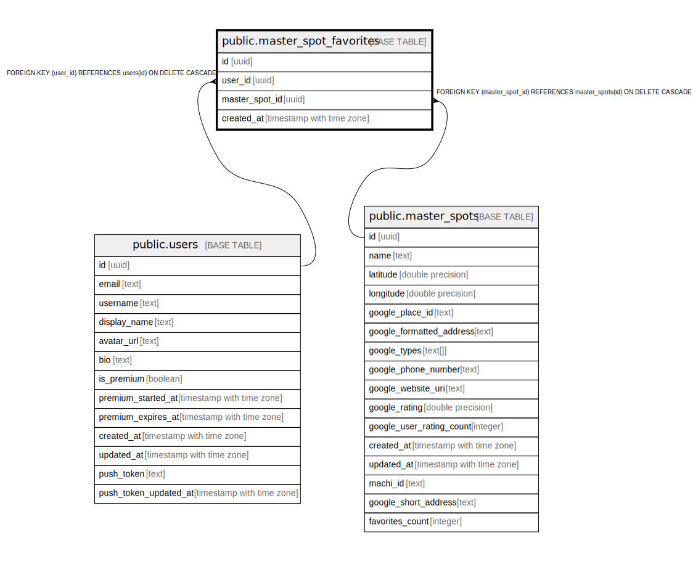

# public.master_spot_favorites

## Description

## Columns

| Name | Type | Default | Nullable | Children | Parents | Comment |
| ---- | ---- | ------- | -------- | -------- | ------- | ------- |
| id | uuid | uuid_generate_v4() | false |  |  |  |
| user_id | uuid |  | false |  | [public.users](public.users.md) |  |
| master_spot_id | uuid |  | false |  | [public.master_spots](public.master_spots.md) |  |
| created_at | timestamp with time zone | now() | true |  |  |  |

## Constraints

| Name | Type | Definition |
| ---- | ---- | ---------- |
| master_spot_favorites_user_id_fkey | FOREIGN KEY | FOREIGN KEY (user_id) REFERENCES users(id) ON DELETE CASCADE |
| master_spot_favorites_master_spot_id_fkey | FOREIGN KEY | FOREIGN KEY (master_spot_id) REFERENCES master_spots(id) ON DELETE CASCADE |
| master_spot_favorites_pkey | PRIMARY KEY | PRIMARY KEY (id) |
| master_spot_favorites_user_id_master_spot_id_key | UNIQUE | UNIQUE (user_id, master_spot_id) |

## Indexes

| Name | Definition |
| ---- | ---------- |
| master_spot_favorites_pkey | CREATE UNIQUE INDEX master_spot_favorites_pkey ON public.master_spot_favorites USING btree (id) |
| master_spot_favorites_user_id_master_spot_id_key | CREATE UNIQUE INDEX master_spot_favorites_user_id_master_spot_id_key ON public.master_spot_favorites USING btree (user_id, master_spot_id) |
| idx_master_spot_favorites_user_id | CREATE INDEX idx_master_spot_favorites_user_id ON public.master_spot_favorites USING btree (user_id) |
| idx_master_spot_favorites_master_spot_id | CREATE INDEX idx_master_spot_favorites_master_spot_id ON public.master_spot_favorites USING btree (master_spot_id) |

## Triggers

| Name | Definition |
| ---- | ---------- |
| trigger_update_master_spot_favorites_count | CREATE TRIGGER trigger_update_master_spot_favorites_count AFTER INSERT OR DELETE ON public.master_spot_favorites FOR EACH ROW EXECUTE FUNCTION update_master_spot_favorites_count() |

## Relations

---

> Generated by [tbls](https://github.com/k1LoW/tbls)
