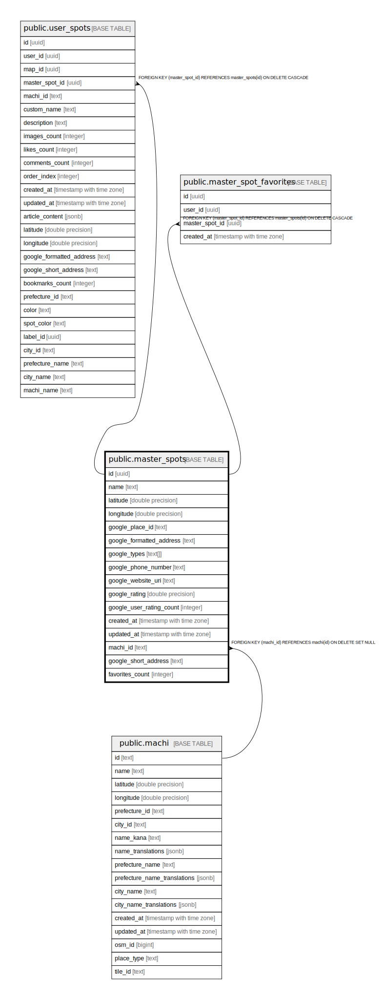

# public.master_spots

## Description

## Columns

| Name | Type | Default | Nullable | Children | Parents | Comment |
| ---- | ---- | ------- | -------- | -------- | ------- | ------- |
| id | uuid | gen_random_uuid() | false | [public.user_spots](public.user_spots.md) [public.master_spot_favorites](public.master_spot_favorites.md) |  |  |
| name | text |  | false |  |  |  |
| latitude | double precision |  | false |  |  |  |
| longitude | double precision |  | false |  |  |  |
| google_place_id | text |  | true |  |  |  |
| google_formatted_address | text |  | true |  |  |  |
| google_types | text[] |  | true |  |  |  |
| google_phone_number | text |  | true |  |  |  |
| google_website_uri | text |  | true |  |  |  |
| google_rating | double precision |  | true |  |  |  |
| google_user_rating_count | integer |  | true |  |  |  |
| created_at | timestamp with time zone | now() | false |  |  |  |
| updated_at | timestamp with time zone | now() | false |  |  |  |
| machi_id | text |  | true |  | [public.machi](public.machi.md) |  |
| google_short_address | text |  | true |  |  |  |
| favorites_count | integer | 0 | false |  |  |  |

## Constraints

| Name | Type | Definition |
| ---- | ---- | ---------- |
| master_spots_machi_id_fkey | FOREIGN KEY | FOREIGN KEY (machi_id) REFERENCES machi(id) ON DELETE SET NULL |
| master_spots_pkey | PRIMARY KEY | PRIMARY KEY (id) |
| master_spots_google_place_id_key | UNIQUE | UNIQUE (google_place_id) |

## Indexes

| Name | Definition |
| ---- | ---------- |
| master_spots_pkey | CREATE UNIQUE INDEX master_spots_pkey ON public.master_spots USING btree (id) |
| master_spots_google_place_id_key | CREATE UNIQUE INDEX master_spots_google_place_id_key ON public.master_spots USING btree (google_place_id) |
| idx_master_spots_google_place_id | CREATE INDEX idx_master_spots_google_place_id ON public.master_spots USING btree (google_place_id) |
| idx_master_spots_name | CREATE INDEX idx_master_spots_name ON public.master_spots USING btree (name) |
| idx_master_spots_location | CREATE INDEX idx_master_spots_location ON public.master_spots USING btree (latitude, longitude) |
| idx_master_spots_machi_id | CREATE INDEX idx_master_spots_machi_id ON public.master_spots USING btree (machi_id) |

## Triggers

| Name | Definition |
| ---- | ---------- |
| update_master_spots_updated_at | CREATE TRIGGER update_master_spots_updated_at BEFORE UPDATE ON public.master_spots FOR EACH ROW EXECUTE FUNCTION update_updated_at_column() |

## Relations

---

> Generated by [tbls](https://github.com/k1LoW/tbls)
