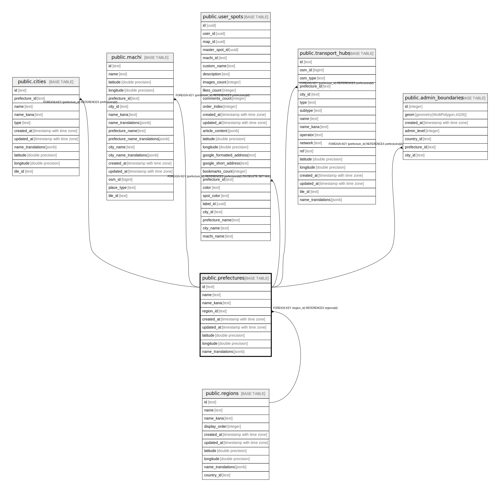

# public.prefectures

## Description

## Columns

| Name | Type | Default | Nullable | Children | Parents | Comment |
| ---- | ---- | ------- | -------- | -------- | ------- | ------- |
| id | text |  | false | [public.cities](public.cities.md) [public.machi](public.machi.md) [public.user_spots](public.user_spots.md) [public.transport_hubs](public.transport_hubs.md) [public.admin_boundaries](public.admin_boundaries.md) |  |  |
| name | text |  | false |  |  |  |
| name_kana | text |  | true |  |  |  |
| region_id | text |  | false |  | [public.regions](public.regions.md) |  |
| created_at | timestamp with time zone | now() | false |  |  |  |
| updated_at | timestamp with time zone | now() | false |  |  |  |
| latitude | double precision |  | false |  |  |  |
| longitude | double precision |  | false |  |  |  |
| name_translations | jsonb |  | true |  |  | 多言語翻訳 {"en": "Tokyo", "zh": "东京"} |

## Constraints

| Name | Type | Definition |
| ---- | ---- | ---------- |
| prefectures_region_id_fkey | FOREIGN KEY | FOREIGN KEY (region_id) REFERENCES regions(id) |
| prefectures_pkey | PRIMARY KEY | PRIMARY KEY (id) |
| prefectures_name_key | UNIQUE | UNIQUE (name) |

## Indexes

| Name | Definition |
| ---- | ---------- |
| prefectures_pkey | CREATE UNIQUE INDEX prefectures_pkey ON public.prefectures USING btree (id) |
| prefectures_name_key | CREATE UNIQUE INDEX prefectures_name_key ON public.prefectures USING btree (name) |

## Triggers

| Name | Definition |
| ---- | ---------- |
| update_prefectures_updated_at | CREATE TRIGGER update_prefectures_updated_at BEFORE UPDATE ON public.prefectures FOR EACH ROW EXECUTE FUNCTION update_updated_at_column() |

## Relations

---

> Generated by [tbls](https://github.com/k1LoW/tbls)
