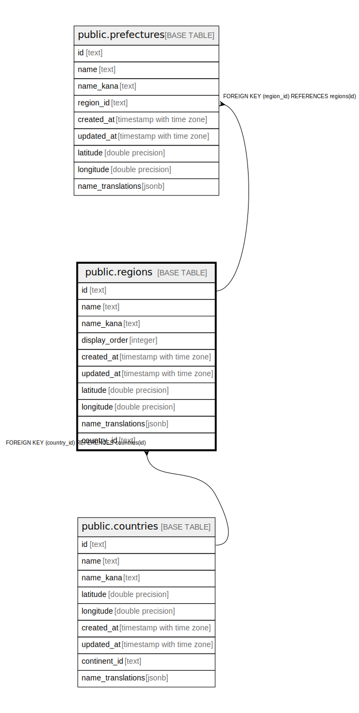

# public.regions

## Description

## Columns

| Name | Type | Default | Nullable | Children | Parents | Comment |
| ---- | ---- | ------- | -------- | -------- | ------- | ------- |
| id | text |  | false | [public.prefectures](public.prefectures.md) |  |  |
| name | text |  | false |  |  |  |
| name_kana | text |  | true |  |  |  |
| display_order | integer |  | false |  |  |  |
| created_at | timestamp with time zone | now() | false |  |  |  |
| updated_at | timestamp with time zone | now() | false |  |  |  |
| latitude | double precision |  | false |  |  |  |
| longitude | double precision |  | false |  |  |  |
| name_translations | jsonb |  | true |  |  | 多言語翻訳 {"en": "Kanto", "zh": "关东"} |
| country_id | text |  | false |  | [public.countries](public.countries.md) |  |

## Constraints

| Name | Type | Definition |
| ---- | ---- | ---------- |
| regions_pkey | PRIMARY KEY | PRIMARY KEY (id) |
| fk_regions_country | FOREIGN KEY | FOREIGN KEY (country_id) REFERENCES countries(id) |

## Indexes

| Name | Definition |
| ---- | ---------- |
| regions_pkey | CREATE UNIQUE INDEX regions_pkey ON public.regions USING btree (id) |

## Relations

---

> Generated by [tbls](https://github.com/k1LoW/tbls)
