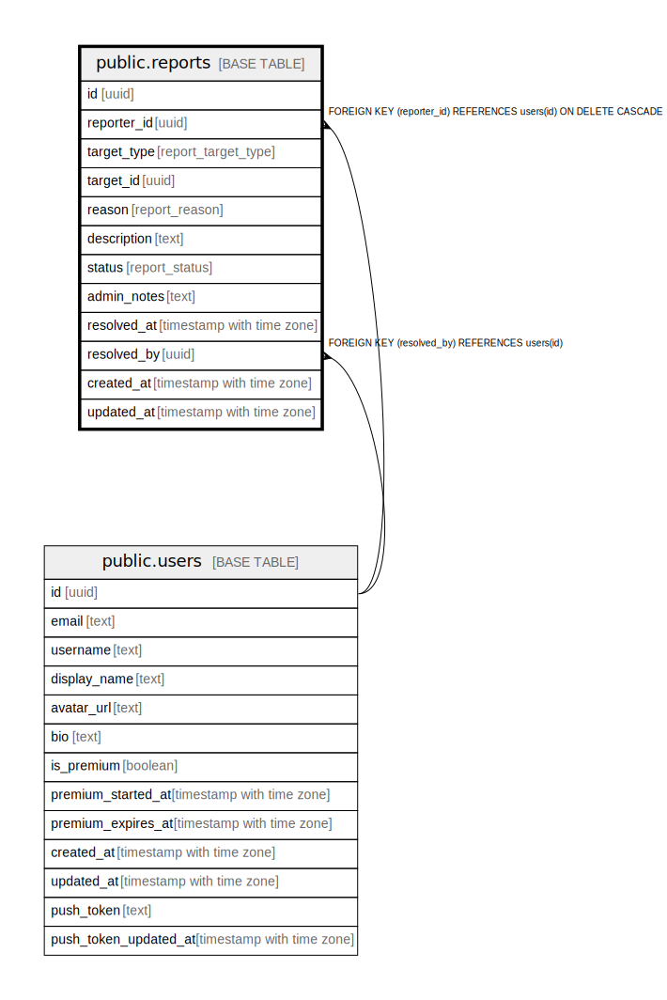

# public.reports

## Description

報告機能テーブル

## Columns

| Name | Type | Default | Nullable | Children | Parents | Comment |
| ---- | ---- | ------- | -------- | -------- | ------- | ------- |
| id | uuid | gen_random_uuid() | false |  |  |  |
| reporter_id | uuid |  | false |  | [public.users](public.users.md) | 報告したユーザーID |
| target_type | report_target_type |  | false |  |  | 報告対象のタイプ（map, spot, user, comment） |
| target_id | uuid |  | false |  |  | 報告対象のID |
| reason | report_reason | 'other'::report_reason | false |  |  | 報告理由 |
| description | text |  | true |  |  | 報告の詳細説明 |
| status | report_status | 'pending'::report_status | false |  |  | 報告のステータス |
| admin_notes | text |  | true |  |  | 管理者のメモ |
| resolved_at | timestamp with time zone |  | true |  |  | 解決日時 |
| resolved_by | uuid |  | true |  | [public.users](public.users.md) | 解決した管理者のID |
| created_at | timestamp with time zone | now() | false |  |  |  |
| updated_at | timestamp with time zone | now() | false |  |  |  |

## Constraints

| Name | Type | Definition |
| ---- | ---- | ---------- |
| reports_reporter_id_fkey | FOREIGN KEY | FOREIGN KEY (reporter_id) REFERENCES users(id) ON DELETE CASCADE |
| reports_resolved_by_fkey | FOREIGN KEY | FOREIGN KEY (resolved_by) REFERENCES users(id) |
| reports_pkey | PRIMARY KEY | PRIMARY KEY (id) |

## Indexes

| Name | Definition |
| ---- | ---------- |
| reports_pkey | CREATE UNIQUE INDEX reports_pkey ON public.reports USING btree (id) |
| idx_reports_reporter_id | CREATE INDEX idx_reports_reporter_id ON public.reports USING btree (reporter_id) |
| idx_reports_target | CREATE INDEX idx_reports_target ON public.reports USING btree (target_type, target_id) |
| idx_reports_status | CREATE INDEX idx_reports_status ON public.reports USING btree (status) |
| idx_reports_created_at | CREATE INDEX idx_reports_created_at ON public.reports USING btree (created_at DESC) |
| idx_reports_unique_report | CREATE UNIQUE INDEX idx_reports_unique_report ON public.reports USING btree (reporter_id, target_type, target_id) WHERE (status = ANY (ARRAY['pending'::report_status, 'reviewing'::report_status])) |

## Triggers

| Name | Definition |
| ---- | ---------- |
| update_reports_updated_at | CREATE TRIGGER update_reports_updated_at BEFORE UPDATE ON public.reports FOR EACH ROW EXECUTE FUNCTION update_updated_at_column() |

## Relations

---

> Generated by [tbls](https://github.com/k1LoW/tbls)
