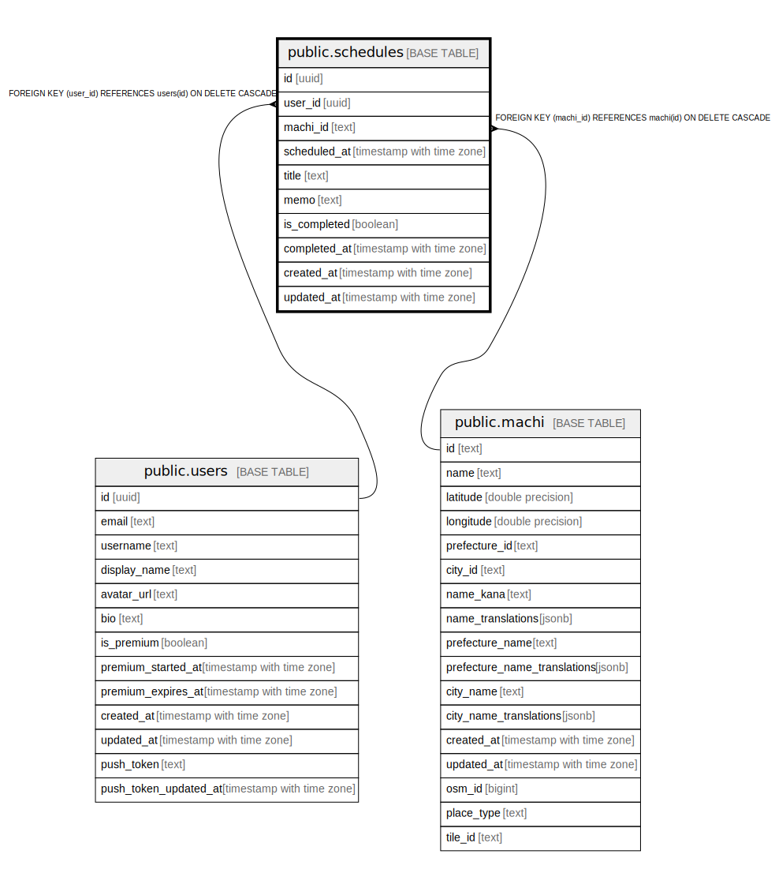

# public.schedules

## Description

ユーザーの予定（街への訪問予定など）

## Columns

| Name | Type | Default | Nullable | Children | Parents | Comment |
| ---- | ---- | ------- | -------- | -------- | ------- | ------- |
| id | uuid | gen_random_uuid() | false |  |  | 予定ID |
| user_id | uuid |  | false |  | [public.users](public.users.md) | ユーザーID |
| machi_id | text |  | false |  | [public.machi](public.machi.md) | 街ID |
| scheduled_at | timestamp with time zone |  | false |  |  | 予定日時 |
| title | text |  | false |  |  | 予定タイトル |
| memo | text |  | true |  |  | メモ |
| is_completed | boolean | false | false |  |  | 完了済みかどうか |
| completed_at | timestamp with time zone |  | true |  |  | 完了日時 |
| created_at | timestamp with time zone | now() | false |  |  |  |
| updated_at | timestamp with time zone | now() | false |  |  |  |

## Constraints

| Name | Type | Definition |
| ---- | ---- | ---------- |
| schedules_user_id_fkey | FOREIGN KEY | FOREIGN KEY (user_id) REFERENCES users(id) ON DELETE CASCADE |
| schedules_machi_id_fkey | FOREIGN KEY | FOREIGN KEY (machi_id) REFERENCES machi(id) ON DELETE CASCADE |
| schedules_pkey | PRIMARY KEY | PRIMARY KEY (id) |

## Indexes

| Name | Definition |
| ---- | ---------- |
| schedules_pkey | CREATE UNIQUE INDEX schedules_pkey ON public.schedules USING btree (id) |
| idx_schedules_user_id | CREATE INDEX idx_schedules_user_id ON public.schedules USING btree (user_id) |
| idx_schedules_machi_id | CREATE INDEX idx_schedules_machi_id ON public.schedules USING btree (machi_id) |
| idx_schedules_scheduled_at | CREATE INDEX idx_schedules_scheduled_at ON public.schedules USING btree (scheduled_at) |
| idx_schedules_user_scheduled | CREATE INDEX idx_schedules_user_scheduled ON public.schedules USING btree (user_id, scheduled_at) |

## Relations

---

> Generated by [tbls](https://github.com/k1LoW/tbls)
