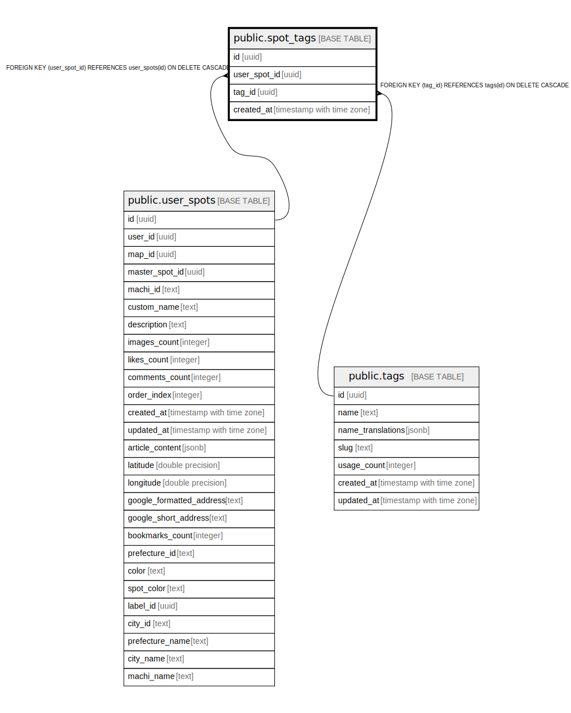

# public.spot_tags

## Description

## Columns

| Name | Type | Default | Nullable | Children | Parents | Comment |
| ---- | ---- | ------- | -------- | -------- | ------- | ------- |
| id | uuid | gen_random_uuid() | false |  |  |  |
| user_spot_id | uuid |  | false |  | [public.user_spots](public.user_spots.md) |  |
| tag_id | uuid |  | false |  | [public.tags](public.tags.md) |  |
| created_at | timestamp with time zone | now() | false |  |  |  |

## Constraints

| Name | Type | Definition |
| ---- | ---- | ---------- |
| spot_tags_user_spot_id_fkey | FOREIGN KEY | FOREIGN KEY (user_spot_id) REFERENCES user_spots(id) ON DELETE CASCADE |
| spot_tags_tag_id_fkey | FOREIGN KEY | FOREIGN KEY (tag_id) REFERENCES tags(id) ON DELETE CASCADE |
| spot_tags_pkey | PRIMARY KEY | PRIMARY KEY (id) |
| spot_tags_user_spot_id_tag_id_key | UNIQUE | UNIQUE (user_spot_id, tag_id) |

## Indexes

| Name | Definition |
| ---- | ---------- |
| spot_tags_pkey | CREATE UNIQUE INDEX spot_tags_pkey ON public.spot_tags USING btree (id) |
| spot_tags_user_spot_id_tag_id_key | CREATE UNIQUE INDEX spot_tags_user_spot_id_tag_id_key ON public.spot_tags USING btree (user_spot_id, tag_id) |
| idx_spot_tags_user_spot_id | CREATE INDEX idx_spot_tags_user_spot_id ON public.spot_tags USING btree (user_spot_id) |
| idx_spot_tags_tag_id | CREATE INDEX idx_spot_tags_tag_id ON public.spot_tags USING btree (tag_id) |

## Triggers

| Name | Definition |
| ---- | ---------- |
| update_tag_usage_count_for_spots_trigger | CREATE TRIGGER update_tag_usage_count_for_spots_trigger AFTER INSERT OR DELETE ON public.spot_tags FOR EACH ROW EXECUTE FUNCTION update_tag_usage_count_for_spots() |

## Relations

---

> Generated by [tbls](https://github.com/k1LoW/tbls)
