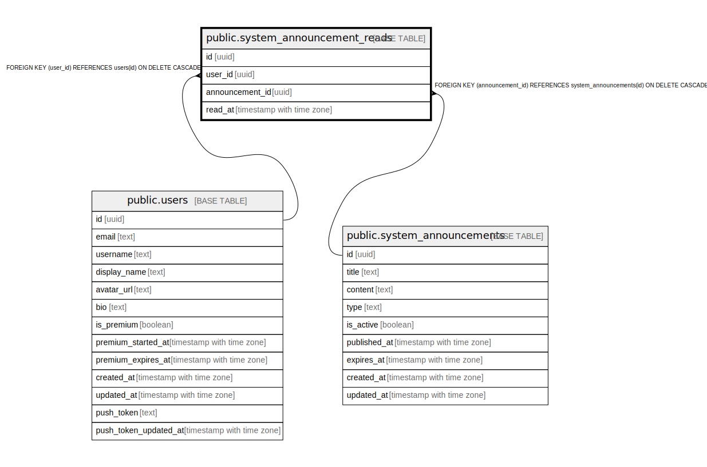

# public.system_announcement_reads

## Description

## Columns

| Name | Type | Default | Nullable | Children | Parents | Comment |
| ---- | ---- | ------- | -------- | -------- | ------- | ------- |
| id | uuid | gen_random_uuid() | false |  |  |  |
| user_id | uuid |  | false |  | [public.users](public.users.md) |  |
| announcement_id | uuid |  | false |  | [public.system_announcements](public.system_announcements.md) |  |
| read_at | timestamp with time zone | now() | true |  |  |  |

## Constraints

| Name | Type | Definition |
| ---- | ---- | ---------- |
| user_announcement_reads_user_id_fkey | FOREIGN KEY | FOREIGN KEY (user_id) REFERENCES users(id) ON DELETE CASCADE |
| user_announcement_reads_announcement_id_fkey | FOREIGN KEY | FOREIGN KEY (announcement_id) REFERENCES system_announcements(id) ON DELETE CASCADE |
| user_announcement_reads_pkey | PRIMARY KEY | PRIMARY KEY (id) |
| user_announcement_reads_user_id_announcement_id_key | UNIQUE | UNIQUE (user_id, announcement_id) |

## Indexes

| Name | Definition |
| ---- | ---------- |
| user_announcement_reads_pkey | CREATE UNIQUE INDEX user_announcement_reads_pkey ON public.system_announcement_reads USING btree (id) |
| user_announcement_reads_user_id_announcement_id_key | CREATE UNIQUE INDEX user_announcement_reads_user_id_announcement_id_key ON public.system_announcement_reads USING btree (user_id, announcement_id) |
| idx_user_announcement_reads_user_id | CREATE INDEX idx_user_announcement_reads_user_id ON public.system_announcement_reads USING btree (user_id) |
| idx_user_announcement_reads_announcement_id | CREATE INDEX idx_user_announcement_reads_announcement_id ON public.system_announcement_reads USING btree (announcement_id) |

## Relations

---

> Generated by [tbls](https://github.com/k1LoW/tbls)
