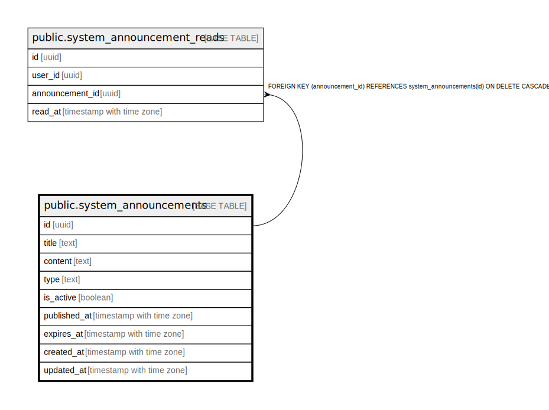

# public.system_announcements

## Description

## Columns

| Name | Type | Default | Nullable | Children | Parents | Comment |
| ---- | ---- | ------- | -------- | -------- | ------- | ------- |
| id | uuid | uuid_generate_v4() | false | [public.system_announcement_reads](public.system_announcement_reads.md) |  |  |
| title | text |  | false |  |  |  |
| content | text |  | false |  |  |  |
| type | text | 'info'::text | true |  |  |  |
| is_active | boolean | true | true |  |  |  |
| published_at | timestamp with time zone | now() | true |  |  |  |
| expires_at | timestamp with time zone |  | true |  |  |  |
| created_at | timestamp with time zone | now() | true |  |  |  |
| updated_at | timestamp with time zone | now() | true |  |  |  |

## Constraints

| Name | Type | Definition |
| ---- | ---- | ---------- |
| system_announcements_pkey | PRIMARY KEY | PRIMARY KEY (id) |

## Indexes

| Name | Definition |
| ---- | ---------- |
| system_announcements_pkey | CREATE UNIQUE INDEX system_announcements_pkey ON public.system_announcements USING btree (id) |
| idx_system_announcements_published | CREATE INDEX idx_system_announcements_published ON public.system_announcements USING btree (is_active, published_at DESC) |

## Relations

---

> Generated by [tbls](https://github.com/k1LoW/tbls)
