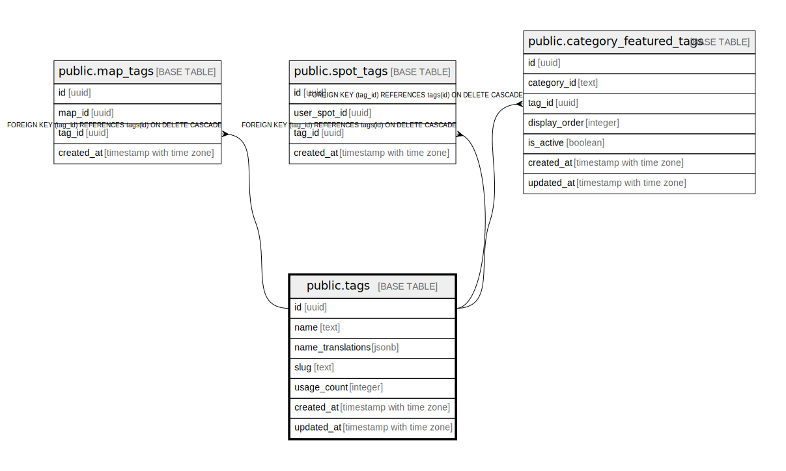

# public.tags

## Description

## Columns

| Name | Type | Default | Nullable | Children | Parents | Comment |
| ---- | ---- | ------- | -------- | -------- | ------- | ------- |
| id | uuid | gen_random_uuid() | false | [public.map_tags](public.map_tags.md) [public.spot_tags](public.spot_tags.md) [public.category_featured_tags](public.category_featured_tags.md) |  |  |
| name | text |  | false |  |  |  |
| name_translations | jsonb |  | true |  |  |  |
| slug | text |  | false |  |  |  |
| usage_count | integer | 0 | false |  |  |  |
| created_at | timestamp with time zone | now() | false |  |  |  |
| updated_at | timestamp with time zone | now() | false |  |  |  |

## Constraints

| Name | Type | Definition |
| ---- | ---- | ---------- |
| tags_pkey | PRIMARY KEY | PRIMARY KEY (id) |
| tags_name_key | UNIQUE | UNIQUE (name) |
| tags_slug_key | UNIQUE | UNIQUE (slug) |

## Indexes

| Name | Definition |
| ---- | ---------- |
| tags_pkey | CREATE UNIQUE INDEX tags_pkey ON public.tags USING btree (id) |
| tags_name_key | CREATE UNIQUE INDEX tags_name_key ON public.tags USING btree (name) |
| tags_slug_key | CREATE UNIQUE INDEX tags_slug_key ON public.tags USING btree (slug) |
| idx_tags_name | CREATE INDEX idx_tags_name ON public.tags USING btree (name) |
| idx_tags_slug | CREATE INDEX idx_tags_slug ON public.tags USING btree (slug) |
| idx_tags_usage_count | CREATE INDEX idx_tags_usage_count ON public.tags USING btree (usage_count DESC) |

## Triggers

| Name | Definition |
| ---- | ---------- |
| update_tags_updated_at | CREATE TRIGGER update_tags_updated_at BEFORE UPDATE ON public.tags FOR EACH ROW EXECUTE FUNCTION update_updated_at_column() |

## Relations

---

> Generated by [tbls](https://github.com/k1LoW/tbls)
