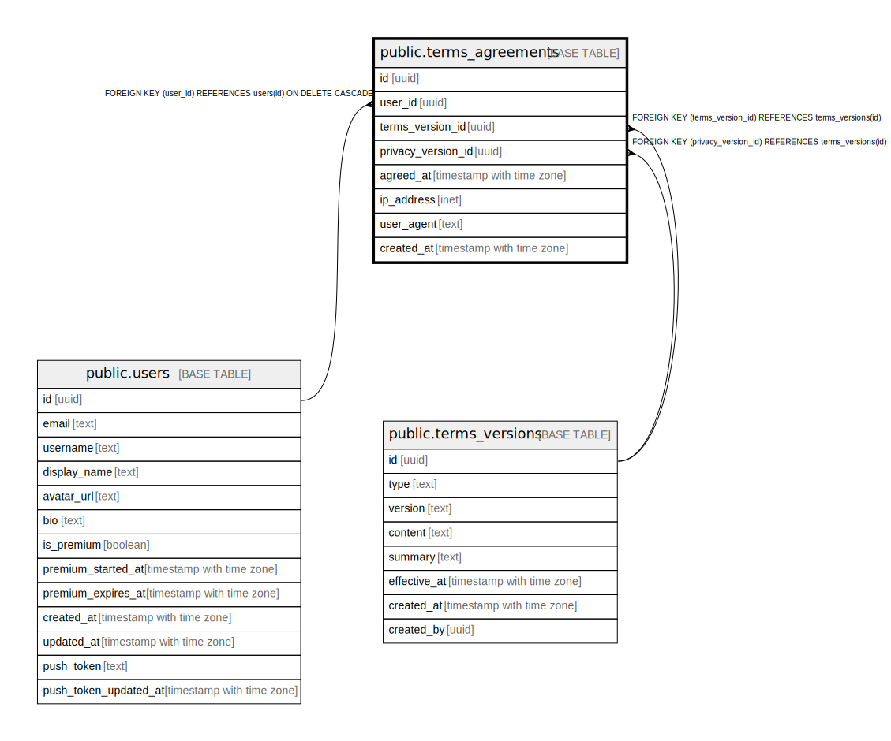

# public.terms_agreements

## Description

ユーザーの利用規約・プライバシーポリシー同意履歴

## Columns

| Name | Type | Default | Nullable | Children | Parents | Comment |
| ---- | ---- | ------- | -------- | -------- | ------- | ------- |
| id | uuid | gen_random_uuid() | false |  |  |  |
| user_id | uuid |  | false |  | [public.users](public.users.md) | 同意したユーザーID |
| terms_version_id | uuid |  | false |  | [public.terms_versions](public.terms_versions.md) | 同意した利用規約のバージョンID |
| privacy_version_id | uuid |  | false |  | [public.terms_versions](public.terms_versions.md) | 同意したプライバシーポリシーのバージョンID |
| agreed_at | timestamp with time zone | now() | false |  |  | 同意日時 |
| ip_address | inet |  | true |  |  | 同意時のIPアドレス（法的証跡） |
| user_agent | text |  | true |  |  | 同意時のユーザーエージェント（法的証跡） |
| created_at | timestamp with time zone | now() | false |  |  |  |

## Constraints

| Name | Type | Definition |
| ---- | ---- | ---------- |
| terms_agreements_user_id_fkey | FOREIGN KEY | FOREIGN KEY (user_id) REFERENCES users(id) ON DELETE CASCADE |
| terms_agreements_privacy_version_id_fkey | FOREIGN KEY | FOREIGN KEY (privacy_version_id) REFERENCES terms_versions(id) |
| terms_agreements_terms_version_id_fkey | FOREIGN KEY | FOREIGN KEY (terms_version_id) REFERENCES terms_versions(id) |
| terms_agreements_pkey | PRIMARY KEY | PRIMARY KEY (id) |

## Indexes

| Name | Definition |
| ---- | ---------- |
| terms_agreements_pkey | CREATE UNIQUE INDEX terms_agreements_pkey ON public.terms_agreements USING btree (id) |
| idx_terms_agreements_user_id | CREATE INDEX idx_terms_agreements_user_id ON public.terms_agreements USING btree (user_id) |
| idx_terms_agreements_agreed_at | CREATE INDEX idx_terms_agreements_agreed_at ON public.terms_agreements USING btree (agreed_at DESC) |
| idx_terms_agreements_user_agreed | CREATE INDEX idx_terms_agreements_user_agreed ON public.terms_agreements USING btree (user_id, agreed_at DESC) |

## Relations

---

> Generated by [tbls](https://github.com/k1LoW/tbls)
