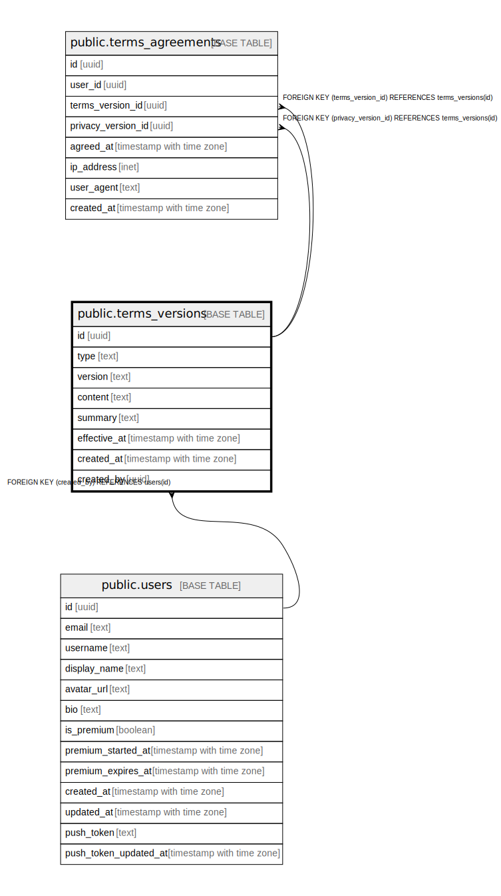

# public.terms_versions

## Description

利用規約・プライバシーポリシーのバージョン管理

## Columns

| Name | Type | Default | Nullable | Children | Parents | Comment |
| ---- | ---- | ------- | -------- | -------- | ------- | ------- |
| id | uuid | gen_random_uuid() | false | [public.terms_agreements](public.terms_agreements.md) |  |  |
| type | text |  | false |  |  | 文書タイプ: terms_of_service（利用規約）, privacy_policy（プライバシーポリシー） |
| version | text |  | false |  |  | バージョン番号（例: 1.0.0） |
| content | text |  | false |  |  | 規約本文（マークダウン形式） |
| summary | text |  | true |  |  | 変更概要（更新時のユーザー通知用） |
| effective_at | timestamp with time zone |  | false |  |  | 施行日時 |
| created_at | timestamp with time zone | now() | false |  |  |  |
| created_by | uuid |  | true |  | [public.users](public.users.md) |  |

## Constraints

| Name | Type | Definition |
| ---- | ---- | ---------- |
| terms_versions_type_check | CHECK | CHECK ((type = ANY (ARRAY['terms_of_service'::text, 'privacy_policy'::text]))) |
| terms_versions_created_by_fkey | FOREIGN KEY | FOREIGN KEY (created_by) REFERENCES users(id) |
| terms_versions_pkey | PRIMARY KEY | PRIMARY KEY (id) |
| terms_versions_type_version_key | UNIQUE | UNIQUE (type, version) |

## Indexes

| Name | Definition |
| ---- | ---------- |
| terms_versions_pkey | CREATE UNIQUE INDEX terms_versions_pkey ON public.terms_versions USING btree (id) |
| terms_versions_type_version_key | CREATE UNIQUE INDEX terms_versions_type_version_key ON public.terms_versions USING btree (type, version) |
| idx_terms_versions_type | CREATE INDEX idx_terms_versions_type ON public.terms_versions USING btree (type) |
| idx_terms_versions_effective_at | CREATE INDEX idx_terms_versions_effective_at ON public.terms_versions USING btree (effective_at DESC) |
| idx_terms_versions_type_effective | CREATE INDEX idx_terms_versions_type_effective ON public.terms_versions USING btree (type, effective_at DESC) |

## Relations

---

> Generated by [tbls](https://github.com/k1LoW/tbls)
