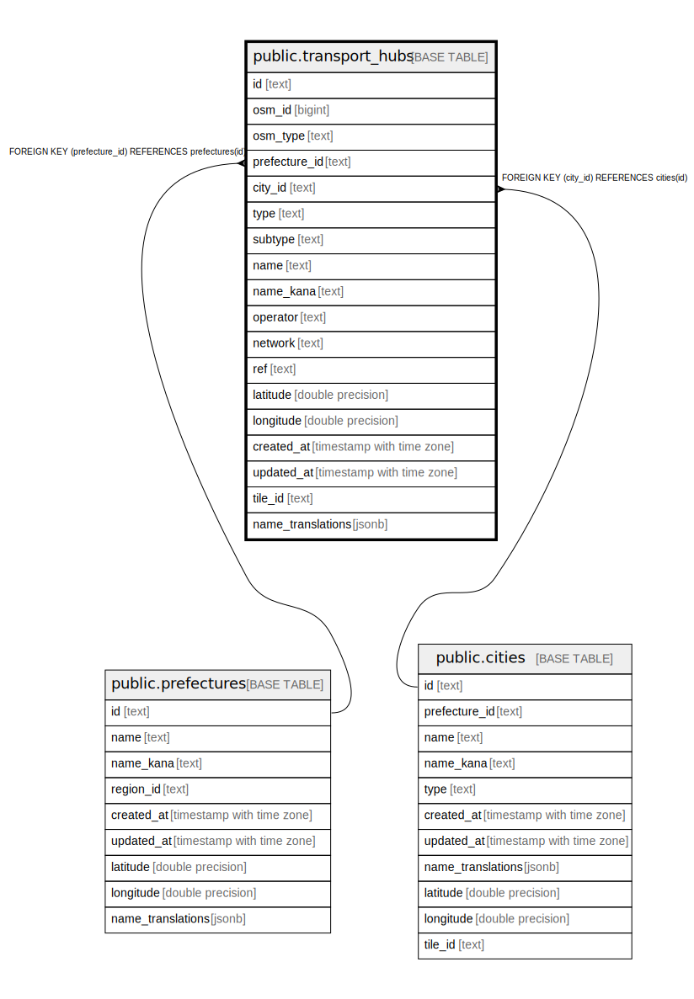

# public.transport_hubs

## Description

交通機関データ（駅、空港、フェリーターミナル、バスターミナル）

## Columns

| Name | Type | Default | Nullable | Children | Parents | Comment |
| ---- | ---- | ------- | -------- | -------- | ------- | ------- |
| id | text |  | false |  |  | 一意識別子（prefecture_type_osmid形式） |
| osm_id | bigint |  | true |  |  | OpenStreetMapのID |
| osm_type | text |  | true |  |  | OSMの要素タイプ（node/way/relation） |
| prefecture_id | text |  | false |  | [public.prefectures](public.prefectures.md) | 都道府県ID |
| city_id | text |  | true |  | [public.cities](public.cities.md) | 市区町村ID（オプション） |
| type | text |  | false |  |  | 交通機関の種類（station/airport/ferry_terminal/bus_terminal） |
| subtype | text |  | true |  |  | サブタイプ（駅: jr/metro/toei/subway/private、空港: international/domestic/military/heliport） |
| name | text |  | false |  |  | 名称（日本語） |
| name_kana | text |  | true |  |  | 名称（ふりがな） |
| operator | text |  | true |  |  | 運営会社 |
| network | text |  | true |  |  | 路線網 |
| ref | text |  | true |  |  | 路線コード/空港コード |
| latitude | double precision |  | false |  |  | 緯度 |
| longitude | double precision |  | false |  |  | 経度 |
| created_at | timestamp with time zone | now() | true |  |  |  |
| updated_at | timestamp with time zone | now() | true |  |  |  |
| tile_id | text |  | false |  |  | タイルID（0.25度グリッド、例: "559_142"） |
| name_translations | jsonb |  | true |  |  | 多言語翻訳 {"en": "Shibuya Station", "cn": "涩谷站", "tw": "澀谷站"} |

## Constraints

| Name | Type | Definition |
| ---- | ---- | ---------- |
| transport_hubs_type_check | CHECK | CHECK ((type = ANY (ARRAY['station'::text, 'airport'::text, 'ferry_terminal'::text, 'bus_terminal'::text]))) |
| transport_hubs_prefecture_id_fkey | FOREIGN KEY | FOREIGN KEY (prefecture_id) REFERENCES prefectures(id) |
| transport_hubs_city_id_fkey | FOREIGN KEY | FOREIGN KEY (city_id) REFERENCES cities(id) |
| transport_hubs_pkey | PRIMARY KEY | PRIMARY KEY (id) |

## Indexes

| Name | Definition |
| ---- | ---------- |
| transport_hubs_pkey | CREATE UNIQUE INDEX transport_hubs_pkey ON public.transport_hubs USING btree (id) |
| idx_transport_hubs_prefecture_id | CREATE INDEX idx_transport_hubs_prefecture_id ON public.transport_hubs USING btree (prefecture_id) |
| idx_transport_hubs_type | CREATE INDEX idx_transport_hubs_type ON public.transport_hubs USING btree (type) |
| idx_transport_hubs_type_subtype | CREATE INDEX idx_transport_hubs_type_subtype ON public.transport_hubs USING btree (type, subtype) |
| idx_transport_hubs_name | CREATE INDEX idx_transport_hubs_name ON public.transport_hubs USING btree (name) |
| idx_transport_hubs_location | CREATE INDEX idx_transport_hubs_location ON public.transport_hubs USING btree (latitude, longitude) |
| idx_transport_hubs_osm_id | CREATE INDEX idx_transport_hubs_osm_id ON public.transport_hubs USING btree (osm_id) |
| idx_transport_hubs_tile_id | CREATE INDEX idx_transport_hubs_tile_id ON public.transport_hubs USING btree (tile_id) |

## Relations

---

> Generated by [tbls](https://github.com/k1LoW/tbls)
