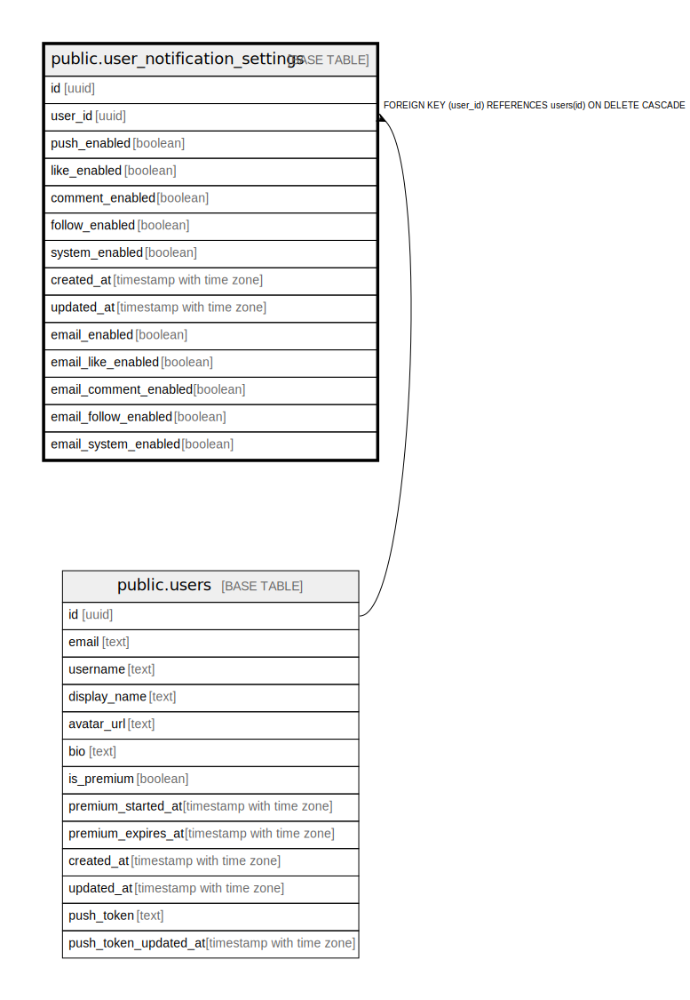

# public.user_notification_settings

## Description

## Columns

| Name | Type | Default | Nullable | Children | Parents | Comment |
| ---- | ---- | ------- | -------- | -------- | ------- | ------- |
| id | uuid | gen_random_uuid() | false |  |  |  |
| user_id | uuid |  | false |  | [public.users](public.users.md) |  |
| push_enabled | boolean | true | false |  |  |  |
| like_enabled | boolean | true | false |  |  |  |
| comment_enabled | boolean | true | false |  |  |  |
| follow_enabled | boolean | true | false |  |  |  |
| system_enabled | boolean | true | false |  |  |  |
| created_at | timestamp with time zone | now() | false |  |  |  |
| updated_at | timestamp with time zone | now() | false |  |  |  |
| email_enabled | boolean | false | false |  |  | メール通知のマスター設定 |
| email_like_enabled | boolean | true | false |  |  | いいねのメール通知 |
| email_comment_enabled | boolean | true | false |  |  | コメントのメール通知 |
| email_follow_enabled | boolean | true | false |  |  | フォローのメール通知 |
| email_system_enabled | boolean | true | false |  |  | システムのメール通知 |

## Constraints

| Name | Type | Definition |
| ---- | ---- | ---------- |
| user_notification_settings_user_id_fkey | FOREIGN KEY | FOREIGN KEY (user_id) REFERENCES users(id) ON DELETE CASCADE |
| user_notification_settings_pkey | PRIMARY KEY | PRIMARY KEY (id) |
| user_notification_settings_user_id_key | UNIQUE | UNIQUE (user_id) |

## Indexes

| Name | Definition |
| ---- | ---------- |
| user_notification_settings_pkey | CREATE UNIQUE INDEX user_notification_settings_pkey ON public.user_notification_settings USING btree (id) |
| user_notification_settings_user_id_key | CREATE UNIQUE INDEX user_notification_settings_user_id_key ON public.user_notification_settings USING btree (user_id) |
| idx_user_notification_settings_user_id | CREATE INDEX idx_user_notification_settings_user_id ON public.user_notification_settings USING btree (user_id) |

## Triggers

| Name | Definition |
| ---- | ---------- |
| trigger_update_notification_settings_updated_at | CREATE TRIGGER trigger_update_notification_settings_updated_at BEFORE UPDATE ON public.user_notification_settings FOR EACH ROW EXECUTE FUNCTION update_notification_settings_updated_at() |

## Relations

---

> Generated by [tbls](https://github.com/k1LoW/tbls)
