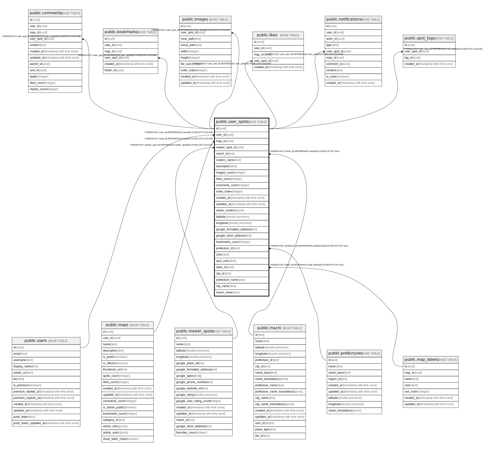

# public.user_spots

## Description

## Columns

| Name | Type | Default | Nullable | Children | Parents | Comment |
| ---- | ---- | ------- | -------- | -------- | ------- | ------- |
| id | uuid | gen_random_uuid() | false | [public.comments](public.comments.md) [public.bookmarks](public.bookmarks.md) [public.images](public.images.md) [public.likes](public.likes.md) [public.notifications](public.notifications.md) [public.spot_tags](public.spot_tags.md) |  |  |
| user_id | uuid |  | false |  | [public.users](public.users.md) |  |
| map_id | uuid |  | false |  | [public.maps](public.maps.md) |  |
| master_spot_id | uuid |  | true |  | [public.master_spots](public.master_spots.md) |  |
| machi_id | text |  | true |  | [public.machi](public.machi.md) |  |
| custom_name | text |  | false |  |  |  |
| description | text |  | true |  |  |  |
| images_count | integer | 0 | false |  |  | 画像数（デフォルト: 0） |
| likes_count | integer | 0 | false |  |  | いいね数（デフォルト: 0） |
| comments_count | integer | 0 | false |  |  | コメント数（デフォルト: 0） |
| order_index | integer | 0 | false |  |  | 表示順序（デフォルト: 0） |
| created_at | timestamp with time zone | now() | false |  |  |  |
| updated_at | timestamp with time zone | now() | false |  |  |  |
| article_content | jsonb |  | true |  |  | マップ記事用のスポット紹介文（ProseMirror JSON形式） |
| latitude | double precision |  | false |  |  |  |
| longitude | double precision |  | false |  |  |  |
| google_formatted_address | text |  | true |  |  |  |
| google_short_address | text |  | true |  |  |  |
| bookmarks_count | integer | 0 | false |  |  | ブックマーク数（デフォルト: 0） |
| prefecture_id | text |  | true |  | [public.prefectures](public.prefectures.md) | 都道府県ID（prefectures.id）。都道府県別検索の高速化のため非正規化 |
| color | text |  | true |  |  | スポットの色（pink, red, orange, yellow, green, blue, purple, gray, white） |
| spot_color | text | 'blue'::text | true |  |  | スポットの色（pink, red, orange, yellow, green, blue, purple, gray, white） |
| label_id | uuid |  | true |  | [public.map_labels](public.map_labels.md) | スポットのラベル（map_labelsへの外部キー） |
| city_id | text |  | true |  |  |  |
| prefecture_name | text |  | true |  |  |  |
| city_name | text |  | true |  |  |  |
| machi_name | text |  | true |  |  |  |

## Constraints

| Name | Type | Definition |
| ---- | ---- | ---------- |
| user_spots_user_id_fkey | FOREIGN KEY | FOREIGN KEY (user_id) REFERENCES users(id) ON DELETE CASCADE |
| user_spots_prefecture_id_fkey | FOREIGN KEY | FOREIGN KEY (prefecture_id) REFERENCES prefectures(id) ON DELETE SET NULL |
| user_spots_machi_id_fkey | FOREIGN KEY | FOREIGN KEY (machi_id) REFERENCES machi(id) ON DELETE SET NULL |
| user_spots_map_id_fkey | FOREIGN KEY | FOREIGN KEY (map_id) REFERENCES maps(id) ON DELETE CASCADE |
| user_spots_master_spot_id_fkey | FOREIGN KEY | FOREIGN KEY (master_spot_id) REFERENCES master_spots(id) ON DELETE CASCADE |
| user_spots_pkey | PRIMARY KEY | PRIMARY KEY (id) |
| user_spots_user_id_map_id_master_spot_id_key | UNIQUE | UNIQUE (user_id, map_id, master_spot_id) |
| user_spots_label_id_fkey | FOREIGN KEY | FOREIGN KEY (label_id) REFERENCES map_labels(id) ON DELETE SET NULL |

## Indexes

| Name | Definition |
| ---- | ---------- |
| user_spots_pkey | CREATE UNIQUE INDEX user_spots_pkey ON public.user_spots USING btree (id) |
| user_spots_user_id_map_id_master_spot_id_key | CREATE UNIQUE INDEX user_spots_user_id_map_id_master_spot_id_key ON public.user_spots USING btree (user_id, map_id, master_spot_id) |
| idx_user_spots_user_id | CREATE INDEX idx_user_spots_user_id ON public.user_spots USING btree (user_id) |
| idx_user_spots_map_id | CREATE INDEX idx_user_spots_map_id ON public.user_spots USING btree (map_id) |
| idx_user_spots_master_spot_id | CREATE INDEX idx_user_spots_master_spot_id ON public.user_spots USING btree (master_spot_id) |
| idx_user_spots_machi_id | CREATE INDEX idx_user_spots_machi_id ON public.user_spots USING btree (machi_id) |
| idx_user_spots_created_at | CREATE INDEX idx_user_spots_created_at ON public.user_spots USING btree (created_at DESC) |
| idx_user_spots_bookmarks_count | CREATE INDEX idx_user_spots_bookmarks_count ON public.user_spots USING btree (bookmarks_count DESC) |
| idx_user_spots_prefecture_id | CREATE INDEX idx_user_spots_prefecture_id ON public.user_spots USING btree (prefecture_id) |
| idx_user_spots_prefecture_map | CREATE INDEX idx_user_spots_prefecture_map ON public.user_spots USING btree (prefecture_id, map_id) |
| idx_user_spots_label_id | CREATE INDEX idx_user_spots_label_id ON public.user_spots USING btree (label_id) |

## Triggers

| Name | Definition |
| ---- | ---------- |
| enforce_spots_limit | CREATE TRIGGER enforce_spots_limit BEFORE INSERT ON public.user_spots FOR EACH ROW EXECUTE FUNCTION check_spots_limit() |
| enforce_spots_limit_on_update | CREATE TRIGGER enforce_spots_limit_on_update BEFORE UPDATE ON public.user_spots FOR EACH ROW EXECUTE FUNCTION check_spots_limit_on_update() |
| trigger_update_map_spots_count | CREATE TRIGGER trigger_update_map_spots_count AFTER INSERT OR DELETE ON public.user_spots FOR EACH ROW EXECUTE FUNCTION update_map_spots_count() |
| update_user_spots_updated_at | CREATE TRIGGER update_user_spots_updated_at BEFORE UPDATE ON public.user_spots FOR EACH ROW EXECUTE FUNCTION update_updated_at_column() |

## Relations

---

> Generated by [tbls](https://github.com/k1LoW/tbls)
