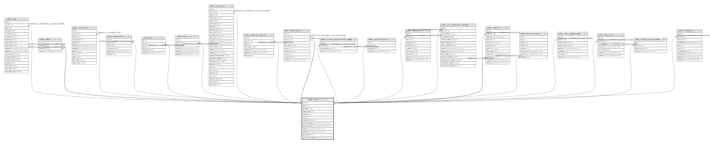

# public.users

## Description

## Columns

| Name | Type | Default | Nullable | Children | Parents | Comment |
| ---- | ---- | ------- | -------- | -------- | ------- | ------- |
| id | uuid | gen_random_uuid() | false | [public.maps](public.maps.md) [public.follows](public.follows.md) [public.comments](public.comments.md) [public.bookmarks](public.bookmarks.md) [public.likes](public.likes.md) [public.visits](public.visits.md) [public.user_spots](public.user_spots.md) [public.bookmark_folders](public.bookmark_folders.md) [public.notifications](public.notifications.md) [public.system_announcement_reads](public.system_announcement_reads.md) [public.comment_likes](public.comment_likes.md) [public.collections](public.collections.md) [public.user_notification_settings](public.user_notification_settings.md) [public.reports](public.reports.md) [public.terms_versions](public.terms_versions.md) [public.terms_agreements](public.terms_agreements.md) [public.view_history](public.view_history.md) [public.master_spot_favorites](public.master_spot_favorites.md) [public.schedules](public.schedules.md) |  |  |
| email | text |  | false |  |  |  |
| username | text |  | false |  |  | ユーザー名（@で表示される識別子） |
| display_name | text |  | false |  |  | 表示名（自由に設定できる名前） |
| avatar_url | text |  | true |  |  |  |
| bio | text |  | true |  |  |  |
| is_premium | boolean | false | true |  |  |  |
| premium_started_at | timestamp with time zone |  | true |  |  |  |
| premium_expires_at | timestamp with time zone |  | true |  |  |  |
| created_at | timestamp with time zone | now() | false |  |  |  |
| updated_at | timestamp with time zone | now() | false |  |  |  |
| push_token | text |  | true |  |  |  |
| push_token_updated_at | timestamp with time zone |  | true |  |  |  |

## Constraints

| Name | Type | Definition |
| ---- | ---- | ---------- |
| users_pkey | PRIMARY KEY | PRIMARY KEY (id) |
| users_email_key | UNIQUE | UNIQUE (email) |
| users_username_key | UNIQUE | UNIQUE (username) |

## Indexes

| Name | Definition |
| ---- | ---------- |
| users_pkey | CREATE UNIQUE INDEX users_pkey ON public.users USING btree (id) |
| users_email_key | CREATE UNIQUE INDEX users_email_key ON public.users USING btree (email) |
| users_username_key | CREATE UNIQUE INDEX users_username_key ON public.users USING btree (username) |
| idx_users_email | CREATE INDEX idx_users_email ON public.users USING btree (email) |
| idx_users_username | CREATE INDEX idx_users_username ON public.users USING btree (username) |
| idx_users_push_token | CREATE INDEX idx_users_push_token ON public.users USING btree (push_token) WHERE (push_token IS NOT NULL) |
| idx_users_is_premium | CREATE INDEX idx_users_is_premium ON public.users USING btree (is_premium) |
| users_username_idx | CREATE UNIQUE INDEX users_username_idx ON public.users USING btree (username) |

## Triggers

| Name | Definition |
| ---- | ---------- |
| trigger_create_default_notification_settings | CREATE TRIGGER trigger_create_default_notification_settings AFTER INSERT ON public.users FOR EACH ROW EXECUTE FUNCTION create_default_notification_settings() |
| update_users_updated_at | CREATE TRIGGER update_users_updated_at BEFORE UPDATE ON public.users FOR EACH ROW EXECUTE FUNCTION update_updated_at_column() |

## Relations

---

> Generated by [tbls](https://github.com/k1LoW/tbls)
