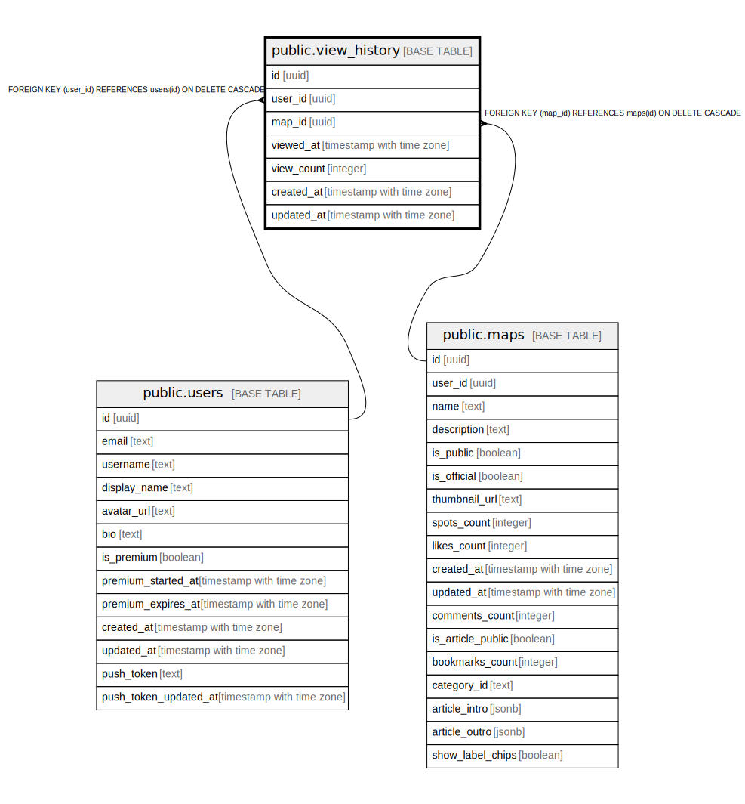

# public.view_history

## Description

閲覧履歴（マップ）

## Columns

| Name | Type | Default | Nullable | Children | Parents | Comment |
| ---- | ---- | ------- | -------- | -------- | ------- | ------- |
| id | uuid | gen_random_uuid() | false |  |  |  |
| user_id | uuid |  | false |  | [public.users](public.users.md) | 閲覧したユーザーID |
| map_id | uuid |  | false |  | [public.maps](public.maps.md) | 閲覧したマップID |
| viewed_at | timestamp with time zone | now() | false |  |  | 最終閲覧日時 |
| view_count | integer | 1 | false |  |  | 閲覧回数 |
| created_at | timestamp with time zone | now() | false |  |  |  |
| updated_at | timestamp with time zone | now() | false |  |  |  |

## Constraints

| Name | Type | Definition |
| ---- | ---- | ---------- |
| view_history_user_id_fkey | FOREIGN KEY | FOREIGN KEY (user_id) REFERENCES users(id) ON DELETE CASCADE |
| view_history_map_id_fkey | FOREIGN KEY | FOREIGN KEY (map_id) REFERENCES maps(id) ON DELETE CASCADE |
| view_history_pkey | PRIMARY KEY | PRIMARY KEY (id) |
| view_history_user_id_map_id_key | UNIQUE | UNIQUE (user_id, map_id) |

## Indexes

| Name | Definition |
| ---- | ---------- |
| view_history_pkey | CREATE UNIQUE INDEX view_history_pkey ON public.view_history USING btree (id) |
| view_history_user_id_map_id_key | CREATE UNIQUE INDEX view_history_user_id_map_id_key ON public.view_history USING btree (user_id, map_id) |
| idx_view_history_user_id | CREATE INDEX idx_view_history_user_id ON public.view_history USING btree (user_id) |
| idx_view_history_map_id | CREATE INDEX idx_view_history_map_id ON public.view_history USING btree (map_id) |
| idx_view_history_viewed_at | CREATE INDEX idx_view_history_viewed_at ON public.view_history USING btree (viewed_at DESC) |
| idx_view_history_user_viewed | CREATE INDEX idx_view_history_user_viewed ON public.view_history USING btree (user_id, viewed_at DESC) |

## Triggers

| Name | Definition |
| ---- | ---------- |
| trigger_cleanup_view_history | CREATE TRIGGER trigger_cleanup_view_history AFTER INSERT OR UPDATE ON public.view_history FOR EACH ROW EXECUTE FUNCTION cleanup_old_view_history() |
| trigger_update_view_history_updated_at | CREATE TRIGGER trigger_update_view_history_updated_at BEFORE UPDATE ON public.view_history FOR EACH ROW EXECUTE FUNCTION update_view_history_updated_at() |

## Relations

---

> Generated by [tbls](https://github.com/k1LoW/tbls)
