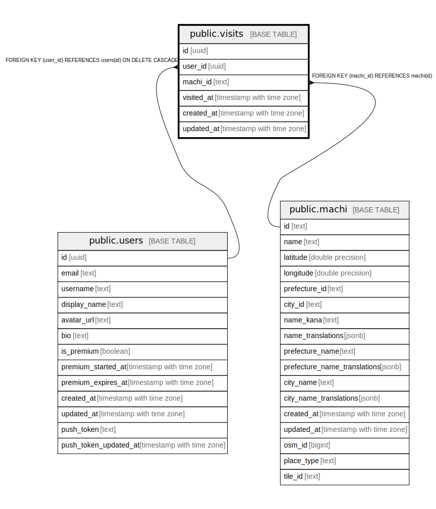

# public.visits

## Description

ユーザーが訪問した街の記録（街ごとに1レコード、訪問有無のみ管理）

## Columns

| Name | Type | Default | Nullable | Children | Parents | Comment |
| ---- | ---- | ------- | -------- | -------- | ------- | ------- |
| id | uuid | gen_random_uuid() | false |  |  |  |
| user_id | uuid |  | false |  | [public.users](public.users.md) |  |
| machi_id | text |  | false |  | [public.machi](public.machi.md) | 訪問した街（駅）のID |
| visited_at | timestamp with time zone |  | false |  |  | 訪問した日時 |
| created_at | timestamp with time zone | now() | false |  |  |  |
| updated_at | timestamp with time zone | now() | false |  |  |  |

## Constraints

| Name | Type | Definition |
| ---- | ---- | ---------- |
| visits_user_id_fkey | FOREIGN KEY | FOREIGN KEY (user_id) REFERENCES users(id) ON DELETE CASCADE |
| visits_machi_id_fkey | FOREIGN KEY | FOREIGN KEY (machi_id) REFERENCES machi(id) |
| visits_pkey | PRIMARY KEY | PRIMARY KEY (id) |
| visits_user_id_machi_id_key | UNIQUE | UNIQUE (user_id, machi_id) |

## Indexes

| Name | Definition |
| ---- | ---------- |
| visits_pkey | CREATE UNIQUE INDEX visits_pkey ON public.visits USING btree (id) |
| visits_user_id_machi_id_key | CREATE UNIQUE INDEX visits_user_id_machi_id_key ON public.visits USING btree (user_id, machi_id) |
| idx_visits_user_id | CREATE INDEX idx_visits_user_id ON public.visits USING btree (user_id) |
| idx_visits_machi_id | CREATE INDEX idx_visits_machi_id ON public.visits USING btree (machi_id) |
| idx_visits_visited_at | CREATE INDEX idx_visits_visited_at ON public.visits USING btree (visited_at DESC) |
| idx_visits_user_machi | CREATE INDEX idx_visits_user_machi ON public.visits USING btree (user_id, machi_id) |

## Relations

---

> Generated by [tbls](https://github.com/k1LoW/tbls)
