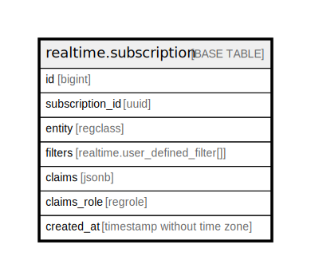

# realtime.subscription

## Description

## Columns

| Name | Type | Default | Nullable | Extra Definition | Children | Parents | Comment |
| ---- | ---- | ------- | -------- | ---------------- | -------- | ------- | ------- |
| id | bigint |  | false |  |  |  |  |
| subscription_id | uuid |  | false |  |  |  |  |
| entity | regclass |  | false |  |  |  |  |
| filters | realtime.user_defined_filter[] | '{}'::realtime.user_defined_filter[] | false |  |  |  |  |
| claims | jsonb |  | false |  |  |  |  |
| claims_role | regrole |  | false | GENERATED ALWAYS AS realtime.to_regrole((claims -\>\> 'role'::text)) STORED |  |  |  |
| created_at | timestamp without time zone | timezone('utc'::text, now()) | false |  |  |  |  |

## Constraints

| Name | Type | Definition |
| ---- | ---- | ---------- |
| pk_subscription | PRIMARY KEY | PRIMARY KEY (id) |

## Indexes

| Name | Definition |
| ---- | ---------- |
| pk_subscription | CREATE UNIQUE INDEX pk_subscription ON realtime.subscription USING btree (id) |
| subscription_subscription_id_entity_filters_key | CREATE UNIQUE INDEX subscription_subscription_id_entity_filters_key ON realtime.subscription USING btree (subscription_id, entity, filters) |
| ix_realtime_subscription_entity | CREATE INDEX ix_realtime_subscription_entity ON realtime.subscription USING btree (entity) |

## Triggers

| Name | Definition |
| ---- | ---------- |
| tr_check_filters | CREATE TRIGGER tr_check_filters BEFORE INSERT OR UPDATE ON realtime.subscription FOR EACH ROW EXECUTE FUNCTION realtime.subscription_check_filters() |

## Relations

---

> Generated by [tbls](https://github.com/k1LoW/tbls)
