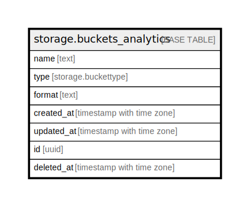

# storage.buckets_analytics

## Description

## Columns

| Name | Type | Default | Nullable | Children | Parents | Comment |
| ---- | ---- | ------- | -------- | -------- | ------- | ------- |
| name | text |  | false |  |  |  |
| type | storage.buckettype | 'ANALYTICS'::storage.buckettype | false |  |  |  |
| format | text | 'ICEBERG'::text | false |  |  |  |
| created_at | timestamp with time zone | now() | false |  |  |  |
| updated_at | timestamp with time zone | now() | false |  |  |  |
| id | uuid | gen_random_uuid() | false |  |  |  |
| deleted_at | timestamp with time zone |  | true |  |  |  |

## Constraints

| Name | Type | Definition |
| ---- | ---- | ---------- |
| buckets_analytics_pkey | PRIMARY KEY | PRIMARY KEY (id) |

## Indexes

| Name | Definition |
| ---- | ---------- |
| buckets_analytics_pkey | CREATE UNIQUE INDEX buckets_analytics_pkey ON storage.buckets_analytics USING btree (id) |
| buckets_analytics_unique_name_idx | CREATE UNIQUE INDEX buckets_analytics_unique_name_idx ON storage.buckets_analytics USING btree (name) WHERE (deleted_at IS NULL) |

## Relations

---

> Generated by [tbls](https://github.com/k1LoW/tbls)
