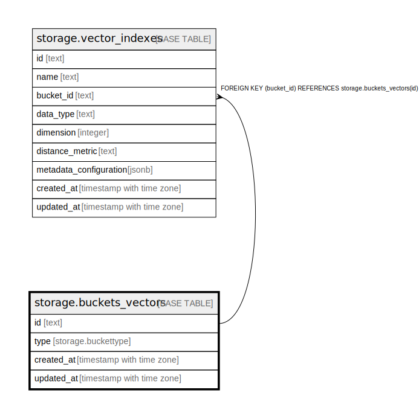

# storage.buckets_vectors

## Description

## Columns

| Name | Type | Default | Nullable | Children | Parents | Comment |
| ---- | ---- | ------- | -------- | -------- | ------- | ------- |
| id | text |  | false | [storage.vector_indexes](storage.vector_indexes.md) |  |  |
| type | storage.buckettype | 'VECTOR'::storage.buckettype | false |  |  |  |
| created_at | timestamp with time zone | now() | false |  |  |  |
| updated_at | timestamp with time zone | now() | false |  |  |  |

## Constraints

| Name | Type | Definition |
| ---- | ---- | ---------- |
| buckets_vectors_pkey | PRIMARY KEY | PRIMARY KEY (id) |

## Indexes

| Name | Definition |
| ---- | ---------- |
| buckets_vectors_pkey | CREATE UNIQUE INDEX buckets_vectors_pkey ON storage.buckets_vectors USING btree (id) |

## Relations

---

> Generated by [tbls](https://github.com/k1LoW/tbls)
