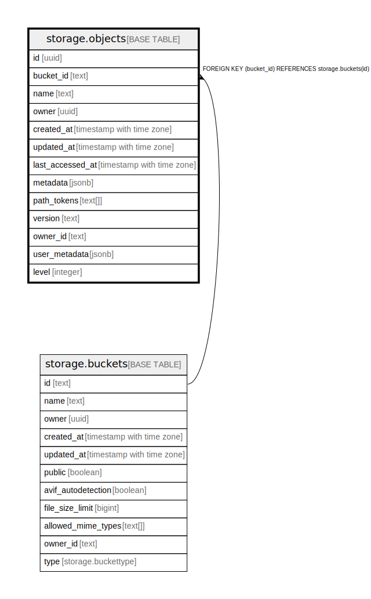

# storage.objects

## Description

## Columns

| Name | Type | Default | Nullable | Extra Definition | Children | Parents | Comment |
| ---- | ---- | ------- | -------- | ---------------- | -------- | ------- | ------- |
| id | uuid | gen_random_uuid() | false |  |  |  |  |
| bucket_id | text |  | true |  |  | [storage.buckets](storage.buckets.md) |  |
| name | text |  | true |  |  |  |  |
| owner | uuid |  | true |  |  |  | Field is deprecated, use owner_id instead |
| created_at | timestamp with time zone | now() | true |  |  |  |  |
| updated_at | timestamp with time zone | now() | true |  |  |  |  |
| last_accessed_at | timestamp with time zone | now() | true |  |  |  |  |
| metadata | jsonb |  | true |  |  |  |  |
| path_tokens | text[] |  | true | GENERATED ALWAYS AS string_to_array(name, '/'::text) STORED |  |  |  |
| version | text |  | true |  |  |  |  |
| owner_id | text |  | true |  |  |  |  |
| user_metadata | jsonb |  | true |  |  |  |  |
| level | integer |  | true |  |  |  |  |

## Constraints

| Name | Type | Definition |
| ---- | ---- | ---------- |
| objects_bucketId_fkey | FOREIGN KEY | FOREIGN KEY (bucket_id) REFERENCES storage.buckets(id) |
| objects_pkey | PRIMARY KEY | PRIMARY KEY (id) |

## Indexes

| Name | Definition |
| ---- | ---------- |
| objects_pkey | CREATE UNIQUE INDEX objects_pkey ON storage.objects USING btree (id) |
| bucketid_objname | CREATE UNIQUE INDEX bucketid_objname ON storage.objects USING btree (bucket_id, name) |
| name_prefix_search | CREATE INDEX name_prefix_search ON storage.objects USING btree (name text_pattern_ops) |
| idx_objects_bucket_id_name | CREATE INDEX idx_objects_bucket_id_name ON storage.objects USING btree (bucket_id, name COLLATE "C") |
| idx_name_bucket_level_unique | CREATE UNIQUE INDEX idx_name_bucket_level_unique ON storage.objects USING btree (name COLLATE "C", bucket_id, level) |
| objects_bucket_id_level_idx | CREATE UNIQUE INDEX objects_bucket_id_level_idx ON storage.objects USING btree (bucket_id, level, name COLLATE "C") |
| idx_objects_lower_name | CREATE INDEX idx_objects_lower_name ON storage.objects USING btree ((path_tokens[level]), lower(name) text_pattern_ops, bucket_id, level) |

## Triggers

| Name | Definition |
| ---- | ---------- |
| objects_delete_delete_prefix | CREATE TRIGGER objects_delete_delete_prefix AFTER DELETE ON storage.objects FOR EACH ROW EXECUTE FUNCTION storage.delete_prefix_hierarchy_trigger() |
| objects_insert_create_prefix | CREATE TRIGGER objects_insert_create_prefix BEFORE INSERT ON storage.objects FOR EACH ROW EXECUTE FUNCTION storage.objects_insert_prefix_trigger() |
| objects_update_create_prefix | CREATE TRIGGER objects_update_create_prefix BEFORE UPDATE ON storage.objects FOR EACH ROW WHEN (((new.name <> old.name) OR (new.bucket_id <> old.bucket_id))) EXECUTE FUNCTION storage.objects_update_prefix_trigger() |
| update_objects_updated_at | CREATE TRIGGER update_objects_updated_at BEFORE UPDATE ON storage.objects FOR EACH ROW EXECUTE FUNCTION storage.update_updated_at_column() |

## Relations

---

> Generated by [tbls](https://github.com/k1LoW/tbls)
