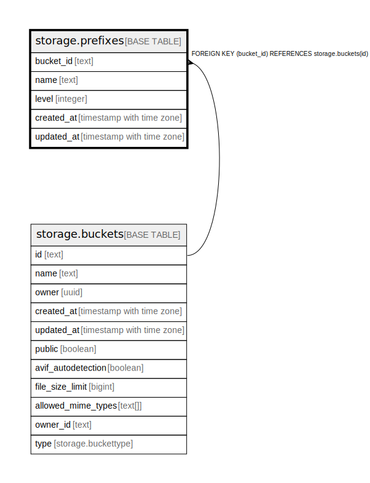

# storage.prefixes

## Description

## Columns

| Name | Type | Default | Nullable | Extra Definition | Children | Parents | Comment |
| ---- | ---- | ------- | -------- | ---------------- | -------- | ------- | ------- |
| bucket_id | text |  | false |  |  | [storage.buckets](storage.buckets.md) |  |
| name | text |  | false |  |  |  |  |
| level | integer |  | false | GENERATED ALWAYS AS storage.get_level(name) STORED |  |  |  |
| created_at | timestamp with time zone | now() | true |  |  |  |  |
| updated_at | timestamp with time zone | now() | true |  |  |  |  |

## Constraints

| Name | Type | Definition |
| ---- | ---- | ---------- |
| prefixes_bucketId_fkey | FOREIGN KEY | FOREIGN KEY (bucket_id) REFERENCES storage.buckets(id) |
| prefixes_pkey | PRIMARY KEY | PRIMARY KEY (bucket_id, level, name) |

## Indexes

| Name | Definition |
| ---- | ---------- |
| prefixes_pkey | CREATE UNIQUE INDEX prefixes_pkey ON storage.prefixes USING btree (bucket_id, level, name) |
| idx_prefixes_lower_name | CREATE INDEX idx_prefixes_lower_name ON storage.prefixes USING btree (bucket_id, level, ((string_to_array(name, '/'::text))[level]), lower(name) text_pattern_ops) |

## Triggers

| Name | Definition |
| ---- | ---------- |
| prefixes_create_hierarchy | CREATE TRIGGER prefixes_create_hierarchy BEFORE INSERT ON storage.prefixes FOR EACH ROW WHEN ((pg_trigger_depth() < 1)) EXECUTE FUNCTION storage.prefixes_insert_trigger() |
| prefixes_delete_hierarchy | CREATE TRIGGER prefixes_delete_hierarchy AFTER DELETE ON storage.prefixes FOR EACH ROW EXECUTE FUNCTION storage.delete_prefix_hierarchy_trigger() |

## Relations

---

> Generated by [tbls](https://github.com/k1LoW/tbls)
