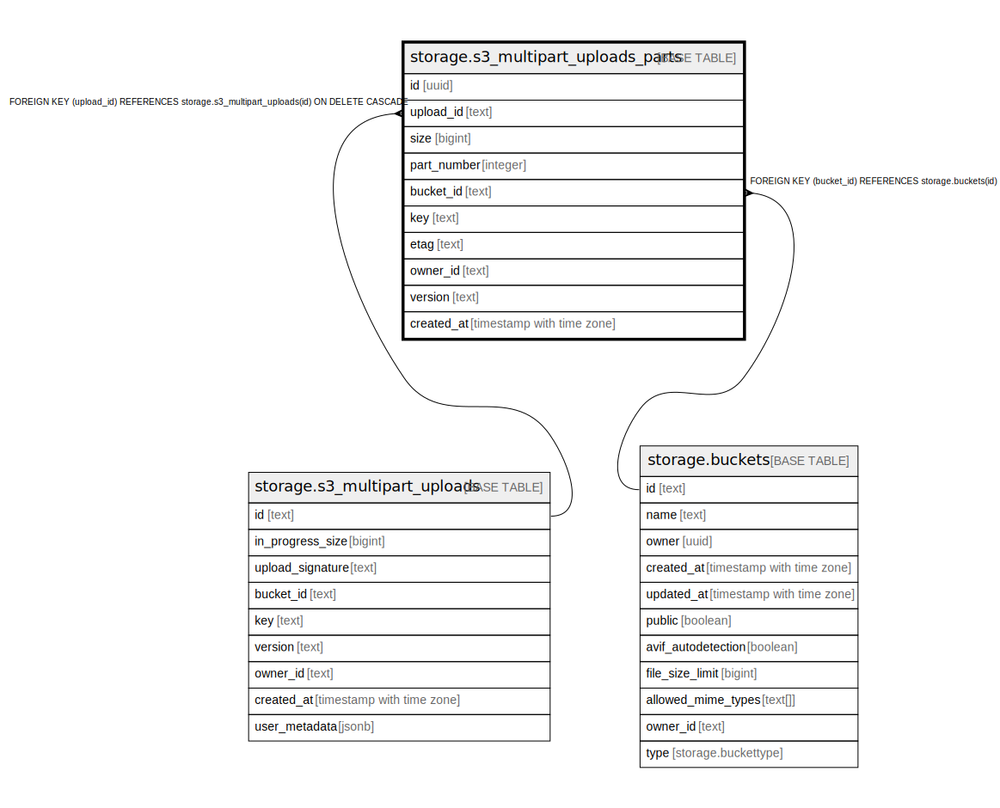

# storage.s3_multipart_uploads_parts

## Description

## Columns

| Name | Type | Default | Nullable | Children | Parents | Comment |
| ---- | ---- | ------- | -------- | -------- | ------- | ------- |
| id | uuid | gen_random_uuid() | false |  |  |  |
| upload_id | text |  | false |  | [storage.s3_multipart_uploads](storage.s3_multipart_uploads.md) |  |
| size | bigint | 0 | false |  |  |  |
| part_number | integer |  | false |  |  |  |
| bucket_id | text |  | false |  | [storage.buckets](storage.buckets.md) |  |
| key | text |  | false |  |  |  |
| etag | text |  | false |  |  |  |
| owner_id | text |  | true |  |  |  |
| version | text |  | false |  |  |  |
| created_at | timestamp with time zone | now() | false |  |  |  |

## Constraints

| Name | Type | Definition |
| ---- | ---- | ---------- |
| s3_multipart_uploads_parts_bucket_id_fkey | FOREIGN KEY | FOREIGN KEY (bucket_id) REFERENCES storage.buckets(id) |
| s3_multipart_uploads_parts_upload_id_fkey | FOREIGN KEY | FOREIGN KEY (upload_id) REFERENCES storage.s3_multipart_uploads(id) ON DELETE CASCADE |
| s3_multipart_uploads_parts_pkey | PRIMARY KEY | PRIMARY KEY (id) |

## Indexes

| Name | Definition |
| ---- | ---------- |
| s3_multipart_uploads_parts_pkey | CREATE UNIQUE INDEX s3_multipart_uploads_parts_pkey ON storage.s3_multipart_uploads_parts USING btree (id) |

## Relations

---

> Generated by [tbls](https://github.com/k1LoW/tbls)
